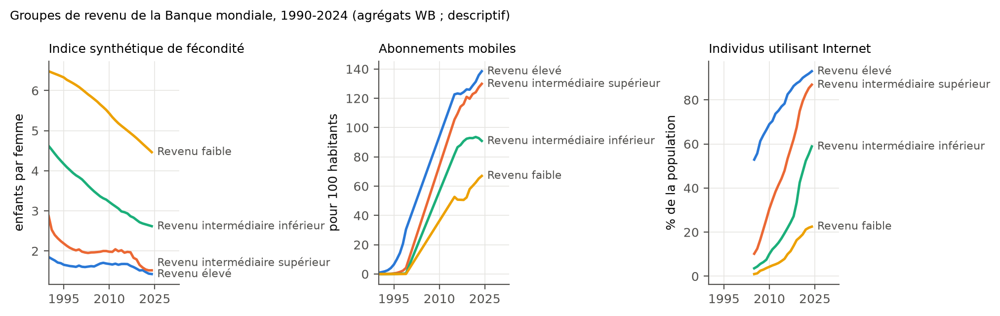
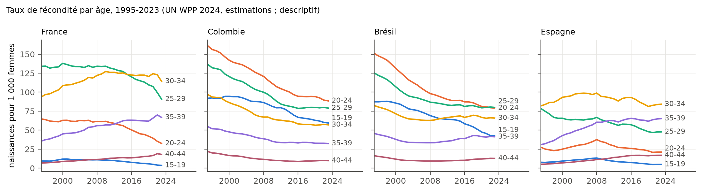
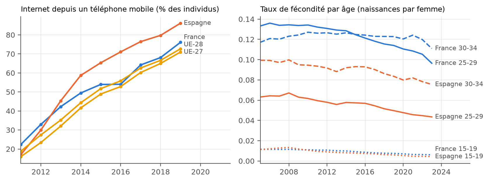
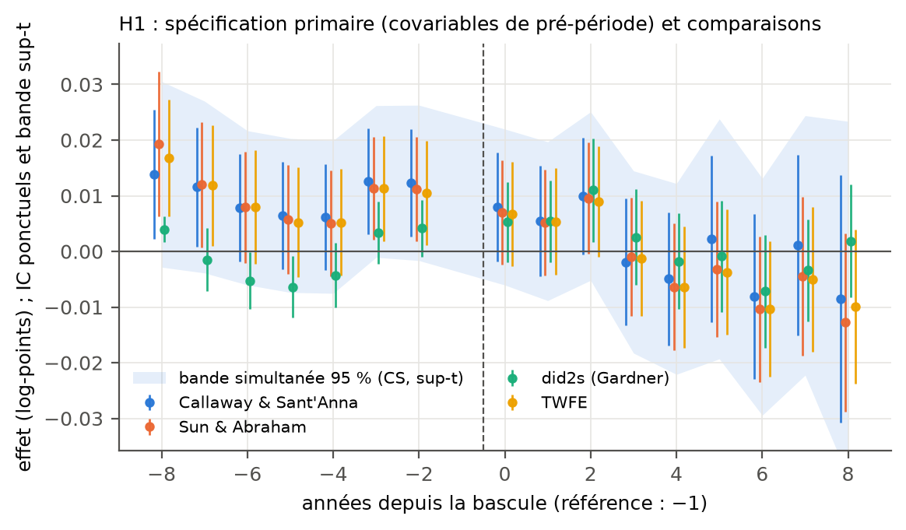
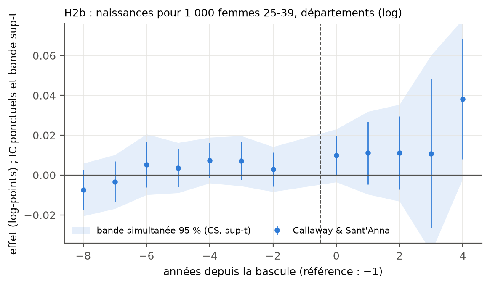
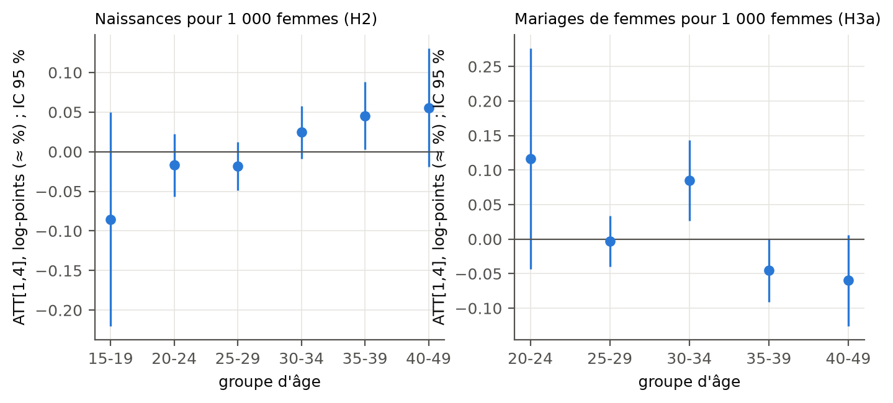
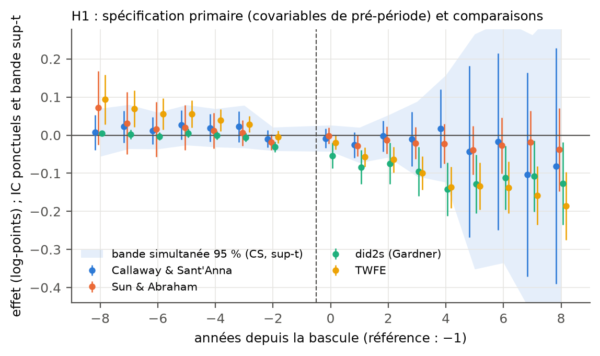
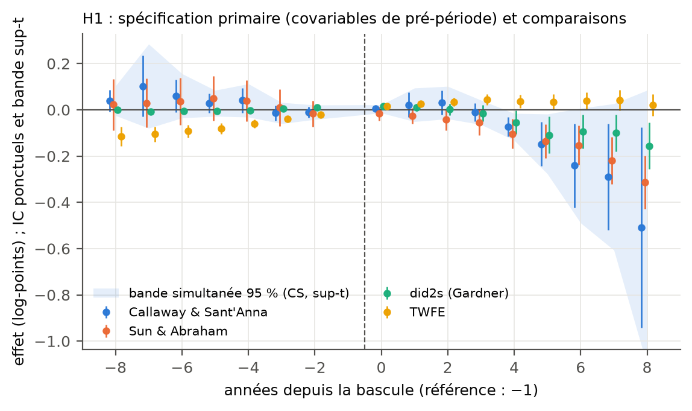
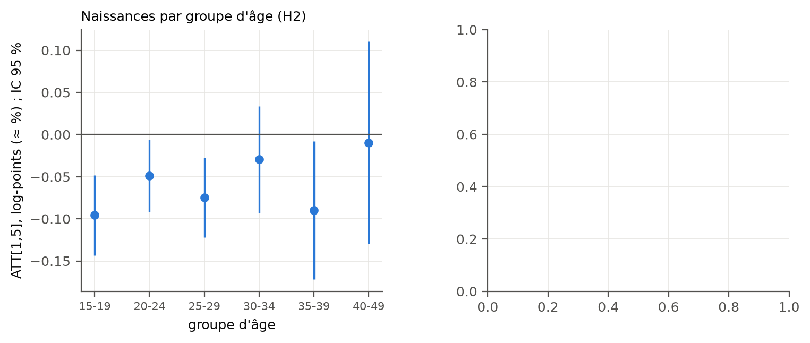
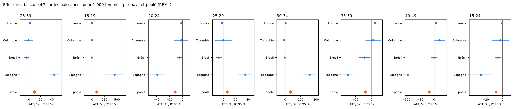

# Smartphones, réseaux sociaux, applications de rencontre et fécondité : y a-t-il un effet causal au-delà des adolescentes ?

*Working paper — version de travail, ne pas citer. Généré par scripts/22_paper_md.py à partir de paper/paper.tex ; version PDF : paper/paper.pdf.*

**Abstract.** Does the diffusion of smartphones, and through them of social media and dating apps, reduce fertility beyond the teenage years? We preregistered a staggered difference-in-differences design based on the municipal timing of 4G coverage and estimated it with the same code in four countries that met file-in-hand inclusion criteria (France, Colombia, Brazil, Spain; Sweden was examined and excluded). Births by age of the mother come from vital statistics; the estimator is the doubly robust Callaway–Sant’Anna event study with not-yet-treated controls. The preregistered primary test, the effect on births to women aged 25–39, is not rejected in France (+1.8%, $`p=0.12`$) nor in Colombia ($`-1.4`$%, $`p=0.72`$); it is rejected in Brazil ($`-4.7`$%, $`p=0.03`$ analytic, $`p=0.10`$ with cluster bootstrap) and, with a failed pre-trend test and a degenerate control group, in Spain. The random-effects pooled estimate across the four countries is $`+9.7`$% ($`p=0.40`$, $`I^2=96`$%); the preregistered decision rule therefore concludes that a net effect on women aged 25 and over is *not established*. Where effects appear (Brazil, and the exploratory Colombia–Brazil pool), they are concentrated on women under 30. No country allows the channel (union formation versus fertility within unions) to be identified. We state what would move the smartphone from an indeterminate to a first-order factor.

**Résumé.** La diffusion des smartphones, et à travers eux des réseaux sociaux et des applications de rencontre, réduit-elle la fécondité au-delà des adolescentes ? Nous avons préenregistré un dessin de différences-de-différences échelonnées fondé sur le calendrier municipal de la couverture 4G, puis estimé avec le même code dans les quatre pays remplissant les critères d’inclusion fixés à l’avance (France, Colombie, Brésil, Espagne ; la Suède a été examinée et exclue). Les naissances par âge de la mère viennent de l’état civil ; l’estimateur est l’event study doublement robuste de Callaway et Sant’Anna avec contrôle « pas encore traité ». Le test primaire préenregistré, l’effet sur les naissances des femmes de 25 à 39 ans, n’est rejeté ni en France ($`+1{,}8`$ %, $`p=0{,}12`$) ni en Colombie ($`-1{,}4`$ %, $`p=0{,}72`$) ; il l’est au Brésil ($`-4{,}7`$ %, $`p=0{,}03`$ analytique, $`0{,}10`$ par bootstrap) et, avec un pré-test rejeté et un groupe de contrôle dégénéré, en Espagne. L’estimation poolée à effets aléatoires vaut $`+9{,}7`$ % ($`p=0{,}40`$, $`I^2=96`$ %) : la règle de décision préenregistrée conclut qu’un effet net sur les 25 ans et plus n’est *pas établi*. Là où des effets apparaissent (Brésil, synthèse exploratoire Colombie-Brésil), ils se concentrent sur les femmes de moins de 30 ans. Aucun pays ne permet d’identifier le canal. Nous énonçons ce qui ferait passer le smartphone du statut de facteur indéterminé à celui de cause de premier ordre.

# Introduction

La fécondité des pays à revenu élevé a baissé après 2008-2010 dans la plupart d’entre eux, au moment même où le smartphone, les réseaux sociaux et les applications de rencontre se diffusaient. La coïncidence est frappante ; elle n’est pas une preuve. Ce papier pose une question étroite et y répond avec un dessin fixé avant de voir les résultats : la bascule d’un territoire dans la couverture 4G, qui conditionne l’usage mobile d’Internet, change-t-elle le nombre de naissances des femmes de 25 ans et plus, et non seulement des adolescentes ? Si oui, l’effet passe-t-il par la mise en couple ou par la fécondité au sein des couples ?

Poser la question ainsi a deux conséquences. La première est que le traitement n’est pas l’usage du smartphone, impossible à dater au niveau local, mais la bascule d’un territoire dans la couverture 4G, datée par le régulateur ; l’effet mesuré est celui de la possibilité d’un usage mobile intensif, pas celui de l’usage lui-même, et nous le rappelons à chaque étape. La seconde est que la réponse doit être lue groupe d’âge par groupe d’âge : les travaux existants mesurent surtout des effets sur les adolescentes, dont les naissances pèsent peu dans l’indice synthétique de fécondité des pays à revenu élevé ; un facteur de premier ordre de la baisse récente devrait toucher les femmes de 25 à 39 ans, qui en font l’essentiel. C’est pourquoi le test primaire porte sur elles, et pourquoi la règle de décision ne compte pas un effet sur les adolescentes comme une réponse à la question posée.

La contribution est triple. D’abord, le dessin est préenregistré (`docs/preregistration.md`, gelé au commit `c4002c6`) avec des hypothèses, des tailles d’effet minimales détectables, des familles de tests et une règle de décision écrites avant toute estimation ; les décisions de mesure prises à la lecture des fichiers sont consignées dans des addenda datés. Ensuite, le même code est appliqué à quatre pays retenus par des critères fixés à l’avance et vérifiés fichiers en main, ce qui évite de choisir le pays qui « marche ». Enfin, chaque chiffre du papier est produit par un script du dépôt ; aucune donnée n’est inventée, aucun résultat n’est emprunté.

Le résultat principal tient en une phrase : avec un dessin capable de détecter des effets de 1 % en France et au Brésil, de 2 % en Espagne et de 5 % en Colombie, l’effet net de la 4G sur les naissances des femmes de 25 à 39 ans n’est pas établi ; les seuls effets négatifs crédibles apparaissent au Brésil et se concentrent sur les femmes de moins de 30 ans.

La suite est organisée comme suit. La section 2 situe le papier dans la littérature ; la section 3 expose le cadre conceptuel et les hypothèses préenregistrées ; la section 4 décrit les faits stylisés, les pays examinés et les données ; la section 5 la stratégie empirique ; les sections 6 à 8 donnent les résultats par âge, la décomposition du canal et la robustesse ; la section 9 discute les mécanismes, la section 10 les limites, et la section 11 énonce le statut du smartphone comme facteur explicatif et les critères qui le réviseraient. Les annexes donnent les tableaux complets, le dictionnaire des variables, les sources exactes et la liste des pays examinés.

# Positionnement

Les études causales existantes portent presque toutes sur le haut débit *fixe* ou sur les moins de 25 ans. Guldi and Herbst (2016) trouvent qu’aux États-Unis la diffusion du haut débit fixe réduit la fécondité adolescente ; Bellou (2014) que le même haut débit élève les mariages des 21-30 ans ; Billari et al. (2019) qu’en Allemagne il élève la fécondité des femmes diplômées de 25-45 ans, par le télétravail. Aucune de ces trois études ne traite de l’Internet mobile ni, pour les deux premières, des femmes de plus de 25 ans. Du côté de la rencontre, Rosenfeld et al. (2019) documentent qu’aux États-Unis la rencontre en ligne est devenue vers 2013 le premier mode de rencontre des couples hétérosexuels, et Potarca (2020) décrit en Suisse les intentions de cohabitation et de fécondité des couples formés via des applications ; ces travaux sont descriptifs.

Des travaux plus récents se rapprochent de notre question. Myers and Hooper (2026) exploite le monopole d’AT&T sur l’iPhone (2007-2011) et mesure des effets sur les naissances des 15-19 et 20-24 ans aux États-Unis ; Hudson and Moscoso Boedo (2026) relient la chute de la fécondité adolescente au Royaume-Uni à la couverture 4G ; Ershov et al. (2026) étudient ce que change le passage de la rencontre en ligne des sites aux applications sur les marchés matrimoniaux américains ; Jung and Lusher (2026) relient applications de rencontre et taux de mariage ; Si et al. (2025) examinent le haut débit et les décisions de fécondité en Chine ; Liu (2026) l’Internet mobile et la fécondité en Afrique subsaharienne ; Churchill and Johnson (2026) le haut débit et la santé mentale des adolescents. Le constat qui motive ce papier est que l’effet *net* de l’Internet mobile sur les femmes de 25 ans et plus — celles dont les naissances font l’essentiel de l’indice synthétique de fécondité — reste à mesurer avec un dessin de couverture échelonnée, dans plusieurs pays, et avec une règle de décision écrite à l’avance.

Méthodologiquement, nous nous appuyons sur les estimateurs robustes à l’adoption échelonnée : Callaway and Sant’Anna (2021) pour l’estimateur primaire, Sun and Abraham (2021) et Gardner (2022) pour les comparaisons, Chaisemartin and D’Haultfœuille (2020) et Roth et al. (2023) pour les biais du modèle à deux effets fixes et la synthèse de cette littérature.

# Cadre conceptuel et hypothèses

Le cadre est celui de la préregistration (version 1.0, commit `c4002c6`, section 3), résumé ici. Le smartphone peut agir sur la fécondité par cinq canaux : (a) l’élargissement du marché de l’appariement, qui élève le coût d’opportunité de s’engager et reporte la mise en couple ; (b) le déplacement du temps vers l’écran et la baisse de l’activité sexuelle ; (c) la diffusion de normes et d’aspirations qui dévalorisent la parentalité précoce ; (d) le coût d’opportunité du temps parental ; (e) la santé mentale. Les canaux (a) et (b) prédisent un effet qui passe par la mise en couple ; (c) à (e) un effet au sein des couples. Le traitement observable n’est pas l’usage mais la *possibilité* d’usage : l’arrivée de la 4G dans une unité géographique, datée par le régulateur.

Ces canaux n’ont pas les mêmes prédictions par âge ni les mêmes traces observables. L’élargissement du marché de l’appariement (a) et le déplacement du temps (b) devraient toucher d’abord les femmes jeunes, pas encore en couple, et se traduire par un recul des mariages et des mises en couple avant celui des naissances ; les canaux (c) à (e) peuvent toucher toutes les femmes en âge de procréer, y compris celles déjà en couple, et se traduire par une baisse des naissances par femme en couple sans recul des unions. C’est ce contraste qui fonde H3 : si l’effet sur les naissances passe par la mise en couple, l’effet sur les mariages devrait être négatif et précéder celui sur les naissances ; s’il passe par la fécondité des couples, l’effet sur les naissances par femme en couple devrait être négatif à unions constantes. Le smartphone peut aussi agir en sens contraire : l’accès à l’information et aux services de santé reproductive peut réduire les naissances non désirées, ce qui est un effet négatif pour un autre motif, et la rencontre en ligne peut accélérer la mise en couple de personnes isolées géographiquement. Le signe net n’est donc pas donné par la théorie, ce qui justifie des tests bilatéraux et une règle de décision qui exige la concordance des signes entre pays.

Les hypothèses, numérotées comme dans la préregistration, sont les suivantes. H1 : la bascule 4G réduit les naissances pour 1 000 femmes en âge de procréer. H2 : l’effet est hétérogène par âge ; H2a sur les 15-19 et 20-24 ans, H2b sur les 25-39 ans (*test primaire du papier*), H2c par groupe quinquennal au-delà de 25 ans, H2d : l’effet des 15-24 ans est plus négatif que celui des 25-39 ans. H3 : le canal ; H3a sur les mariages et la mise en couple, H3b sur la fécondité des femmes en couple, H3c sur le calendrier relatif des deux. H4 : premier étage, la couverture élève la possession de smartphone et l’usage des réseaux sociaux. H5 : placebos ; H5a bascule fictive décalée de trois ans, H5b résultat sans lien attendu (décès), H5c tendances pré-traitement. H6 : hétérogénéité par densité, revenu, diplôme, zone de déploiement prioritaire, rang de naissance. La règle de décision de la section 6 de la préregistration stipule qu’un effet net sur les 25 ans et plus est « établi » si H2b est rejetée avec le même signe dans au moins deux pays de niveau 1, si l’estimation poolée est significative et si H5a-c ne sont pas rejetées dans ces pays.

Les critères d’inclusion d’un pays (section 4.3) sont fixés à l’avance : (1) un traitement infranational daté avec au moins trois années de pré-période pour au moins 30 % des unités ; (2) des naissances annuelles par âge au niveau de l’unité ; (3) un téléchargement scriptable sous licence permettant la reproduction ; (4) des dénominateurs par sexe et âge. La décision est prise et committée avant toute estimation et n’est jamais révisée. Les déviations et décisions de mesure sont dans `docs/preregistration_addenda.md` (A1 à A8).

# Données

## Faits stylisés

La figure <a href="#fig:world" data-reference-type="ref" data-reference="fig:world">1</a> rapproche, par groupe de revenu de la Banque mondiale, l’indice synthétique de fécondité, les abonnements mobiles et l’usage d’Internet depuis 1990. Les pays à revenu élevé et intermédiaire supérieur, où les abonnements mobiles dépassent 120 pour 100 habitants, ont un indice proche ou inférieur au seuil de remplacement depuis le début de la période ; la baisse récente y est faible en niveau. Parmi les 114 pays dont l’indice synthétique était inférieur à 2,5 en 2000 (estimations des Nations unies, tableau `t_world_inflection.md`), 66 (58 %) atteignent leur maximum local entre 2008 et 2015 avant de baisser ; la baisse médiane depuis ce maximum est de 20 %. Pour les pays souvent cités, le maximum est en 2007 aux États-Unis, 2008 en Espagne, 2009 en Norvège, 2010 en Finlande, en France et en Italie, 2015 en Allemagne et au Japon ; la Corée du Sud et le Brésil baissent de façon continue depuis 2000. Cette datation est descriptive : elle dit que l’inflexion coïncide avec la diffusion du smartphone (figure <a href="#fig:eu" data-reference-type="ref" data-reference="fig:eu">3</a>, panneau de gauche : la part des individus accédant à Internet depuis un téléphone mobile passe de 22 % à 76 % en France et de 17 % à 86 % en Espagne entre 2011 et 2019), elle n’en dit pas la cause.

<figure id="fig:world" data-latex-placement="htbp">

<figcaption>Indice synthétique de fécondité, abonnements mobiles et usage d’Internet par groupe de revenu (Banque mondiale, 1990-2024). Source : <code>scripts/19_world_facts.py</code>.</figcaption>
</figure>

<figure id="fig:asfr" data-latex-placement="htbp">

<figcaption>Taux de fécondité par âge dans les quatre pays d’étude, 1995-2023 (Nations unies, WPP 2024). Source : <code>scripts/19_world_facts.py</code>.</figcaption>
</figure>

<figure id="fig:eu" data-latex-placement="htbp">

<figcaption>Accès à Internet depuis un téléphone mobile et taux de fécondité par âge, France et Espagne (Eurostat). Source : <code>scripts/19_world_facts.py</code>.</figcaption>
</figure>

La figure <a href="#fig:asfr" data-reference-type="ref" data-reference="fig:asfr">2</a> montre les taux de fécondité par âge dans les quatre pays d’étude. En France et en Espagne, la fécondité des 25-29 ans baisse depuis 2010 tandis que celle des 30-34 et des 35-39 ans se maintient ; en Colombie et au Brésil, la baisse est générale et antérieure à la 4G pour les moins de 25 ans. C’est cette superposition de tendances séculaires qu’un dessin causal doit séparer de l’effet propre de la couverture.

## Pays examinés et retenus

Le balayage de l’Étape 0 (`docs/etape0_pays.md`) a classé 47 pays. Cinq étaient de niveau 1 (réplication causale possible) : France, Espagne, Suède, Brésil, Colombie. Chacun a été vérifié fichiers en main, dans l’ordre préenregistré, avec une check-list des quatre critères (`docs/data_log.md`). La Suède a été exclue au critère 1 : le régulateur ne publie plus les cartographies 2010-2014 par commune et, dès la première année disponible (2015), 96 % des communes sont couvertes (addendum A3). Les quatre autres pays sont inclus (A1-A2, A4, A5, A6). Le tableau <a href="#tab:countries" data-reference-type="ref" data-reference="tab:countries">15</a> en annexe liste les 47 pays et leur statut ; le tableau <a href="#tab:design" data-reference-type="ref" data-reference="tab:design">1</a> résume le dessin par pays.

| Pays | Unité | Traitement | Fenêtre | Unités | Cohortes | Jamais traitées |
|:---|:---|:---|:---|---:|:---|---:|
| France (commune) | commune | D1 : premier émetteur 4G en service (ANFR) | 2008-2024 | 34 704 | 2013-2027 | 13 312 |
| Colombie | municipio × âge | part de population couverte en 4G $`\geq`$ 50 % (MinTIC), censure 2015-T4 | 1998-2024 | 932 | 2016-2023 | 67 |
| Brésil | município × âge | présence 4G d’au moins un opérateur (Anatel) | 2003-2024 | 5 558 | 2014-2023 | 0 |
| Espagne | municipio ($`>`$ 10 000 hab.) × âge | part de population couverte en LTE $`\geq`$ 50 % (MINECO) | 2007-2022 | 722 | 2013-2016 | 0 |

Dessin par pays : unité, traitement, fenêtre et échantillon de la spécification H1

Source : tables/t_sample\_\*.csv (scripts 04, 11, 15) ; addenda A1-A6.

## Traitement

**France.** Le traitement principal (D1) est la première année civile où une commune compte au moins un émetteur 4G en service, d’après l’observatoire des installations radioélectriques de l’ANFR et ses archives annuelles (2018-2025). Sur 34 833 unités communales harmonisées au Code officiel géographique 2026, 21 392 basculent entre 2013 et 2024 et 13 312 ne basculent pas sur la fenêtre (`t_treatment_fr.md`). Au niveau du département, D3 est la part des femmes de 15-44 ans (recensement 2011) résidant dans une commune couverte ; la cohorte départementale est la première année où D3 atteint 50 % ; les 96 départements métropolitains basculent entre 2013 et 2018, de sorte qu’aucun ne sert de contrôle jamais traité. Les variantes (observatoire seul, deuxième opérateur, sites ARCEP, 3G) sont dans le tableau de robustesse.

**Colombie.** Le ministère des TIC publie par centro poblado, opérateur et trimestre (2015-T4 à 2023-T3) la présence de chaque technologie. Nous construisons la part de la population municipale couverte en 4G par au moins un opérateur, avec les populations 2015 des projections du DANE ; la cohorte est la première année où cette part atteint 50 %. Les 189 municipios déjà couverts au premier trimestre observé sont censurés à gauche et exclus du primaire ; les cohortes vont de 2016 à 2023 et 67 municipios ne basculent pas (A4).

**Brésil.** L’Anatel publie par município, opérateur et technologie la présence du service (instantanés de décembre 2013-2016, mensuels ensuite). Le régulateur ne publiant pas de part de population couverte avant fin 2021, le traitement est la présence de la 4G par au moins un opérateur ; la cohorte est la première année de présence (2014 : 189 municípios, 2015 : 298, 2016 : 551, 2017 : 2 739, 2018 : 680, puis 1 113 jusqu’en 2023). L’instantané de décembre 2013 ne contient aucune présence 4G, y compris à São Paulo où elle était commercialisée : la cohorte 2014 peut contenir des municípios couverts dès 2013, ce qui est traité en robustesse (A5).

**Espagne.** Le ministère publie par municipio la part de la population couverte en LTE aux instantanés de décembre 2013, 2014 et 2015 puis de juin 2016 à 2020. Parmi les 8 131 municipios, 210 atteignent 50 % dès décembre 2013, 1 051 en 2014, 2 795 en 2015, 7 948 en 2020. Mais les naissances ne sont identifiables que pour les municipios de plus de 10 000 habitants, où la bascule est concentrée : 179 dès 2013, 580 en 2014, 749 en 2015 et tous en 2016 (A6).

## Résultats

Les naissances viennent de l’état civil : fichiers détail de l’INSEE au département par âge de la mère (1998-2024) et naissances par commune (2008-2024) en France ; microdonnées des Estadísticas Vitales du DANE par municipio de résidence de la mère et groupe d’âge quinquennal (1998-2024) en Colombie ; table 2609 du registre civil de l’IBGE par município de résidence, année de naissance et groupe d’âge (2003-2024) au Brésil, en recomposant l’année d’occurrence à partir des enregistrements de l’année et de l’année suivante ; microdonnées de l’INE par municipio de résidence (codé si plus de 10 000 habitants), âge, état civil et rang (2007-2024) en Espagne. Les dénominateurs sont les femmes par groupe d’âge : estimations de population de l’INSEE, projections municipales du DANE par âge simple, interpolation entre les recensements 2000, 2010 et 2022 de l’IBGE calée sur la population totale annuelle, et Padrón continu au 1er janvier (2003-2022) en Espagne, ce qui borne la fenêtre espagnole à 2022.

Le résultat primaire est $`\log`$(naissances $`+\,0{,}5`$ pour 1 000 femmes du groupe d’âge) au niveau de l’unité $`\times`$ âge ; au département français, où les cellules ne sont jamais nulles, $`\log`$(naissances pour 1 000 femmes). Les groupes d’âge sont 15-19, 20-24, 25-29, 30-34, 35-39 et 40-49 ans. Les mesures du canal sont les mariages de femmes par âge (INSEE ; INE ; IBGE, mais seulement 2013-2016 au moment de l’exécution, l’API de l’IBGE ne répondant plus pour 2017 et au-delà), les PACS et les parts de personnes en couple entre millésimes du recensement (France), les naissances de mères en union libre ou mariées (Colombie) ou mariées (Espagne).

## Descriptives, échantillons et puissance

Le tableau <a href="#tab:sample" data-reference-type="ref" data-reference="tab:sample">2</a> donne les échantillons français ; ses équivalents colombien, brésilien et espagnol sont en annexe. En France, le panel communal compte 34 704 communes sur 2008-2024 (31 194 avec les cinq covariables de pré-période) et le panel départemental 96 départements sur 1998-2024. En Colombie, 932 municipios (907 après équilibrage) sur 1998-2024 ; au Brésil, 5 558 municípios sur 2003-2024 ; en Espagne, 722 municipios codés toutes les années 2007-2022.

La taille d’effet minimale détectable (puissance 80 %, seuil 5 %) a été calculée avant toute estimation par permutation des cohortes entre unités (tableau <a href="#tab:mde" data-reference-type="ref" data-reference="tab:mde">3</a>) : pour le test primaire H2b, 1,3 % en France, 5,0 % en Colombie, 1,4 % au Brésil et 2,4 % en Espagne. Un effet de quelques pour cent n’est donc pas détectable en Colombie ; les intervalles de confiance le rappelleront.

| Spécification | Unités | Années | Unités-années | Traitées | Jamais traitées | Cohortes |
|:---|---:|---:|---:|---:|---:|---:|
| H1 commune × année, naissances/1 000 femmes 15-44 (toutes) | 34 704 | 2008-2024 | 589 968 | 21 392 | 13 312 | 2013-2027 |
| H1 idem, cohortes avec $`\geq`$ 3 années de pré-période (primaire) | 34 704 | 2008-2024 | 589 968 | 21 392 | 13 312 | 2013-2027 |
| H1 robustesse 2008-2019 | 34 704 | 2008-2019 | 416 448 | 21 392 | 13 312 | 2013-2027 |
| H1 robustesse hors cohortes 2013-2017 | 25 979 | 2008-2024 | 441 643 | 12 667 | 13 312 | 2018-2027 |
| H6 densité dense | 764 | 2008-2024 | 12 988 | 756 | 8 | 2013-2027 |
| H6 densité intermédiaire | 3 346 | 2008-2024 | 56 882 | 2 892 | 454 | 2013-2027 |
| H6 densité rural | 30 594 | 2008-2024 | 520 098 | 17 744 | 12 850 | 2013-2027 |
| H6 ZDP | 21 184 | 2008-2024 | 360 128 | 11 671 | 9 513 | 2013-2027 |
| H2 département × année, naissances/1 000 femmes 15-19 (D3 $`\geq`$ 50 %) | 96 | 1998-2024 | 2 592 | 96 | 0 | 2013-2018 |
| H2 département × année, naissances/1 000 femmes 20-24 (D3 $`\geq`$ 50 %) | 96 | 1998-2024 | 2 592 | 96 | 0 | 2013-2018 |
| H2 département × année, naissances/1 000 femmes 25-29 (D3 $`\geq`$ 50 %) | 96 | 1998-2024 | 2 592 | 96 | 0 | 2013-2018 |
| H2 département × année, naissances/1 000 femmes 30-34 (D3 $`\geq`$ 50 %) | 96 | 1998-2024 | 2 592 | 96 | 0 | 2013-2018 |
| H2 département × année, naissances/1 000 femmes 35-39 (D3 $`\geq`$ 50 %) | 96 | 1998-2024 | 2 592 | 96 | 0 | 2013-2018 |
| H2 département × année, naissances/1 000 femmes 40-49 (D3 $`\geq`$ 50 %) | 96 | 1998-2024 | 2 592 | 96 | 0 | 2013-2018 |
| H3a département × âge × année, mariages/1 000 femmes | 96 | 1998-2024 | 15 552 | 96 | 0 | 2013-2018 |

Échantillons par spécification, France

Source : scripts/04_sample_mde.py. Unités = communes harmonisées (COG 2026) ou départements.

| Hypothèse | É.-t. des ATT placebo | MDE (80 %, 5 %), % | Permutations |
|:---|---:|---:|---:|
| H1 commune, log(naissances/1 000 f. 15-44) | 0.0030 | 0.84 | 200 |
| H2b département, log(naissances/1 000 f. 25-39), bascule D3 $`\geq`$ 50 % | 0.0047 | 1.31 | 200 |
| H2 département, log(naissances/1 000 f. 15-19) | 0.0210 | 5.89 | 200 |
| H2 département, log(naissances/1 000 f. 20-24) | 0.0100 | 2.81 | 200 |
| H2 département, log(naissances/1 000 f. 25-29) | 0.0065 | 1.81 | 200 |
| H2 département, log(naissances/1 000 f. 30-34) | 0.0059 | 1.65 | 200 |
| H2 département, log(naissances/1 000 f. 35-39) | 0.0071 | 1.99 | 200 |

Taille d’effet minimale détectable par permutation des cohortes

Source : scripts/04_sample_mde.py. ATT statique TWFE sur le log du taux, cohortes permutées entre unités ; MDE = (1,96 + 0,84) $`\times`$ écart-type placebo.

## Limites de mesure

Trois limites sont dites avant les résultats. (i) Le traitement est la couverture, pas l’usage : le premier étage (H4) n’est mesuré qu’en France, au niveau de neuf zones d’étude et d’aménagement du territoire. (ii) Les dénominateurs brésiliens sont lissés entre recensements ; le taux n’y capte que les variations du numérateur. (iii) En Espagne, l’unité est le municipio de plus de 10 000 habitants, où la 4G est arrivée en deux ans ; en Colombie et au Brésil, la première observation du régulateur suit le lancement commercial, de sorte que les premières cohortes sont bornées. Les cellules à zéro naissance sont traitées par le $`+\,0{,}5`$ ; une régression de Poisson à effets fixes avec offset sert de comparaison.

# Stratégie empirique

L’estimateur primaire est celui de Callaway and Sant’Anna (2021) : pour chaque cohorte $`g`$ et année $`t`$, l’ATT$`(g,t)`$ compare l’évolution du résultat depuis l’année de référence (base universelle, $`t=g-1`$) entre les unités de la cohorte $`g`$ et les unités pas encore traitées en $`t`$, avec une pondération doublement robuste sur des covariables de pré-période fixées par pays (France : cinq covariables communales dont le chômage, la part de diplômées, le revenu et une tendance de pré-période ; Colombie : part de population en cabecera, population, part de mères diplômées, tendance 2010-2014 ; Brésil : population 2010, part des femmes 15-49, niveau et tendance 2008-2013 ; Espagne : population 2013, part des femmes 15-49, part de mères nées à l’étranger, tendance 2008-2012). L’agrégat rapporté, ATT$`[1,k]`$, est la moyenne des effets des années $`+1`$ à $`+k`$, avec $`k`$ la dernière période identifiée jusqu’à 5 ; sa variance utilise la covariance complète des coefficients, calculée à partir des fonctions d’influence sommées par grappe (unité géographique). Lorsqu’aucune unité n’est jamais traitée (France au département, Brésil, Espagne), la dernière cohorte sert de contrôle et la fenêtre identifiée se termine avant elle, ce qui est dit dans chaque ligne de résultat.

L’hypothèse d’identification est celle des tendances parallèles conditionnelles : à covariables de pré-période données, les unités basculant en $`g`$ auraient suivi, sans la 4G, la même évolution que les unités pas encore couvertes. Elle est plus faible que celle du modèle à deux effets fixes à deux titres. D’abord, le groupe de contrôle est formé des unités pas encore traitées à la date $`t`$, jamais des unités déjà traitées, ce qui évite les comparaisons dont Chaisemartin and D’Haultfœuille (2020) et Roth et al. (2023) montrent qu’elles peuvent inverser le signe d’un effet hétérogène dans le temps. Ensuite, la comparaison est conditionnelle : les covariables servent à la fois à pondérer les unités de contrôle et à modéliser le résultat, de sorte que l’estimateur reste convergent si l’un des deux modèles est correct. La base universelle $`t = g-1`$ signifie que chaque coefficient d’event study se lit par rapport à l’année précédant la bascule, pour les périodes pré comme post ; les coefficients pré ne sont pas des paramètres de l’effet mais un test de l’hypothèse, et c’est pourquoi chaque résultat est accompagné de la $`p`$ du test de Wald joint des coefficients $`-8`$ à $`-2`$.

Nous rapportons avec chaque estimation : les coefficients d’event study de $`-8`$ à $`+8`$ avec une bande simultanée à 95 % (bootstrap multiplicateur) ; le test de Wald joint de nullité des coefficients $`-8`$ à $`-2`$ (H5c) ; pour les spécifications primaires, un écart-type par bootstrap par grappes stratifié par cohorte (50 tirages) et un agrégat à composition constante ; les comparaisons de Sun and Abraham (2021), de Gardner (2022) (deux étapes) et du modèle à deux effets fixes, sur la fenêtre identifiée. Les tests par groupe d’âge sont corrigés par Holm dans deux familles (H2a : 15-19, 20-24 ; H2c : 25-29 à 40-49) ; H2d est testée par bootstrap conjoint de la différence des deux agrégats. La règle de décision de la section 6 de la préregistration et la synthèse entre pays (méta-analyse à effets aléatoires des ATT en pourcentage du taux contrefactuel, REML, intervalle de prédiction, $`I^2`$ ; addendum A7) sont appliquées mécaniquement par `scripts/18_meta.py`. Les variables instrumentales (couverture comme instrument de la possession de smartphone, France) sont secondaires et ne sont pas interprétées.

L’inférence est à deux niveaux. Au premier, les écarts-types analytiques viennent des fonctions d’influence sommées par unité, l’équivalent d’un regroupement par unité ; au second, pour les spécifications primaires, un bootstrap par grappes stratifié par cohorte rééchantillonne des unités entières et ré-estime la chaîne complète, pondérations comprises. Lorsque les deux diffèrent sensiblement, c’est le second qui guide la lecture. L’agrégat ATT$`[1,k]`$ est une moyenne simple des effets dynamiques de $`+1`$ à $`+k`$ ; comme les cohortes tardives ne sont pas observées aux horizons longs, il mélange des cohortes différentes selon l’horizon, et l’agrégat à composition constante, qui ne retient que les cohortes observées jusqu’à $`+k`$, en donne la contrepartie. Les tests par groupe d’âge sont corrigés dans des familles fermées, ce qui garde le taux d’erreur de famille à 5 % sans supposer l’indépendance des tests.

La synthèse entre pays convertit chaque ATT$`[1,k]`$ primaire en pourcentage du taux contrefactuel, $`100\,(\exp(\mathrm{ATT})-1)`$, avec un écart-type par la méthode delta, puis combine les quatre pays par effets aléatoires. L’intervalle de prédiction, qui dit où tomberait l’effet d’un cinquième pays, et $`I^2`$, part de la variance entre pays non imputable à l’échantillonnage, sont rapportés parce que quatre pays aux dessins différents n’ont aucune raison d’avoir le même effet. La règle de décision n’a que deux sorties, « établi » ou « non établi » ; elle ne pondère pas les pays selon la qualité de leur dessin. L’addendum A8, écrit avant la synthèse, fixe la présentation d’un pays dont l’identification a échoué : ses résultats sont donnés avec leurs diagnostics, sans interprétation de signe, et il entre dans la synthèse comme prévu.

# Résultats : effet causal par âge

## France

Le tableau <a href="#tab:main" data-reference-type="ref" data-reference="tab:main">[tab:main]</a> et les figures <a href="#fig:fr_h1" data-reference-type="ref" data-reference="fig:fr_h1">4</a> et <a href="#fig:fr_h2b" data-reference-type="ref" data-reference="fig:fr_h2b">5</a> donnent les résultats français. Au niveau communal, l’ATT$`[1,5]`$ de la spécification primaire sur les naissances pour 1 000 femmes de 15-44 ans vaut $`+0{,}002`$ (écart-type $`0{,}005`$, $`p = 0{,}64`$ ; bootstrap par grappes $`p = 0{,}67`$), avec un pré-test non rejeté ($`p = 0{,}14`$) ; l’intervalle de confiance exclut une baisse de plus de 0,7 %. Les comparaisons sur le même échantillon donnent $`+0{,}001`$ (Sun & Abraham), $`+0{,}003`$ (deux étapes) et $`+0{,}001`$ (deux effets fixes, event study) ; le modèle à deux effets fixes statique, biaisé en adoption échelonnée, donne $`-0{,}005`$ ($`p = 0{,}09`$) et $`-0{,}013`$ ($`p < 0{,}001`$) sans covariables, où le pré-test rejette ($`p = 0{,}015`$).

Au niveau départemental, le test primaire H2b donne un ATT$`[1,4]`$ de $`+0{,}018`$ (écart-type $`0{,}011`$, $`p = 0{,}12`$ ; bootstrap $`p = 0{,}10`$) sur les naissances pour 1 000 femmes de 25-39 ans : un effet positif, non significatif, dont l’intervalle exclut une baisse de plus de 0,4 %. Le test de Wald pré est toutefois rejeté ($`p = 0{,}004`$) : les coefficients de $`-8`$ à $`-2`$ ne sont pas conjointement nuls, ce qui fragilise l’hypothèse de tendances parallèles au département. La variante au seuil de 90 % de couverture, dont le pré-test n’est pas rejeté ($`p = 0{,}30`$), donne $`+0{,}002`$ ($`p = 0{,}74`$). Par groupe d’âge (tableau <a href="#tab:h2age" data-reference-type="ref" data-reference="tab:h2age">[tab:h2age]</a>, figure <a href="#fig:fr_age" data-reference-type="ref" data-reference="fig:fr_age">6</a>), aucun effet ne survit à la correction de Holm : $`-0{,}085`$ pour les 15-19 ans ($`p`$ brut $`0{,}22`$), $`-0{,}017`$ pour les 20-24 ans, $`-0{,}018`$ pour les 25-29 ans, $`+0{,}024`$ pour les 30-34 ans, $`+0{,}045`$ pour les 35-39 ans ($`p`$ brut $`0{,}037`$, Holm $`0{,}15`$), $`+0{,}056`$ pour les 40-49 ans. La différence 15-24 moins 25-39 (H2d) vaut $`-0{,}021`$ ($`p = 0{,}41`$).

| Hyp. | Résultat | Échantillon | Estimateur | Terme | Estimation | É.-t. | k (années id.) | Unités | Obs. |
|:---|:---|:---|:---|:---|---:|---:|---:|---:|---:|
| H1 | log(naissances+0,5 / 1 000 f. 15-44) | primaire : communes avec covariables | cs | ATT\[1,5\] | 0.0022 | (0.0046) | 5 ($`\leq`$ 2024) | 31 194 | 530 298 |
| H1 | log(naissances+0,5 / 1 000 f. 15-44) | primaire : communes avec covariables | cs | ATT\[1,5\] | 0.0022 | (0.0051) | 5 ($`\leq`$ 2024) | 31 194 | 530 298 |
| H1 | log(naissances+0,5 / 1 000 f. 15-44) | primaire : communes avec covariables ; agrégation à composition constante (cohortes 2013-2019 observées jusqu’à +5) | cs | ATT\[1,5\] | 0.0018 | (0.0049) | 5 ($`\leq`$ 2024) | 31 194 | 530 298 |
| H1 | log(naissances+0,5 / 1 000 f. 15-44) | communes avec covariables, comparaisons | sunab | ATT\[1,5\] | 0.0008 | (0.0043) |  | 31 194 | 530 298 |
| H1 | log(naissances+0,5 / 1 000 f. 15-44) | communes avec covariables, comparaisons | did2s | ATT\[1,5\] | 0.0033 | (0.0031) |  | 31 194 | 530 298 |
| H1 | log(naissances+0,5 / 1 000 f. 15-44) | communes avec covariables, comparaisons | twfe | ATT\[1,5\] | 0.0006 | (0.0042) |  | 31 194 | 530 298 |
| H1 | log(naissances+0,5 / 1 000 f. 15-44) | communes avec covariables, comparaisons | twfe | ATT | -0.0051\* | (0.0030) |  | 31 194 | 530 298 |
| H1 | log(naissances+0,5 / 1 000 f. 15-44) | communes avec covariables, comparaisons | twfe_poisson | ATT (log du taux contrefactuel) | -0.0036 | (0.0037) |  | 31 194 | 530 298 |
| H1 | log(naissances+0,5 / 1 000 f. 15-44) | communes avec covariables, comparaisons | twfe_poisson | ATT en % du taux contrefactuel | -0.3609 | (0.3672) |  | 31 194 | 530 298 |
| H1 | log(naissances+0,5 / 1 000 f. 15-44) | toutes communes, sans covariables | cs | ATT\[1,5\] | 0.0001 | (0.0041) | 5 ($`\leq`$ 2024) | 34 620 | 588 540 |
| H1 | log(naissances+0,5 / 1 000 f. 15-44) | toutes communes, sans covariables | sunab | ATT\[1,5\] | -0.0041 | (0.0042) |  | 34 620 | 588 540 |
| H1 | log(naissances+0,5 / 1 000 f. 15-44) | toutes communes, sans covariables | did2s | ATT\[1,5\] | -0.0069\*\* | (0.0028) |  | 34 620 | 588 540 |
| H1 | log(naissances+0,5 / 1 000 f. 15-44) | toutes communes, sans covariables | twfe | ATT\[1,5\] | -0.0044 | (0.0042) |  | 34 620 | 588 540 |
| H1 | log(naissances+0,5 / 1 000 f. 15-44) | toutes communes, sans covariables | twfe | ATT | -0.0126\*\*\* | (0.0030) |  | 34 620 | 588 540 |
| H1 | log(naissances+0,5 / 1 000 f. 15-44) | toutes communes, sans covariables | twfe_poisson | ATT (log du taux contrefactuel) | -0.0035 | (0.0037) |  | 34 620 | 588 540 |
| H1 | log(naissances+0,5 / 1 000 f. 15-44) | toutes communes, sans covariables | twfe_poisson | ATT en % du taux contrefactuel | -0.3517 | (0.3655) |  | 34 620 | 588 540 |
| H1 | log(naissances+0,5 / 1 000 f. 15-44) | covariables, contrôle = jamais traitées | cs | ATT\[1,5\] | 0.0015 | (0.0051) | 5 ($`\leq`$ 2024) | 31 194 | 530 298 |
| H1 | naissances / 1 000 f. 15-44 (taux brut) | communes avec covariables | cs | ATT\[1,5\] | 0.4317 | (0.2801) | 5 ($`\leq`$ 2024) | 31 194 | 530 298 |
| H1 | asinh(taux) | communes avec covariables | cs | ATT\[1,5\] | 0.0323\*\*\* | (0.0094) | 5 ($`\leq`$ 2024) | 31 194 | 530 298 |
| H2b | log(naissances / 1 000 f. 25-39) | département, bascule D3 $`\geq`$ 50 % | cs | ATT\[1,4\] | 0.0178 | (0.0113) | 4 ($`\leq`$ 2017) | 96 | 2 592 |
| H2b | log(naissances / 1 000 f. 25-39) | département, bascule D3 $`\geq`$ 50 % | cs | ATT\[1,4\] | 0.0178 | (0.0109) | 4 ($`\leq`$ 2017) | 96 | 2 592 |
| H2b | log(naissances / 1 000 f. 25-39) | département, bascule D3 $`\geq`$ 50 % ; agrégation à composition constante | cs | ATT\[1,5\] (composition constante) |  |  | 4 ($`\leq`$ 2017) | 96 | 2 592 |
| H2b | log(naissances / 1 000 f. 25-39) | département, bascule D3 $`\geq`$ 50 % ; fenêtre identifiée ≤ 2017, cohorte 2018 = contrôle | sunab | ATT\[1,4\] | 0.0104 | (0.0117) |  | 96 | 2 592 |
| H2b | log(naissances / 1 000 f. 25-39) | département, bascule D3 $`\geq`$ 50 % ; fenêtre identifiée ≤ 2017, cohorte 2018 = contrôle | did2s | ATT\[1,4\] | 0.0121 | (0.0146) |  | 96 | 2 592 |
| H2b | log(naissances / 1 000 f. 25-39) | département, bascule D3 $`\geq`$ 50 % ; fenêtre identifiée ≤ 2017, cohorte 2018 = contrôle | twfe | ATT\[1,4\] | 0.0175 | (0.0129) |  | 96 | 2 592 |
| H2b | log(naissances / 1 000 f. 25-39) | département, bascule D3 $`\geq`$ 50 % ; fenêtre identifiée ≤ 2017, cohorte 2018 = contrôle | twfe | ATT | 0.0118\*\* | (0.0059) |  | 96 | 2 592 |
| H2b | log(naissances / 1 000 f. 25-39) | département, bascule D3 $`\geq`$ 50 % ; fenêtre identifiée ≤ 2017, cohorte 2018 = contrôle | twfe_poisson | ATT (log du taux contrefactuel) | 0.0065 | (0.0120) |  | 96 | 2 592 |
| H2b | log(naissances / 1 000 f. 25-39) | département, bascule D3 $`\geq`$ 50 % ; fenêtre identifiée ≤ 2017, cohorte 2018 = contrôle | twfe_poisson | ATT en % du taux contrefactuel | 0.6481 | (1.2051) |  | 96 | 2 592 |
| H2b | naissances / 1 000 f. 25-39 (taux brut) | département, bascule D3 $`\geq`$ 50 % | cs | ATT\[1,4\] | 1.3268 | (1.0607) | 4 ($`\leq`$ 2017) | 96 | 2 592 |
| H2b | asinh(naissances / 1 000 f. 25-39) | département, bascule D3 $`\geq`$ 50 % | cs | ATT\[1,4\] | 0.0178 | (0.0113) | 4 ($`\leq`$ 2017) | 96 | 2 592 |

Source : scripts/05_estimate.py. cs = Callaway & Sant’Anna (écart-type avec covariance complète des coefficients). ATT\[1,k\] = moyenne des effets +1 à +k (k = dernière période disponible $`\leq`$ 5 ; colonne k, avec la dernière année où les ATT(g,t) sont identifiés pour Callaway & Sant’Anna). \* p\<0,10, \*\* p\<0,05, \*\*\* p\<0,01 (p d’un test z sur l’écart-type indiqué ; $`^{w}`$ : p du wild cluster bootstrap ; pour les tests de Wald, la p est donnée à la place de l’écart-type).

| Hyp. | Résultat | Échantillon | Estimateur | Terme | Estimation | É.-t. | k (années id.) | Unités | Obs. |
|:---|:---|:---|:---|:---|---:|---:|---:|---:|---:|
| H2b | log(naissances / 1 000 f. 25-39) | département, bascule D3 $`\geq`$ 50 % | cs | ATT\[1,4\] | 0.0178 | (0.0113) | 4 ($`\leq`$ 2017) | 96 | 2 592 |
| H2b | naissances / 1 000 f. 25-39 (taux brut) | département, bascule D3 $`\geq`$ 50 % | cs | ATT\[1,4\] | 1.3268 | (1.0607) | 4 ($`\leq`$ 2017) | 96 | 2 592 |
| H2b | asinh(naissances / 1 000 f. 25-39) | département, bascule D3 $`\geq`$ 50 % | cs | ATT\[1,4\] | 0.0178 | (0.0113) | 4 ($`\leq`$ 2017) | 96 | 2 592 |
| H2a | log(naissances / 1 000 f. 15-19) | département, bascule D3 $`\geq`$ 50 % | cs | ATT\[1,4\] | -0.0853 | (0.0688) | 4 ($`\leq`$ 2017) | 96 | 2 592 |
| H2a | log(naissances / 1 000 f. 20-24) | département, bascule D3 $`\geq`$ 50 % | cs | ATT\[1,4\] | -0.0168 | (0.0202) | 4 ($`\leq`$ 2017) | 96 | 2 592 |
| H2c | log(naissances / 1 000 f. 25-29) | département, bascule D3 $`\geq`$ 50 % | cs | ATT\[1,4\] | -0.0181 | (0.0156) | 4 ($`\leq`$ 2017) | 96 | 2 592 |
| H2c | log(naissances / 1 000 f. 30-34) | département, bascule D3 $`\geq`$ 50 % | cs | ATT\[1,4\] | 0.0245 | (0.0169) | 4 ($`\leq`$ 2017) | 96 | 2 592 |
| H2c | log(naissances / 1 000 f. 35-39) | département, bascule D3 $`\geq`$ 50 % | cs | ATT\[1,4\] | 0.0454\*\* | (0.0217) | 4 ($`\leq`$ 2017) | 96 | 2 592 |
| H2c | log(naissances / 1 000 f. 40-49) | département, bascule D3 $`\geq`$ 50 % | cs | ATT\[1,4\] | 0.0556 | (0.0382) | 4 ($`\leq`$ 2017) | 96 | 2 592 |
| H2c | log(naissances / 1 000 f. 25-29) | département, bascule D3 $`\geq`$ 50 % | cs | ATT\[1,4\] (Holm) | -0.0181 | (0.0156) | 4 ($`\leq`$ 2017) | 96 | 2 592 |
| H2c | log(naissances / 1 000 f. 30-34) | département, bascule D3 $`\geq`$ 50 % | cs | ATT\[1,4\] (Holm) | 0.0245 | (0.0169) | 4 ($`\leq`$ 2017) | 96 | 2 592 |
| H2c | log(naissances / 1 000 f. 35-39) | département, bascule D3 $`\geq`$ 50 % | cs | ATT\[1,4\] (Holm) | 0.0454\*\* | (0.0217) | 4 ($`\leq`$ 2017) | 96 | 2 592 |
| H2c | log(naissances / 1 000 f. 40-49) | département, bascule D3 $`\geq`$ 50 % | cs | ATT\[1,4\] (Holm) | 0.0556 | (0.0382) | 4 ($`\leq`$ 2017) | 96 | 2 592 |
| H2a | log(naissances / 1 000 f. 15-19) | département, bascule D3 $`\geq`$ 50 % | cs | ATT\[1,4\] (Holm) | -0.0853 | (0.0688) | 4 ($`\leq`$ 2017) | 96 | 2 592 |
| H2a | log(naissances / 1 000 f. 20-24) | département, bascule D3 $`\geq`$ 50 % | cs | ATT\[1,4\] (Holm) | -0.0168 | (0.0202) | 4 ($`\leq`$ 2017) | 96 | 2 592 |
| H2d | log(naissances / 1 000 f. 15-24) | département, bascule D3 $`\geq`$ 50 % | cs | ATT\[1,4\] | -0.0027 | (0.0215) | 4 ($`\leq`$ 2017) | 96 | 2 592 |
| H2d | ATT 15-24 $`-`$ ATT 25-39 | département, bascule D3 $`\geq`$ 50 % | cs | différence (bootstrap conjoint) | -0.0205 | (0.0251) |  | 96 | 12 960 |
| H2 continu | log(naissances / 1 000 f.), tous âges | département × âge, D3 continu | twfe_continuous | d3 | -0.0226 | (0.0350) |  | 96 | 15 552 |
| H2b | log(naissances / 1 000 f. 25-39) | département, 1998-2019 | cs | ATT\[1,4\] | 0.0178 | (0.0113) | 4 ($`\leq`$ 2017) | 96 | 2 112 |
| H2b | log(naissances / 1 000 f. 25-39) | département, sans 2020-2021 | cs | ATT\[1,4\] | 0.0178 | (0.0113) | 4 ($`\leq`$ 2017) | 96 | 2 400 |
| H2b | log(naissances / 1 000 f. 25-39) | département, 2008-2019 (préreg.) | cs | ATT\[1,4\] | 0.0178 | (0.0113) | 4 ($`\leq`$ 2017) | 96 | 1 152 |
| H2b | log(naissances / 1 000 f. 25-39) | département, 2008-2024 | cs | ATT\[1,4\] | 0.0178 | (0.0113) | 4 ($`\leq`$ 2017) | 96 | 1 632 |
| H2b | log(naissances / 1 000 f. 25-39) | département, DOM inclus (4 départements d’outre-mer), 2010-2024 | cs | ATT\[1,4\] | 0.0150 | (0.0113) | 4 ($`\leq`$ 2017) | 100 | 1 500 |

Source : scripts/05_estimate.py. Familles corrigées par Holm : 15-19, 20-24 (H2a) ; 25-29, 30-34, 35-39, 40-49 (H2c) ; p Holm dans est_fr_all.csv. ATT\[1,k\] = moyenne des effets +1 à +k (k = dernière période disponible $`\leq`$ 5 ; colonne k, avec la dernière année où les ATT(g,t) sont identifiés pour Callaway & Sant’Anna). \* p\<0,10, \*\* p\<0,05, \*\*\* p\<0,01 (p d’un test z sur l’écart-type indiqué ; $`^{w}`$ : p du wild cluster bootstrap ; pour les tests de Wald, la p est donnée à la place de l’écart-type).

<figure id="fig:fr_h1" data-latex-placement="htbp">

<figcaption>France, H1 : event study de la spécification primaire (communes, log des naissances pour 1 000 femmes de 15-44 ans) et comparaisons. Source : <code>scripts/06_figures.py</code>.</figcaption>
</figure>

<figure id="fig:fr_h2b" data-latex-placement="htbp">

<figcaption>France, H2b : event study au département, naissances pour 1 000 femmes de 25-39 ans. Source : <code>scripts/06_figures.py</code>.</figcaption>
</figure>

<figure id="fig:fr_age" data-latex-placement="htbp">

<figcaption>France : ATT[1, 4] par groupe d’âge, naissances et mariages de femmes (départements). Source : <code>scripts/06_figures.py</code>.</figcaption>
</figure>

## Colombie

Le tableau <a href="#tab:co_main" data-reference-type="ref" data-reference="tab:co_main">[tab:co_main]</a> et la figure <a href="#fig:co_h1" data-reference-type="ref" data-reference="fig:co_h1">7</a> donnent les résultats colombiens. La spécification primaire H1 donne un ATT$`[1,5]`$ de $`-0{,}013`$ (écart-type $`0{,}040`$, $`p = 0{,}75`$), pré-test non rejeté ($`p = 0{,}22`$) ; H2b donne $`-0{,}014`$ (écart-type $`0{,}039`$, $`p = 0{,}72`$ ; bootstrap $`p = 0{,}76`$), pré-test non rejeté ($`p = 0{,}54`$). Les intervalles couvrent des effets de $`\pm 8`$ % : la Colombie n’exclut pas un effet modéré, elle ne le détecte pas. Les comparaisons sans covariables de pré-période (Sun & Abraham $`-0{,}025`$, deux étapes $`-0{,}105`$, deux effets fixes $`-0{,}098`$) donnent des effets négatifs croissants dans le temps, mais leur pré-test rejette ($`p \le 0{,}01`$) : les coefficients pré lointains y sont positifs, ce qui ressemble à une tendance différentielle que la tendance 2010-2014 incluse dans les covariables absorbe. Par âge, deux coefficients ont une $`p`$ brute inférieure à 5 % — $`-0{,}085`$ pour les 30-34 ans et $`+0{,}178`$ pour les 40-49 ans — mais aucun ne survit à Holm ($`0{,}12`$ et $`0{,}11`$) ; H2d vaut $`-0{,}013`$ ($`p = 0{,}72`$).

| Hyp. | Résultat | Échantillon | Estimateur | Terme | Estimation | É.-t. | k (années id.) | Unités | Obs. |
|:---|:---|:---|:---|:---|---:|---:|---:|---:|---:|
| H1 | log(naissances+0,5 / 1 000 f. 15-49) | primaire : municipios avec covariables | cs | ATT\[1,5\] | -0.0129 | (0.0397) | 5 ($`\leq`$ 2024) | 907 | 24 489 |
| H1 | log(naissances+0,5 / 1 000 f. 15-49) | primaire : municipios avec covariables | cs | ATT\[1,5\] | -0.0129 | (0.0419) | 5 ($`\leq`$ 2024) | 907 | 24 489 |
| H1 | log(naissances+0,5 / 1 000 f. 15-49) | primaire : municipios avec covariables ; agrégation à composition constante (cohortes 2016-2019 observées jusqu’à +5) | cs | ATT\[1,5\] | -0.0290 | (0.0521) | 5 ($`\leq`$ 2024) | 907 | 24 489 |
| H1 | log(naissances+0,5 / 1 000 f. 15-49) | municipios avec covariables, comparaisons | sunab | ATT\[1,5\] | -0.0247 | (0.0207) |  | 907 | 24 489 |
| H1 | log(naissances+0,5 / 1 000 f. 15-49) | municipios avec covariables, comparaisons | did2s | ATT\[1,5\] | -0.1047\*\*\* | (0.0305) |  | 907 | 24 489 |
| H1 | log(naissances+0,5 / 1 000 f. 15-49) | municipios avec covariables, comparaisons | twfe | ATT\[1,5\] | -0.0984\*\*\* | (0.0212) |  | 907 | 24 489 |
| H1 | log(naissances+0,5 / 1 000 f. 15-49) | municipios avec covariables, comparaisons | twfe | ATT | -0.0708\*\*\* | (0.0175) |  | 907 | 24 489 |
| H1 | log(naissances+0,5 / 1 000 f. 15-49) | municipios avec covariables, comparaisons | twfe_poisson | ATT (log du taux contrefactuel) | -0.0266 | (0.0202) |  | 907 | 24 489 |
| H1 | log(naissances+0,5 / 1 000 f. 15-49) | municipios avec covariables, comparaisons | twfe_poisson | ATT en % du taux contrefactuel | -2.6224 | (1.9680) |  | 907 | 24 489 |
| H1 | log(naissances+0,5 / 1 000 f. 15-49) | tous municipios, sans covariables | cs | ATT\[1,5\] | -0.0334\*\* | (0.0168) | 5 ($`\leq`$ 2024) | 907 | 24 489 |
| H1 | log(naissances+0,5 / 1 000 f. 15-49) | tous municipios, sans covariables | sunab | ATT\[1,5\] | -0.0247 | (0.0207) |  | 907 | 24 489 |
| H1 | log(naissances+0,5 / 1 000 f. 15-49) | tous municipios, sans covariables | did2s | ATT\[1,5\] | -0.1047\*\*\* | (0.0305) |  | 907 | 24 489 |
| H1 | log(naissances+0,5 / 1 000 f. 15-49) | tous municipios, sans covariables | twfe | ATT\[1,5\] | -0.0984\*\*\* | (0.0212) |  | 907 | 24 489 |
| H1 | log(naissances+0,5 / 1 000 f. 15-49) | tous municipios, sans covariables | twfe | ATT | -0.0708\*\*\* | (0.0175) |  | 907 | 24 489 |
| H1 | log(naissances+0,5 / 1 000 f. 15-49) | tous municipios, sans covariables | twfe_poisson | ATT (log du taux contrefactuel) | -0.0266 | (0.0202) |  | 907 | 24 489 |
| H1 | log(naissances+0,5 / 1 000 f. 15-49) | tous municipios, sans covariables | twfe_poisson | ATT en % du taux contrefactuel | -2.6224 | (1.9680) |  | 907 | 24 489 |
| H1 | log(naissances+0,5 / 1 000 f. 15-49) | covariables, contrôle = jamais traités | cs | ATT\[1,5\] | -0.0162 | (0.0549) | 5 ($`\leq`$ 2024) | 907 | 24 489 |
| H1 | naissances / 1 000 f. 15-49 (taux brut) | municipios avec covariables | cs | ATT\[1,5\] | -0.8623 | (1.4217) | 5 ($`\leq`$ 2024) | 907 | 24 489 |
| H1 | asinh(taux) | municipios avec covariables | cs | ATT\[1,5\] | -0.0089 | (0.0420) | 5 ($`\leq`$ 2024) | 907 | 24 489 |
| H2b | log(naissances+0,5 / 1 000 f. 25-39) | municipios avec covariables, bascule 4G $`\geq`$ 50 % | cs | ATT\[1,5\] | -0.0139 | (0.0391) | 5 ($`\leq`$ 2024) | 907 | 24 489 |
| H2b | log(naissances+0,5 / 1 000 f. 25-39) | municipios avec covariables, bascule 4G $`\geq`$ 50 % | cs | ATT\[1,5\] | -0.0139 | (0.0462) | 5 ($`\leq`$ 2024) | 907 | 24 489 |
| H2b | log(naissances+0,5 / 1 000 f. 25-39) | municipios avec covariables, bascule 4G $`\geq`$ 50 % ; agrégation à composition constante (cohortes 2016-2019 observées jusqu’à +5) | cs | ATT\[1,5\] | -0.0383 | (0.0522) | 5 ($`\leq`$ 2024) | 907 | 24 489 |
| H2b | log(naissances+0,5 / 1 000 f. 25-39) | municipios avec covariables, bascule 4G $`\geq`$ 50 % | sunab | ATT\[1,5\] | -0.0299 | (0.0224) |  | 907 | 24 489 |
| H2b | log(naissances+0,5 / 1 000 f. 25-39) | municipios avec covariables, bascule 4G $`\geq`$ 50 % | did2s | ATT\[1,5\] | -0.0942\*\*\* | (0.0285) |  | 907 | 24 489 |
| H2b | log(naissances+0,5 / 1 000 f. 25-39) | municipios avec covariables, bascule 4G $`\geq`$ 50 % | twfe | ATT\[1,5\] | -0.0931\*\*\* | (0.0212) |  | 907 | 24 489 |
| H2b | log(naissances+0,5 / 1 000 f. 25-39) | municipios avec covariables, bascule 4G $`\geq`$ 50 % | twfe | ATT | -0.0645\*\*\* | (0.0169) |  | 907 | 24 489 |
| H2b | log(naissances+0,5 / 1 000 f. 25-39) | municipios avec covariables, bascule 4G $`\geq`$ 50 % | twfe_poisson | ATT (log du taux contrefactuel) | -0.0234 | (0.0207) |  | 907 | 24 489 |
| H2b | log(naissances+0,5 / 1 000 f. 25-39) | municipios avec covariables, bascule 4G $`\geq`$ 50 % | twfe_poisson | ATT en % du taux contrefactuel | -2.3150 | (2.0258) |  | 907 | 24 489 |
| H2b | log(naissances+0,5 / 1 000 f. 25-39) | municipios, sans covariables | cs | ATT\[1,5\] | -0.0379\* | (0.0198) | 5 ($`\leq`$ 2024) | 907 | 24 489 |
| H2b | log(naissances+0,5 / 1 000 f. 25-39) | municipios, sans covariables | twfe | ATT\[1,5\] | -0.0931\*\*\* | (0.0212) |  | 907 | 24 489 |
| H2b | log(naissances+0,5 / 1 000 f. 25-39) | municipios, sans covariables | twfe | ATT | -0.0645\*\*\* | (0.0169) |  | 907 | 24 489 |
| H2b | naissances / 1 000 f. 25-39 (taux brut) | municipios avec covariables, bascule 4G $`\geq`$ 50 % | cs | ATT\[1,5\] | -1.0339 | (2.0158) | 5 ($`\leq`$ 2024) | 907 | 24 489 |
| H2b | asinh(naissances / 1 000 f. 25-39) | municipios avec covariables, bascule 4G $`\geq`$ 50 % | cs | ATT\[1,5\] | -0.0041 | (0.0445) | 5 ($`\leq`$ 2024) | 907 | 24 489 |

Source : scripts/11_co_estimate.py. cs = Callaway & Sant’Anna (écart-type avec covariance complète des coefficients). ATT\[1,k\] = moyenne des effets +1 à +k (k = dernière période disponible $`\leq`$ 5 ; colonne k, avec la dernière année où les ATT(g,t) sont identifiés pour Callaway & Sant’Anna). \* p\<0,10, \*\* p\<0,05, \*\*\* p\<0,01 (p d’un test z sur l’écart-type indiqué ; $`^{w}`$ : p du wild cluster bootstrap ; pour les tests de Wald, la p est donnée à la place de l’écart-type).

<figure id="fig:co_h1" data-latex-placement="htbp">

<figcaption>Colombie, H1 : event study de la spécification primaire (municipios, log des naissances + 0, 5 pour 1 000 femmes de 15-49 ans) et comparaisons. Source : <code>scripts/12_co_figures_tables.py</code>.</figcaption>
</figure>

## Brésil

Le Brésil est le pays où le dessin est le plus favorable : 5 558 municípios, onze années de pré-période, des cohortes étalées de 2014 à 2023 et une taille d’effet détectable de 1,3 %. La spécification primaire H1 donne $`-0{,}036`$ (écart-type $`0{,}019`$, $`p = 0{,}06`$ ; bootstrap par grappes : écart-type $`0{,}027`$, $`p = 0{,}18`$), pré-test non rejeté ($`p = 0{,}66`$) ; l’agrégat à composition constante vaut $`-0{,}024`$ ($`p = 0{,}28`$). Le test primaire H2b donne $`-0{,}048`$ (écart-type $`0{,}022`$, $`p = 0{,}03`$ ; bootstrap $`p = 0{,}10`$), pré-test non rejeté ($`p = 0{,}82`$), agrégat à composition constante $`-0{,}033`$ ($`p = 0{,}19`$). La figure <a href="#fig:br_h1" data-reference-type="ref" data-reference="fig:br_h1">8</a> montre des coefficients nuls jusqu’à $`+3`$ puis décroissants jusqu’à $`-0{,}5`$ à $`+8`$ ; les périodes lointaines ne sont observées que pour les cohortes 2014-2016 et la bande simultanée y est large. Les comparaisons donnent $`-0{,}073`$ (Sun & Abraham, $`p = 0{,}004`$), $`-0{,}033`$ (deux étapes, $`p = 0{,}08`$) et $`+0{,}035`$ (deux effets fixes, $`p = 0{,}003`$) : le signe du modèle à deux effets fixes est inversé, illustration des biais de pondération en adoption échelonnée.

Par groupe d’âge (tableau <a href="#tab:br_h2age" data-reference-type="ref" data-reference="tab:br_h2age">[tab:br_h2age]</a>, figure <a href="#fig:br_age" data-reference-type="ref" data-reference="fig:br_age">9</a>), les effets sont concentrés sur les moins de 30 ans : $`-0{,}096`$ pour les 15-19 ans ($`p`$ Holm $`< 0{,}01`$), $`-0{,}049`$ pour les 20-24 ans (Holm $`0{,}03`$), $`-0{,}075`$ pour les 25-29 ans (Holm $`0{,}01`$), $`-0{,}030`$ pour les 30-34 ans (Holm $`0{,}72`$), $`-0{,}090`$ pour les 35-39 ans (Holm $`0{,}09`$) et $`-0{,}010`$ pour les 40-49 ans. La différence 15-24 moins 25-39 (H2d) vaut $`-0{,}010`$ ($`p = 0{,}46`$) : les moins de 25 ans ne sont pas significativement plus touchées que les 25-39 ans.

| Hyp. | Résultat | Échantillon | Estimateur | Terme | Estimation | É.-t. | k (années id.) | Unités | Obs. |
|:---|:---|:---|:---|:---|---:|---:|---:|---:|---:|
| H1 | log(naissances+0,5 / 1 000 f. 15-49) | primaire : unités avec covariables | cs | ATT\[1,5\] | -0.0359\* | (0.0193) | 5 ($`\leq`$ 2022) | 5 558 | 122 276 |
| H1 | log(naissances+0,5 / 1 000 f. 15-49) | primaire : unités avec covariables | cs | ATT\[1,5\] | -0.0359 | (0.0270) | 5 ($`\leq`$ 2022) | 5 558 | 122 276 |
| H1 | log(naissances+0,5 / 1 000 f. 15-49) | primaire : unités avec covariables ; agrégation à composition constante (cohortes 2014-2017 observées jusqu’à +5) | cs | ATT\[1,5\] | -0.0235 | (0.0218) | 5 ($`\leq`$ 2022) | 5 558 | 122 276 |
| H1 | log(naissances+0,5 / 1 000 f. 15-49) | unités avec covariables, comparaisons ; fenêtre identifiée ≤ 2022, cohorte 2023 = contrôle | sunab | ATT\[1,5\] | -0.0727\*\*\* | (0.0252) |  | 5 558 | 122 276 |
| H1 | log(naissances+0,5 / 1 000 f. 15-49) | unités avec covariables, comparaisons ; fenêtre identifiée ≤ 2022, cohorte 2023 = contrôle | did2s | ATT\[1,5\] | -0.0333\* | (0.0192) |  | 5 558 | 122 276 |
| H1 | log(naissances+0,5 / 1 000 f. 15-49) | unités avec covariables, comparaisons ; fenêtre identifiée ≤ 2022, cohorte 2023 = contrôle | twfe | ATT\[1,5\] | 0.0351\*\*\* | (0.0116) |  | 5 558 | 122 276 |
| H1 | log(naissances+0,5 / 1 000 f. 15-49) | unités avec covariables, comparaisons ; fenêtre identifiée ≤ 2022, cohorte 2023 = contrôle | twfe | ATT | 0.0302\*\*\* | (0.0055) |  | 5 558 | 122 276 |
| H1 | log(naissances+0,5 / 1 000 f. 15-49) | unités avec covariables, comparaisons ; fenêtre identifiée ≤ 2022, cohorte 2023 = contrôle | twfe_poisson | ATT (log du taux contrefactuel) | 0.0779\*\*\* | (0.0043) |  | 5 558 | 122 276 |
| H1 | log(naissances+0,5 / 1 000 f. 15-49) | unités avec covariables, comparaisons ; fenêtre identifiée ≤ 2022, cohorte 2023 = contrôle | twfe_poisson | ATT en % du taux contrefactuel | 8.1009\*\*\* | (0.4698) |  | 5 558 | 122 276 |
| H1 | log(naissances+0,5 / 1 000 f. 15-49) | toutes unités, sans covariables | cs | ATT\[1,5\] | -0.0603\*\*\* | (0.0148) | 5 ($`\leq`$ 2022) | 5 558 | 122 276 |
| H1 | log(naissances+0,5 / 1 000 f. 15-49) | toutes unités, sans covariables ; fenêtre identifiée ≤ 2022, cohorte 2023 = contrôle | sunab | ATT\[1,5\] | -0.0727\*\*\* | (0.0252) |  | 5 558 | 122 276 |
| H1 | log(naissances+0,5 / 1 000 f. 15-49) | toutes unités, sans covariables ; fenêtre identifiée ≤ 2022, cohorte 2023 = contrôle | did2s | ATT\[1,5\] | -0.0333\* | (0.0192) |  | 5 558 | 122 276 |
| H1 | log(naissances+0,5 / 1 000 f. 15-49) | toutes unités, sans covariables ; fenêtre identifiée ≤ 2022, cohorte 2023 = contrôle | twfe | ATT\[1,5\] | 0.0351\*\*\* | (0.0116) |  | 5 558 | 122 276 |
| H1 | log(naissances+0,5 / 1 000 f. 15-49) | toutes unités, sans covariables ; fenêtre identifiée ≤ 2022, cohorte 2023 = contrôle | twfe | ATT | 0.0302\*\*\* | (0.0055) |  | 5 558 | 122 276 |
| H1 | log(naissances+0,5 / 1 000 f. 15-49) | toutes unités, sans covariables ; fenêtre identifiée ≤ 2022, cohorte 2023 = contrôle | twfe_poisson | ATT (log du taux contrefactuel) | 0.0779\*\*\* | (0.0043) |  | 5 558 | 122 276 |
| H1 | log(naissances+0,5 / 1 000 f. 15-49) | toutes unités, sans covariables ; fenêtre identifiée ≤ 2022, cohorte 2023 = contrôle | twfe_poisson | ATT en % du taux contrefactuel | 8.1009\*\*\* | (0.4698) |  | 5 558 | 122 276 |
| H1 | naissances / 1 000 f. 15-49 (taux brut) | unités avec covariables | cs | ATT\[1,5\] | -1.3202 | (1.1531) | 5 ($`\leq`$ 2022) | 5 558 | 122 276 |
| H1 | asinh(taux) | unités avec covariables | cs | ATT\[1,5\] | -0.0363\* | (0.0195) | 5 ($`\leq`$ 2022) | 5 558 | 122 276 |
| H2b | log(naissances+0,5 / 1 000 f. 25-39) | unités avec covariables, bascule 4G | cs | ATT\[1,5\] | -0.0478\*\* | (0.0220) | 5 ($`\leq`$ 2022) | 5 558 | 122 276 |
| H2b | log(naissances+0,5 / 1 000 f. 25-39) | unités avec covariables, bascule 4G | cs | ATT\[1,5\] | -0.0478\* | (0.0289) | 5 ($`\leq`$ 2022) | 5 558 | 122 276 |
| H2b | log(naissances+0,5 / 1 000 f. 25-39) | unités avec covariables, bascule 4G ; agrégation à composition constante (cohortes 2014-2017 observées jusqu’à +5) | cs | ATT\[1,5\] | -0.0334 | (0.0252) | 5 ($`\leq`$ 2022) | 5 558 | 122 276 |
| H2b | log(naissances+0,5 / 1 000 f. 25-39) | unités avec covariables, bascule 4G ; fenêtre identifiée ≤ 2022, cohorte 2023 = contrôle | sunab | ATT\[1,5\] | -0.0981\*\*\* | (0.0249) |  | 5 558 | 122 276 |
| H2b | log(naissances+0,5 / 1 000 f. 25-39) | unités avec covariables, bascule 4G ; fenêtre identifiée ≤ 2022, cohorte 2023 = contrôle | did2s | ATT\[1,5\] | -0.0691\*\*\* | (0.0223) |  | 5 558 | 122 276 |
| H2b | log(naissances+0,5 / 1 000 f. 25-39) | unités avec covariables, bascule 4G ; fenêtre identifiée ≤ 2022, cohorte 2023 = contrôle | twfe | ATT\[1,5\] | 0.0106 | (0.0123) |  | 5 558 | 122 276 |
| H2b | log(naissances+0,5 / 1 000 f. 25-39) | unités avec covariables, bascule 4G ; fenêtre identifiée ≤ 2022, cohorte 2023 = contrôle | twfe | ATT | 0.0194\*\*\* | (0.0059) |  | 5 558 | 122 276 |
| H2b | log(naissances+0,5 / 1 000 f. 25-39) | unités avec covariables, bascule 4G ; fenêtre identifiée ≤ 2022, cohorte 2023 = contrôle | twfe_poisson | ATT (log du taux contrefactuel) | 0.0667\*\*\* | (0.0044) |  | 5 558 | 122 276 |
| H2b | log(naissances+0,5 / 1 000 f. 25-39) | unités avec covariables, bascule 4G ; fenêtre identifiée ≤ 2022, cohorte 2023 = contrôle | twfe_poisson | ATT en % du taux contrefactuel | 6.9005\*\*\* | (0.4652) |  | 5 558 | 122 276 |
| H2b | log(naissances+0,5 / 1 000 f. 25-39) | unités, sans covariables | cs | ATT\[1,5\] | -0.0735\*\*\* | (0.0135) | 5 ($`\leq`$ 2022) | 5 558 | 122 276 |
| H2b | log(naissances+0,5 / 1 000 f. 25-39) | unités, sans covariables ; fenêtre identifiée ≤ 2022, cohorte 2023 = contrôle | twfe | ATT\[1,5\] | 0.0106 | (0.0123) |  | 5 558 | 122 276 |
| H2b | log(naissances+0,5 / 1 000 f. 25-39) | unités, sans covariables ; fenêtre identifiée ≤ 2022, cohorte 2023 = contrôle | twfe | ATT | 0.0194\*\*\* | (0.0059) |  | 5 558 | 122 276 |
| H2b | naissances / 1 000 f. 25-39 (taux brut) | unités avec covariables, bascule 4G | cs | ATT\[1,5\] | -1.4963 | (1.2089) | 5 ($`\leq`$ 2022) | 5 558 | 122 276 |
| H2b | asinh(naissances / 1 000 f. 25-39) | unités avec covariables, bascule 4G | cs | ATT\[1,5\] | -0.0472\*\* | (0.0224) | 5 ($`\leq`$ 2022) | 5 558 | 122 276 |

Source : scripts/15_estimate_country.py –country BR. cs = Callaway & Sant’Anna (écart-type avec covariance complète des coefficients). ATT\[1,k\] = moyenne des effets +1 à +k (k = dernière période disponible $`\leq`$ 5 ; colonne k, avec la dernière année où les ATT(g,t) sont identifiés pour Callaway & Sant’Anna). \* p\<0,10, \*\* p\<0,05, \*\*\* p\<0,01 (p d’un test z sur l’écart-type indiqué ; $`^{w}`$ : p du wild cluster bootstrap ; pour les tests de Wald, la p est donnée à la place de l’écart-type).

| Hyp. | Résultat | Échantillon | Estimateur | Terme | Estimation | É.-t. | k (années id.) | Unités | Obs. |
|:---|:---|:---|:---|:---|---:|---:|---:|---:|---:|
| H2b | log(naissances+0,5 / 1 000 f. 25-39) | unités avec covariables, bascule 4G | cs | ATT\[1,5\] | -0.0478\*\* | (0.0220) | 5 ($`\leq`$ 2022) | 5 558 | 122 276 |
| H2b | log(naissances+0,5 / 1 000 f. 25-39) | unités, sans covariables | cs | ATT\[1,5\] | -0.0735\*\*\* | (0.0135) | 5 ($`\leq`$ 2022) | 5 558 | 122 276 |
| H2b | naissances / 1 000 f. 25-39 (taux brut) | unités avec covariables, bascule 4G | cs | ATT\[1,5\] | -1.4963 | (1.2089) | 5 ($`\leq`$ 2022) | 5 558 | 122 276 |
| H2b | asinh(naissances / 1 000 f. 25-39) | unités avec covariables, bascule 4G | cs | ATT\[1,5\] | -0.0472\*\* | (0.0224) | 5 ($`\leq`$ 2022) | 5 558 | 122 276 |
| H2a | log(naissances+0,5 / 1 000 f. 15-19) | unités avec covariables, bascule 4G | cs | ATT\[1,5\] | -0.0958\*\*\* | (0.0243) | 5 ($`\leq`$ 2022) | 5 558 | 122 276 |
| H2a | log(naissances+0,5 / 1 000 f. 20-24) | unités avec covariables, bascule 4G | cs | ATT\[1,5\] | -0.0488\*\* | (0.0219) | 5 ($`\leq`$ 2022) | 5 558 | 122 276 |
| H2c | log(naissances+0,5 / 1 000 f. 25-29) | unités avec covariables, bascule 4G | cs | ATT\[1,5\] | -0.0748\*\*\* | (0.0241) | 5 ($`\leq`$ 2022) | 5 558 | 122 276 |
| H2c | log(naissances+0,5 / 1 000 f. 30-34) | unités avec covariables, bascule 4G | cs | ATT\[1,5\] | -0.0297 | (0.0323) | 5 ($`\leq`$ 2022) | 5 558 | 122 276 |
| H2c | log(naissances+0,5 / 1 000 f. 35-39) | unités avec covariables, bascule 4G | cs | ATT\[1,5\] | -0.0899\*\* | (0.0418) | 5 ($`\leq`$ 2022) | 5 558 | 122 276 |
| H2c | log(naissances+0,5 / 1 000 f. 40-49) | unités avec covariables, bascule 4G | cs | ATT\[1,5\] | -0.0097 | (0.0612) | 5 ($`\leq`$ 2022) | 5 558 | 122 276 |
| H2c | log(naissances+0,5 / 1 000 f. 25-29) | unités avec covariables, bascule 4G | cs | ATT\[1,5\] (Holm) | -0.0748\*\*\* | (0.0241) | 5 ($`\leq`$ 2022) | 5 558 | 122 276 |
| H2c | log(naissances+0,5 / 1 000 f. 30-34) | unités avec covariables, bascule 4G | cs | ATT\[1,5\] (Holm) | -0.0297 | (0.0323) | 5 ($`\leq`$ 2022) | 5 558 | 122 276 |
| H2c | log(naissances+0,5 / 1 000 f. 35-39) | unités avec covariables, bascule 4G | cs | ATT\[1,5\] (Holm) | -0.0899\*\* | (0.0418) | 5 ($`\leq`$ 2022) | 5 558 | 122 276 |
| H2c | log(naissances+0,5 / 1 000 f. 40-49) | unités avec covariables, bascule 4G | cs | ATT\[1,5\] (Holm) | -0.0097 | (0.0612) | 5 ($`\leq`$ 2022) | 5 558 | 122 276 |
| H2a | log(naissances+0,5 / 1 000 f. 15-19) | unités avec covariables, bascule 4G | cs | ATT\[1,5\] (Holm) | -0.0958\*\*\* | (0.0243) | 5 ($`\leq`$ 2022) | 5 558 | 122 276 |
| H2a | log(naissances+0,5 / 1 000 f. 20-24) | unités avec covariables, bascule 4G | cs | ATT\[1,5\] (Holm) | -0.0488\*\* | (0.0219) | 5 ($`\leq`$ 2022) | 5 558 | 122 276 |
| H2d | log(naissances+0,5 / 1 000 f. 15-24) | unités avec covariables, bascule 4G | cs | ATT\[1,5\] | -0.0574\*\*\* | (0.0204) | 5 ($`\leq`$ 2022) | 5 558 | 122 276 |
| H2d | ATT 15-24 $`-`$ ATT 25-39 | unités avec covariables, bascule 4G | cs | différence (bootstrap conjoint) | -0.0095 | (0.0129) |  | 5 558 | 611 380 |
| H2b | log(naissances+0,5 / 1 000 f. 25-39) | sans 2020-2021 | cs | ATT\[1,5\] | -0.0425 | (0.0303) | 5 ($`\leq`$ 2022) | 5 558 | 111 160 |
| H2b | log(naissances+0,5 / 1 000 f. 25-39) | cohort 2014 exclue (première observation utilisable 2014-12, A5) | cs | ATT\[1,5\] | -0.0483\*\* | (0.0228) | 5 ($`\leq`$ 2022) | 5 371 | 118 162 |

Source : scripts/15_estimate_country.py –country BR. Familles corrigées par Holm : 15-19, 20-24 (H2a) ; 25-29, 30-34, 35-39, 40-49 (H2c) ; p Holm dans est\_\<pays\>\_all.csv. ATT\[1,k\] = moyenne des effets +1 à +k (k = dernière période disponible $`\leq`$ 5 ; colonne k, avec la dernière année où les ATT(g,t) sont identifiés pour Callaway & Sant’Anna). \* p\<0,10, \*\* p\<0,05, \*\*\* p\<0,01 (p d’un test z sur l’écart-type indiqué ; $`^{w}`$ : p du wild cluster bootstrap ; pour les tests de Wald, la p est donnée à la place de l’écart-type).

<figure id="fig:br_h1" data-latex-placement="htbp">

<figcaption>Brésil, H1 : event study de la spécification primaire (municípios) et comparaisons. Source : <code>scripts/12_co_figures_tables.py --country BR</code>.</figcaption>
</figure>

<figure id="fig:br_age" data-latex-placement="htbp">

<figcaption>Brésil : ATT[1, 5] par groupe d’âge. Source : <code>scripts/12_co_figures_tables.py --country BR</code>.</figcaption>
</figure>

## Espagne : identification échouée

L’Espagne remplit les critères d’inclusion mais son dessin est dégénéré (addendum A8) : parmi les 722 municipios du panel, 175 sont couverts dès décembre 2013, 388 en 2014, 156 en 2015 et 3 en 2016, et aucun ne reste non couvert. L’estimateur n’identifie donc qu’une année post-traitement, et l’ATT de la cohorte 2015 repose sur 3 municipios de contrôle. Les résultats (tableau <a href="#tab:es_main" data-reference-type="ref" data-reference="tab:es_main">[tab:es_main]</a>) en portent la marque : ATT$`[1,1]`$ de $`+0{,}205`$ pour H1 et $`+0{,}365`$ pour H2b avec des pré-tests rejetés partout ($`p < 0{,}001`$), des coefficients pré absurdes (jusqu’à $`+7{,}8`$ à $`-8`$) et un écart-type bootstrap six fois supérieur à l’écart-type analytique ($`0{,}130`$, $`p = 0{,}12`$). La régression de résultat seule, exploratoire, donne $`-0{,}039`$ (ATT$`[1,2]`$, $`p = 0{,}03`$) avec un pré-test également rejeté. Aucun de ces chiffres n’est interprétable comme un effet ; ils sont rapportés parce que la préregistration l’exige, et l’Espagne entre dans la synthèse avec son estimation et son écart-type, comme prévu à l’avance.

| Hyp. | Résultat | Échantillon | Estimateur | Terme | Estimation | É.-t. | k (années id.) | Unités | Obs. |
|:---|:---|:---|:---|:---|---:|---:|---:|---:|---:|
| H1 | log(naissances+0,5 / 1 000 f. 15-49) | primaire : unités avec covariables | cs | ATT\[1,1\] | 0.2050\*\*\* | (0.0224) | 1 ($`\leq`$ 2015) | 722 | 11 552 |
| H1 | log(naissances+0,5 / 1 000 f. 15-49) | primaire : unités avec covariables | cs | ATT\[1,1\] | 0.2050 | (0.1302) | 1 ($`\leq`$ 2015) | 722 | 11 552 |
| H1 | log(naissances+0,5 / 1 000 f. 15-49) | primaire : unités avec covariables ; agrégation à composition constante | cs | ATT\[1,5\] (composition constante) |  |  | 1 ($`\leq`$ 2015) | 722 | 11 552 |
| H1 | log(naissances+0,5 / 1 000 f. 15-49) | unités avec covariables, comparaisons ; fenêtre identifiée ≤ 2015, cohorte 2016 = contrôle | sunab | ATT\[1,2\] | 0.0716\*\* | (0.0308) |  | 722 | 11 552 |
| H1 | log(naissances+0,5 / 1 000 f. 15-49) | unités avec covariables, comparaisons ; fenêtre identifiée ≤ 2015, cohorte 2016 = contrôle | did2s | ATT\[1,2\] | -0.1387 | (0.1562) |  | 722 | 11 552 |
| H1 | log(naissances+0,5 / 1 000 f. 15-49) | unités avec covariables, comparaisons ; fenêtre identifiée ≤ 2015, cohorte 2016 = contrôle | twfe | ATT\[1,2\] | -0.3145 | (0.2256) |  | 722 | 11 552 |
| H1 | log(naissances+0,5 / 1 000 f. 15-49) | unités avec covariables, comparaisons ; fenêtre identifiée ≤ 2015, cohorte 2016 = contrôle | twfe | ATT | -0.0121 | (0.0141) |  | 722 | 11 552 |
| H1 | log(naissances+0,5 / 1 000 f. 15-49) | unités avec covariables, comparaisons ; fenêtre identifiée ≤ 2015, cohorte 2016 = contrôle | twfe_poisson | ATT (log du taux contrefactuel) | 0.0146\*\* | (0.0065) |  | 722 | 11 552 |
| H1 | log(naissances+0,5 / 1 000 f. 15-49) | unités avec covariables, comparaisons ; fenêtre identifiée ≤ 2015, cohorte 2016 = contrôle | twfe_poisson | ATT en % du taux contrefactuel | 1.4700\*\* | (0.6589) |  | 722 | 11 552 |
| H1 | log(naissances+0,5 / 1 000 f. 15-49) | toutes unités, sans covariables | cs | ATT\[1,2\] | 0.0732\*\*\* | (0.0282) | 2 ($`\leq`$ 2015) | 722 | 11 552 |
| H1 | log(naissances+0,5 / 1 000 f. 15-49) | toutes unités, sans covariables ; fenêtre identifiée ≤ 2015, cohorte 2016 = contrôle | sunab | ATT\[1,2\] | 0.0716\*\* | (0.0308) |  | 722 | 11 552 |
| H1 | log(naissances+0,5 / 1 000 f. 15-49) | toutes unités, sans covariables ; fenêtre identifiée ≤ 2015, cohorte 2016 = contrôle | did2s | ATT\[1,2\] | -0.1387 | (0.1562) |  | 722 | 11 552 |
| H1 | log(naissances+0,5 / 1 000 f. 15-49) | toutes unités, sans covariables ; fenêtre identifiée ≤ 2015, cohorte 2016 = contrôle | twfe | ATT\[1,2\] | -0.3145 | (0.2256) |  | 722 | 11 552 |
| H1 | log(naissances+0,5 / 1 000 f. 15-49) | toutes unités, sans covariables ; fenêtre identifiée ≤ 2015, cohorte 2016 = contrôle | twfe | ATT | -0.0121 | (0.0141) |  | 722 | 11 552 |
| H1 | log(naissances+0,5 / 1 000 f. 15-49) | toutes unités, sans covariables ; fenêtre identifiée ≤ 2015, cohorte 2016 = contrôle | twfe_poisson | ATT (log du taux contrefactuel) | 0.0146\*\* | (0.0065) |  | 722 | 11 552 |
| H1 | log(naissances+0,5 / 1 000 f. 15-49) | toutes unités, sans covariables ; fenêtre identifiée ≤ 2015, cohorte 2016 = contrôle | twfe_poisson | ATT en % du taux contrefactuel | 1.4700\*\* | (0.6589) |  | 722 | 11 552 |
| H1 | naissances / 1 000 f. 15-49 (taux brut) | unités avec covariables | cs | ATT\[1,1\] | 2.9184\*\*\* | (0.6715) | 1 ($`\leq`$ 2015) | 722 | 11 552 |
| H1 | asinh(taux) | unités avec covariables | cs | ATT\[1,1\] | 0.2083\*\*\* | (0.0226) | 1 ($`\leq`$ 2015) | 722 | 11 552 |
| H2b | log(naissances+0,5 / 1 000 f. 25-39) | unités avec covariables, bascule 4G | cs | ATT\[1,1\] | 0.3654\*\*\* | (0.0349) | 1 ($`\leq`$ 2015) | 722 | 11 552 |
| H2b | log(naissances+0,5 / 1 000 f. 25-39) | unités avec covariables, bascule 4G | cs | ATT\[1,1\] | 0.3654\*\* | (0.1837) | 1 ($`\leq`$ 2015) | 722 | 11 552 |
| H2b | log(naissances+0,5 / 1 000 f. 25-39) | unités avec covariables, bascule 4G ; agrégation à composition constante | cs | ATT\[1,5\] (composition constante) |  |  | 1 ($`\leq`$ 2015) | 722 | 11 552 |
| H2b | log(naissances+0,5 / 1 000 f. 25-39) | unités avec covariables, bascule 4G ; fenêtre identifiée ≤ 2015, cohorte 2016 = contrôle | sunab | ATT\[1,2\] | 0.0964\*\*\* | (0.0363) |  | 722 | 11 552 |
| H2b | log(naissances+0,5 / 1 000 f. 25-39) | unités avec covariables, bascule 4G ; fenêtre identifiée ≤ 2015, cohorte 2016 = contrôle | did2s | ATT\[1,2\] | -0.1190 | (0.1475) |  | 722 | 11 552 |
| H2b | log(naissances+0,5 / 1 000 f. 25-39) | unités avec covariables, bascule 4G ; fenêtre identifiée ≤ 2015, cohorte 2016 = contrôle | twfe | ATT\[1,2\] | -0.2849 | (0.2142) |  | 722 | 11 552 |
| H2b | log(naissances+0,5 / 1 000 f. 25-39) | unités avec covariables, bascule 4G ; fenêtre identifiée ≤ 2015, cohorte 2016 = contrôle | twfe | ATT | -0.0083 | (0.0139) |  | 722 | 11 552 |
| H2b | log(naissances+0,5 / 1 000 f. 25-39) | unités avec covariables, bascule 4G ; fenêtre identifiée ≤ 2015, cohorte 2016 = contrôle | twfe_poisson | ATT (log du taux contrefactuel) | 0.0091 | (0.0057) |  | 722 | 11 552 |
| H2b | log(naissances+0,5 / 1 000 f. 25-39) | unités avec covariables, bascule 4G ; fenêtre identifiée ≤ 2015, cohorte 2016 = contrôle | twfe_poisson | ATT en % du taux contrefactuel | 0.9151 | (0.5787) |  | 722 | 11 552 |
| H2b | log(naissances+0,5 / 1 000 f. 25-39) | unités, sans covariables | cs | ATT\[1,2\] | 0.0932\*\* | (0.0370) | 2 ($`\leq`$ 2015) | 722 | 11 552 |
| H2b | log(naissances+0,5 / 1 000 f. 25-39) | unités, sans covariables ; fenêtre identifiée ≤ 2015, cohorte 2016 = contrôle | twfe | ATT\[1,2\] | -0.2849 | (0.2142) |  | 722 | 11 552 |
| H2b | log(naissances+0,5 / 1 000 f. 25-39) | unités, sans covariables ; fenêtre identifiée ≤ 2015, cohorte 2016 = contrôle | twfe | ATT | -0.0083 | (0.0139) |  | 722 | 11 552 |
| H2b | naissances / 1 000 f. 25-39 (taux brut) | unités avec covariables, bascule 4G | cs | ATT\[1,1\] | 16.8524\*\*\* | (1.8656) | 1 ($`\leq`$ 2015) | 722 | 11 552 |
| H2b | asinh(naissances / 1 000 f. 25-39) | unités avec covariables, bascule 4G | cs | ATT\[1,1\] | 0.3698\*\*\* | (0.0353) | 1 ($`\leq`$ 2015) | 722 | 11 552 |

Source : scripts/15_estimate_country.py –country ES. cs = Callaway & Sant’Anna (écart-type avec covariance complète des coefficients). ATT\[1,k\] = moyenne des effets +1 à +k (k = dernière période disponible $`\leq`$ 5 ; colonne k, avec la dernière année où les ATT(g,t) sont identifiés pour Callaway & Sant’Anna). \* p\<0,10, \*\* p\<0,05, \*\*\* p\<0,01 (p d’un test z sur l’écart-type indiqué ; $`^{w}`$ : p du wild cluster bootstrap ; pour les tests de Wald, la p est donnée à la place de l’écart-type).

## Synthèse entre pays et règle de décision

Le tableau <a href="#tab:meta" data-reference-type="ref" data-reference="tab:meta">5</a> et la figure <a href="#fig:meta" data-reference-type="ref" data-reference="fig:meta">10</a> donnent la synthèse. Les ATT$`[1,k]`$ primaires des 25-39 ans, convertis en pourcentage du taux contrefactuel, valent $`+1{,}8`$ % en France ($`p = 0{,}12`$), $`-1{,}4`$ % en Colombie ($`p = 0{,}72`$), $`-4{,}7`$ % au Brésil ($`p = 0{,}03`$) et $`+44{,}1`$ % en Espagne. L’estimation poolée à effets aléatoires des quatre pays vaut $`+9{,}7`$ % (intervalle de confiance $`[-12{,}6 ; +31{,}9]`$, $`p = 0{,}40`$, $`I^2 = 96`$ %, intervalle de prédiction $`[-99 ; +118]`$) ; elle est dominée par l’Espagne, dont l’écart-type analytique est petit. Avec les écarts-types bootstrap, le poolé vaut $`-0{,}0`$ % ($`[-9{,}0 ; +8{,}9]`$, $`p = 0{,}99`$, $`I^2 = 61`$ %).

La règle de décision préenregistrée est appliquée telle quelle : H2b est rejetée dans deux pays mais avec des signes opposés (Brésil et Espagne), l’estimation poolée n’est pas significative, et l’Espagne ne satisfait pas la condition sur les placebos. **Conclusion de la règle : l’effet net sur les 25 ans et plus n’est pas établi.** En sensibilité exploratoire décidée avant le calcul (A7), le poolé sans les pays dont le pré-test rejette (France, Espagne), c’est-à-dire Colombie et Brésil, vaut $`-3{,}9`$ % ($`[-7{,}5 ; -0{,}3]`$, $`p = 0{,}03`$, $`I^2 = 0`$) pour les 25-39 ans, $`-8{,}5`$ % ($`p < 0{,}001`$) pour les 15-19 ans, $`-5{,}2`$ % ($`p = 0{,}004`$) pour les 15-24 ans et $`-5{,}1`$ % ($`p = 0{,}05`$) pour les 30-34 ans. Cette sensibilité n’entre pas dans la règle de décision.

| Pays     | Groupe | ATT (%) | É.-t. (%) |   k |     p | p pré-test |
|:---------|:-------|--------:|----------:|----:|------:|-----------:|
| France   | 25-39  |   +1.80 |      1.15 |   4 | 0.116 |      0.004 |
| France   | 15-19  |   -8.18 |      6.32 |   4 | 0.215 |      0.127 |
| France   | 20-24  |   -1.67 |      1.99 |   4 | 0.405 |      0.590 |
| France   | 25-29  |   -1.79 |      1.54 |   4 | 0.248 |      0.147 |
| France   | 30-34  |   +2.48 |      1.73 |   4 | 0.148 |      0.001 |
| France   | 35-39  |   +4.65 |      2.27 |   4 | 0.037 |      0.006 |
| France   | 40-49  |   +5.72 |      4.03 |   4 | 0.145 |      0.364 |
| France   | 15-24  |   -0.27 |      2.15 |   4 | 0.901 |      0.623 |
| Colombie | 25-39  |   -1.38 |      3.86 |   5 | 0.722 |      0.537 |
| Colombie | 15-19  |   -4.70 |      5.34 |   5 | 0.390 |      0.009 |
| Colombie | 20-24  |   -2.13 |      5.55 |   5 | 0.705 |      0.249 |
| Colombie | 25-29  |   -0.16 |      7.24 |   5 | 0.982 |      0.617 |
| Colombie | 30-34  |   -8.16 |      3.83 |   5 | 0.041 |      0.251 |
| Colombie | 35-39  |   +2.17 |      4.89 |   5 | 0.653 |      0.019 |
| Colombie | 40-49  |  +19.53 |      9.68 |   5 | 0.028 |      0.107 |
| Colombie | 15-24  |   -2.67 |      5.35 |   5 | 0.623 |      0.226 |
| Brésil   | 25-39  |   -4.67 |      2.10 |   5 | 0.030 |      0.819 |
| Brésil   | 15-19  |   -9.13 |      2.21 |   5 | 0.000 |      0.001 |
| Brésil   | 20-24  |   -4.76 |      2.08 |   5 | 0.026 |      0.603 |
| Brésil   | 25-29  |   -7.20 |      2.23 |   5 | 0.002 |      0.426 |
| Brésil   | 30-34  |   -2.92 |      3.14 |   5 | 0.359 |      0.450 |
| Brésil   | 35-39  |   -8.60 |      3.82 |   5 | 0.031 |      0.731 |
| Brésil   | 40-49  |   -0.96 |      6.06 |   5 | 0.874 |      0.010 |
| Brésil   | 15-24  |   -5.58 |      1.92 |   5 | 0.005 |      0.114 |
| Espagne  | 25-39  |  +44.11 |      5.03 |   1 | 0.000 |      0.000 |
| Espagne  | 15-19  | +450.56 |     97.24 |   1 | 0.000 |      0.000 |
| Espagne  | 20-24  |  -38.72 |      5.60 |   1 | 0.000 |      0.000 |
| Espagne  | 25-29  |  +35.53 |      5.82 |   1 | 0.000 |      0.000 |
| Espagne  | 30-34  | +158.11 |     22.86 |   1 | 0.000 |      0.000 |
| Espagne  | 35-39  |  -29.24 |      3.36 |   1 | 0.000 |      0.000 |
| Espagne  | 40-49  |  -94.76 |      1.38 |   1 | 0.000 |      0.000 |
| Espagne  | 15-24  |  -25.85 |      5.91 |   1 | 0.000 |      0.000 |

Estimations nationales entrant dans la synthèse (ATT\[1,k\] primaires, en % du taux contrefactuel)

Source : scripts/18_meta.py (règles A7). ATT = 100 (exp(ATT log) $`-`$ 1) ; écart-type delta.

| Groupe | Variante | Pays | Poolé (%) | IC 95 % | p | Intervalle de prédiction | I$`^2`$ (%) |
|:---|:---|:---|---:|:---|---:|:---|---:|
| 25-39 | primaire (es analytique, tous pays) | France, Colombie, Brésil, Espagne | +9.67 | \[-12.59, +31.93\] | 0.395 | \[-98.63, +117.97\] | 96 |
| 25-39 | es bootstrap | France, Colombie, Brésil, Espagne | -0.04 | \[-9.01, +8.92\] | 0.993 | \[-37.69, +37.61\] | 61 |
| 25-39 | sans pays au pré-test rejeté (A7, exploratoire) | Colombie, Brésil | -3.92 | \[-7.53, -0.31\] | 0.033 | \[-27.34, +19.50\] | 0 |
| 15-19 | primaire (es analytique, tous pays) | France, Colombie, Brésil, Espagne | +91.69 | \[-121.64, +305.02\] | 0.400 | \[-937.09, +1120.47\] | 87 |
| 15-19 | sans pays au pré-test rejeté (A7, exploratoire) | Colombie, Brésil | -8.48 | \[-12.49, -4.48\] | 0.000 | \[-34.42, +17.45\] | 0 |
| 20-24 | primaire (es analytique, tous pays) | France, Colombie, Brésil, Espagne | -11.44 | \[-28.80, +5.91\] | 0.196 | \[-94.78, +71.89\] | 92 |
| 20-24 | sans pays au pré-test rejeté (A7, exploratoire) | Colombie, Brésil | -4.44 | \[-8.26, -0.62\] | 0.023 | \[-29.21, +20.33\] | 0 |
| 25-29 | primaire (es analytique, tous pays) | France, Colombie, Brésil, Espagne | +6.22 | \[-12.78, +25.22\] | 0.521 | \[-84.81, +97.25\] | 94 |
| 25-29 | sans pays au pré-test rejeté (A7, exploratoire) | Colombie, Brésil | -6.59 | \[-10.77, -2.41\] | 0.002 | \[-33.71, +20.53\] | 0 |
| 30-34 | primaire (es analytique, tous pays) | France, Colombie, Brésil, Espagne | +34.99 | \[-42.38, +112.37\] | 0.375 | \[-341.64, +411.62\] | 95 |
| 30-34 | sans pays au pré-test rejeté (A7, exploratoire) | Colombie, Brésil | -5.08 | \[-10.13, -0.03\] | 0.049 | \[-41.23, +31.07\] | 11 |
| 35-39 | primaire (es analytique, tous pays) | France, Colombie, Brésil, Espagne | -7.80 | \[-22.99, +7.39\] | 0.314 | \[-80.66, +65.07\] | 96 |
| 35-39 | sans pays au pré-test rejeté (A7, exploratoire) | Colombie, Brésil | -3.64 | \[-14.17, +6.88\] | 0.497 | \[-108.16, +100.87\] | 67 |
| 40-49 | primaire (es analytique, tous pays) | France, Colombie, Brésil, Espagne | -18.01 | \[-69.26, +33.24\] | 0.491 | \[-268.24, +232.21\] | 100 |
| 40-49 | sans pays au pré-test rejeté (A7, exploratoire) | Colombie, Brésil | +7.90 | \[-12.00, +27.79\] | 0.437 | \[-192.16, +207.95\] | 69 |
| 15-24 | primaire (es analytique, tous pays) | France, Colombie, Brésil, Espagne | -7.87 | \[-18.84, +3.11\] | 0.160 | \[-58.83, +43.09\] | 83 |
| 15-24 | sans pays au pré-test rejeté (A7, exploratoire) | Colombie, Brésil | -5.24 | \[-8.79, -1.70\] | 0.004 | \[-28.24, +17.75\] | 0 |

Synthèse entre pays : estimations poolées (effets aléatoires, REML)

Source : scripts/18_meta.py. Primaire = tous les pays inclus, écarts-types analytiques ; « es bootstrap » = écarts-types du bootstrap par grappes ; « sans pays au pré-test rejeté » = sensibilité exploratoire (A7), hors règle de décision.

<figure id="fig:meta" data-latex-placement="htbp">

<figcaption>ATT[1, <em>k</em>] par pays et estimation poolée (REML) par groupe d’âge, en pourcentage du taux contrefactuel. Source : <code>scripts/18_meta.py</code>.</figcaption>
</figure>

# Résultats : décomposition du canal

La question (2) ne peut être tranchée que là où H3a et H3b sont estimées sur la même fenêtre, et seulement si leurs réponses se distinguent statistiquement. En France (tableau <a href="#tab:h3" data-reference-type="ref" data-reference="tab:h3">[tab:h3]</a>), l’ATT$`[1,4]`$ sur les mariages de femmes de 25-39 ans vaut $`+0{,}005`$ ($`p = 0{,}73`$) ; par âge, $`+0{,}085`$ pour les 30-34 ans ($`p = 0{,}005`$) et $`-0{,}046`$ pour les 35-39 ans ($`p = 0{,}049`$), $`+0{,}151`$ pour les 15-24 ans ($`p = 0{,}034`$) ; les PACS pour 1 000 femmes de 15-49 ans (2007-2016) donnent $`-0{,}028`$ ($`p = 0{,}13`$) ; les parts de personnes en couple en différences longues entre les recensements 2011, 2016 et 2021 ne bougent pas (toutes les différences sont inférieures à 0,002 en valeur absolue). Les naissances pour 1 000 femmes en couple de 25-39 ans (H3b, femmes en couple interpolées entre millésimes) donnent $`+0{,}018`$ ($`p = 0{,}098`$). La différence préenregistrée entre l’effet sur les mariages et l’effet sur la fécondité des femmes en couple (règle de la section 6) vaut $`-0{,}013`$ ($`p = 0{,}56`$) : les deux canaux ne se distinguent pas, et aucun n’est différent de zéro. H3c, le calendrier relatif, n’est pas testable faute d’effet daté.

En Colombie, les mariages par municipio n’existent pas ; les naissances de mères en union libre ou mariées pour 1 000 femmes de 25-39 ans donnent $`+0{,}001`$ ($`p = 0{,}98`$) et celles des 15-24 ans $`-0{,}019`$ ($`p = 0{,}74`$). Au Brésil, les mariages par âge de l’épouse n’ont pu être obtenus que pour 2013-2016 et H3a n’est pas estimée ; l’état civil de la mère n’est pas dans la table des naissances. En Espagne, H3a et H3b sont estimées mais dans le dessin dégénéré décrit plus haut (différence $`+0{,}089`$, $`p = 0{,}50`$, non interprétable). La réponse à la question (2) est donc : dans le seul pays où le canal est mesurable avec un dessin non dégénéré, la France, ni la mise en couple ni la fécondité au sein des couples ne réagissent, ce qui est cohérent avec l’absence d’effet total.

| Hyp. | Résultat | Échantillon | Estimateur | Terme | Estimation | É.-t. | k (années id.) | Unités | Obs. |
|:---|:---|:---|:---|:---|---:|---:|---:|---:|---:|
| H3a | log(mariages de femmes / 1 000 f. 25-39) | département, bascule D3 $`\geq`$ 50 % | cs | ATT\[1,4\] | 0.0048 | (0.0139) | 4 ($`\leq`$ 2017) | 96 | 2 592 |
| H3a | log(mariages de femmes / 1 000 f. 25-39) | département, bascule D3 $`\geq`$ 50 % ; fenêtre identifiée ≤ 2017, cohorte 2018 = contrôle | twfe | ATT\[1,4\] | -0.0219 | (0.0152) |  | 96 | 2 592 |
| H3a | log(mariages de femmes / 1 000 f. 25-39) | département, bascule D3 $`\geq`$ 50 % ; fenêtre identifiée ≤ 2017, cohorte 2018 = contrôle | twfe | ATT | -0.0181\*\* | (0.0089) |  | 96 | 2 592 |
| H3a | log(mariages de femmes / 1 000 f. 25-39) | département, bascule D3 $`\geq`$ 50 % ; fenêtre identifiée ≤ 2017, cohorte 2018 = contrôle | twfe_poisson | ATT (log du taux contrefactuel) | -0.0097 | (0.0094) |  | 96 | 2 592 |
| H3a | log(mariages de femmes / 1 000 f. 25-39) | département, bascule D3 $`\geq`$ 50 % ; fenêtre identifiée ≤ 2017, cohorte 2018 = contrôle | twfe_poisson | ATT en % du taux contrefactuel | -0.9632 | (0.9341) |  | 96 | 2 592 |
| H3a | log(mariages de femmes / 1 000 f. 15-24) | département, bascule D3 $`\geq`$ 50 % | cs | ATT\[1,4\] | 0.1507\*\* | (0.0710) | 4 ($`\leq`$ 2017) | 96 | 2 592 |
| H3a | log(mariages de femmes / 1 000 f. 15-24) | département, bascule D3 $`\geq`$ 50 % ; fenêtre identifiée ≤ 2017, cohorte 2018 = contrôle | twfe | ATT\[1,4\] | 0.1757\*\*\* | (0.0598) |  | 96 | 2 592 |
| H3a | log(mariages de femmes / 1 000 f. 15-24) | département, bascule D3 $`\geq`$ 50 % ; fenêtre identifiée ≤ 2017, cohorte 2018 = contrôle | twfe | ATT | 0.0860\*\*\* | (0.0244) |  | 96 | 2 592 |
| H3a | log(mariages de femmes / 1 000 f. 15-24) | département, bascule D3 $`\geq`$ 50 % ; fenêtre identifiée ≤ 2017, cohorte 2018 = contrôle | twfe_poisson | ATT (log du taux contrefactuel) | 0.0868\*\* | (0.0407) |  | 96 | 2 592 |
| H3a | log(mariages de femmes / 1 000 f. 15-24) | département, bascule D3 $`\geq`$ 50 % ; fenêtre identifiée ≤ 2017, cohorte 2018 = contrôle | twfe_poisson | ATT en % du taux contrefactuel | 9.0654\*\* | (4.4349) |  | 96 | 2 592 |
| H3a | asinh(mariages de femmes / 1 000 f. 15-19) | département, bascule D3 $`\geq`$ 50 % | cs | ATT\[1,4\] | 0.0250 | (0.1008) | 4 ($`\leq`$ 2017) | 96 | 2 592 |
| H3a | asinh(mariages de femmes / 1 000 f. 15-19) | département, bascule D3 $`\geq`$ 50 % ; fenêtre identifiée ≤ 2017, cohorte 2018 = contrôle | twfe | ATT\[1,4\] | -0.0896 | (0.0834) |  | 96 | 2 592 |
| H3a | asinh(mariages de femmes / 1 000 f. 15-19) | département, bascule D3 $`\geq`$ 50 % ; fenêtre identifiée ≤ 2017, cohorte 2018 = contrôle | twfe | ATT | -0.0411 | (0.0297) |  | 96 | 2 592 |
| H3a | asinh(mariages de femmes / 1 000 f. 15-19) | département, bascule D3 $`\geq`$ 50 % ; fenêtre identifiée ≤ 2017, cohorte 2018 = contrôle | twfe_poisson | ATT (log du taux contrefactuel) | -0.0216 | (0.0675) |  | 96 | 2 592 |
| H3a | asinh(mariages de femmes / 1 000 f. 15-19) | département, bascule D3 $`\geq`$ 50 % ; fenêtre identifiée ≤ 2017, cohorte 2018 = contrôle | twfe_poisson | ATT en % du taux contrefactuel | -2.1355 | (6.6094) |  | 96 | 2 592 |
| H3a | log(mariages de femmes / 1 000 f. 20-24) | département, bascule D3 $`\geq`$ 50 % | cs | ATT\[1,4\] | 0.1166 | (0.0814) | 4 ($`\leq`$ 2017) | 96 | 2 592 |
| H3a | log(mariages de femmes / 1 000 f. 20-24) | département, bascule D3 $`\geq`$ 50 % ; fenêtre identifiée ≤ 2017, cohorte 2018 = contrôle | twfe | ATT\[1,4\] | 0.1543\*\*\* | (0.0564) |  | 96 | 2 592 |
| H3a | log(mariages de femmes / 1 000 f. 20-24) | département, bascule D3 $`\geq`$ 50 % ; fenêtre identifiée ≤ 2017, cohorte 2018 = contrôle | twfe | ATT | 0.0812\*\*\* | (0.0245) |  | 96 | 2 592 |
| H3a | log(mariages de femmes / 1 000 f. 20-24) | département, bascule D3 $`\geq`$ 50 % ; fenêtre identifiée ≤ 2017, cohorte 2018 = contrôle | twfe_poisson | ATT (log du taux contrefactuel) | 0.0848\*\* | (0.0387) |  | 96 | 2 592 |
| H3a | log(mariages de femmes / 1 000 f. 20-24) | département, bascule D3 $`\geq`$ 50 % ; fenêtre identifiée ≤ 2017, cohorte 2018 = contrôle | twfe_poisson | ATT en % du taux contrefactuel | 8.8516\*\* | (4.2081) |  | 96 | 2 592 |
| H3a | log(mariages de femmes / 1 000 f. 25-29) | département, bascule D3 $`\geq`$ 50 % | cs | ATT\[1,4\] | -0.0028 | (0.0187) | 4 ($`\leq`$ 2017) | 96 | 2 592 |
| H3a | log(mariages de femmes / 1 000 f. 25-29) | département, bascule D3 $`\geq`$ 50 % ; fenêtre identifiée ≤ 2017, cohorte 2018 = contrôle | twfe | ATT\[1,4\] | 0.0383\* | (0.0213) |  | 96 | 2 592 |
| H3a | log(mariages de femmes / 1 000 f. 25-29) | département, bascule D3 $`\geq`$ 50 % ; fenêtre identifiée ≤ 2017, cohorte 2018 = contrôle | twfe | ATT | 0.0159 | (0.0125) |  | 96 | 2 592 |
| H3a | log(mariages de femmes / 1 000 f. 25-29) | département, bascule D3 $`\geq`$ 50 % ; fenêtre identifiée ≤ 2017, cohorte 2018 = contrôle | twfe_poisson | ATT (log du taux contrefactuel) | 0.0374\*\*\* | (0.0109) |  | 96 | 2 592 |
| H3a | log(mariages de femmes / 1 000 f. 25-29) | département, bascule D3 $`\geq`$ 50 % ; fenêtre identifiée ≤ 2017, cohorte 2018 = contrôle | twfe_poisson | ATT en % du taux contrefactuel | 3.8120\*\*\* | (1.1326) |  | 96 | 2 592 |
| H3a | log(mariages de femmes / 1 000 f. 30-34) | département, bascule D3 $`\geq`$ 50 % | cs | ATT\[1,4\] | 0.0850\*\*\* | (0.0300) | 4 ($`\leq`$ 2017) | 96 | 2 592 |
| H3a | log(mariages de femmes / 1 000 f. 30-34) | département, bascule D3 $`\geq`$ 50 % ; fenêtre identifiée ≤ 2017, cohorte 2018 = contrôle | twfe | ATT\[1,4\] | -0.0083 | (0.0218) |  | 96 | 2 592 |
| H3a | log(mariages de femmes / 1 000 f. 30-34) | département, bascule D3 $`\geq`$ 50 % ; fenêtre identifiée ≤ 2017, cohorte 2018 = contrôle | twfe | ATT | -0.0183 | (0.0126) |  | 96 | 2 592 |
| H3a | log(mariages de femmes / 1 000 f. 30-34) | département, bascule D3 $`\geq`$ 50 % ; fenêtre identifiée ≤ 2017, cohorte 2018 = contrôle | twfe_poisson | ATT (log du taux contrefactuel) | -0.0148 | (0.0151) |  | 96 | 2 592 |
| H3a | log(mariages de femmes / 1 000 f. 30-34) | département, bascule D3 $`\geq`$ 50 % ; fenêtre identifiée ≤ 2017, cohorte 2018 = contrôle | twfe_poisson | ATT en % du taux contrefactuel | -1.4656 | (1.4871) |  | 96 | 2 592 |
| H3a | log(mariages de femmes / 1 000 f. 35-39) | département, bascule D3 $`\geq`$ 50 % | cs | ATT\[1,4\] | -0.0456\*\* | (0.0232) | 4 ($`\leq`$ 2017) | 96 | 2 592 |
| H3a | log(mariages de femmes / 1 000 f. 35-39) | département, bascule D3 $`\geq`$ 50 % ; fenêtre identifiée ≤ 2017, cohorte 2018 = contrôle | twfe | ATT\[1,4\] | -0.1010\*\*\* | (0.0229) |  | 96 | 2 592 |
| H3a | log(mariages de femmes / 1 000 f. 35-39) | département, bascule D3 $`\geq`$ 50 % ; fenêtre identifiée ≤ 2017, cohorte 2018 = contrôle | twfe | ATT | -0.0588\*\*\* | (0.0152) |  | 96 | 2 592 |
| H3a | log(mariages de femmes / 1 000 f. 35-39) | département, bascule D3 $`\geq`$ 50 % ; fenêtre identifiée ≤ 2017, cohorte 2018 = contrôle | twfe_poisson | ATT (log du taux contrefactuel) | -0.0589\*\*\* | (0.0146) |  | 96 | 2 592 |
| H3a | log(mariages de femmes / 1 000 f. 35-39) | département, bascule D3 $`\geq`$ 50 % ; fenêtre identifiée ≤ 2017, cohorte 2018 = contrôle | twfe_poisson | ATT en % du taux contrefactuel | -5.7157\*\*\* | (1.3728) |  | 96 | 2 592 |
| H3a | log(mariages de femmes / 1 000 f. 40-49) | département, bascule D3 $`\geq`$ 50 % | cs | ATT\[1,4\] | -0.0599\* | (0.0338) | 4 ($`\leq`$ 2017) | 96 | 2 592 |
| H3a | log(mariages de femmes / 1 000 f. 40-49) | département, bascule D3 $`\geq`$ 50 % ; fenêtre identifiée ≤ 2017, cohorte 2018 = contrôle | twfe | ATT\[1,4\] | -0.1284\*\*\* | (0.0266) |  | 96 | 2 592 |
| H3a | log(mariages de femmes / 1 000 f. 40-49) | département, bascule D3 $`\geq`$ 50 % ; fenêtre identifiée ≤ 2017, cohorte 2018 = contrôle | twfe | ATT | -0.0596\*\*\* | (0.0115) |  | 96 | 2 592 |
| H3a | log(mariages de femmes / 1 000 f. 40-49) | département, bascule D3 $`\geq`$ 50 % ; fenêtre identifiée ≤ 2017, cohorte 2018 = contrôle | twfe_poisson | ATT (log du taux contrefactuel) | -0.0505\*\*\* | (0.0107) |  | 96 | 2 592 |
| H3a | log(mariages de femmes / 1 000 f. 40-49) | département, bascule D3 $`\geq`$ 50 % ; fenêtre identifiée ≤ 2017, cohorte 2018 = contrôle | twfe_poisson | ATT en % du taux contrefactuel | -4.9281\*\*\* | (1.0178) |  | 96 | 2 592 |
| H3a | log(PACS / 1 000 f. 15-49) | département, 2007-2016 (série PACS disponible) | cs | ATT\[1,3\] | -0.0277 | (0.0184) | 3 ($`\leq`$ 2016) | 96 | 960 |
| H3a | log(PACS / 1 000 f. 15-49) | département, 2007-2016 (série PACS disponible) | twfe | ATT\[1,3\] | -0.0511\*\*\* | (0.0152) |  | 96 | 960 |
| H3a | log(PACS / 1 000 f. 15-49) | département, 2007-2016 (série PACS disponible) | twfe | ATT | -0.0343\*\*\* | (0.0130) |  | 96 | 960 |
| H3a | part des 15-24 ans en couple (RP 2011 → 2016, deux sexes) | commune, différence longue entre millésimes | long_diff | Δ2011→2016 sur treated_by_2016 | -0.0004 | (0.0011) |  | 31 192 | 31 192 |
| H3a | part des 15-24 ans en couple (RP 2011 → 2021, deux sexes) | commune, différence longue entre millésimes | long_diff | Δ2011→2021 sur exposure_2021 | -0.0004\* | (0.0002) |  | 31 191 | 31 191 |
| H3a | part des 25-39 ans en couple (RP 2011 → 2016, deux sexes) | commune, différence longue entre millésimes | long_diff | Δ2011→2016 sur treated_by_2016 | -0.0007 | (0.0011) |  | 31 194 | 31 194 |
| H3a | part des 25-39 ans en couple (RP 2011 → 2021, deux sexes) | commune, différence longue entre millésimes | long_diff | Δ2011→2021 sur exposure_2021 | -0.0001 | (0.0002) |  | 31 194 | 31 194 |
| H3a | part des 15-24 ans en couple (RP 2011 → 2016, deux sexes) | département, différence longue entre millésimes | long_diff | Δ2011→2016 sur treated_by_2016 | 0.0004 | (0.0016) |  | 96 | 96 |
| H3a | part des 15-24 ans en couple (RP 2011 → 2021, deux sexes) | département, différence longue entre millésimes | long_diff | Δ2011→2021 sur exposure_2021 | 0.0004 | (0.0005) |  | 96 | 96 |
| H3a | part des 25-39 ans en couple (RP 2011 → 2016, deux sexes) | département, différence longue entre millésimes | long_diff | Δ2011→2016 sur treated_by_2016 | 0.0013 | (0.0015) |  | 96 | 96 |
| H3a | part des 25-39 ans en couple (RP 2011 → 2021, deux sexes) | département, différence longue entre millésimes | long_diff | Δ2011→2021 sur exposure_2021 | 0.0008 | (0.0009) |  | 96 | 96 |
| H3b | log(naissances / 1 000 f. en couple 25-39) | département, bascule D3 $`\geq`$ 50 %, femmes en couple interpolées entre millésimes | cs | ATT\[1,4\] | 0.0178\* | (0.0107) | 4 ($`\leq`$ 2017) | 96 | 2 016 |
| H3b | log(naissances / 1 000 f. en couple 25-39) | département, bascule D3 $`\geq`$ 50 %, femmes en couple interpolées entre millésimes ; fenêtre identifiée ≤ 2017, cohorte 2018 = contrôle | twfe | ATT\[1,4\] | -0.0331 | (0.0296) |  | 96 | 2 016 |
| H3b | log(naissances / 1 000 f. en couple 25-39) | département, bascule D3 $`\geq`$ 50 %, femmes en couple interpolées entre millésimes ; fenêtre identifiée ≤ 2017, cohorte 2018 = contrôle | twfe | ATT | 0.0000 | (0.0117) |  | 96 | 2 016 |
| H3b | log(naissances / 1 000 f. en couple 25-39) (RP 2011 → 2016) | département, différence longue entre millésimes | long_diff | Δ2011→2016 sur treated_by_2016 | 0.0097 | (0.0099) |  | 96 | 96 |
| H3b | log(naissances / 1 000 f. en couple 25-39) (RP 2011 → 2021) | département, différence longue entre millésimes | long_diff | Δ2011→2021 sur exposure_2021 | -0.0062 | (0.0041) |  | 96 | 96 |
| H3b | log(naissances / 1 000 f. en couple 15-24) | département, bascule D3 $`\geq`$ 50 %, femmes en couple interpolées entre millésimes | cs | ATT\[1,4\] | 0.0176 | (0.0233) | 4 ($`\leq`$ 2017) | 96 | 2 016 |
| H3b | log(naissances / 1 000 f. en couple 15-24) | département, bascule D3 $`\geq`$ 50 %, femmes en couple interpolées entre millésimes ; fenêtre identifiée ≤ 2017, cohorte 2018 = contrôle | twfe | ATT\[1,4\] | -0.0620\* | (0.0320) |  | 96 | 2 016 |
| H3b | log(naissances / 1 000 f. en couple 15-24) | département, bascule D3 $`\geq`$ 50 %, femmes en couple interpolées entre millésimes ; fenêtre identifiée ≤ 2017, cohorte 2018 = contrôle | twfe | ATT | -0.0140 | (0.0177) |  | 96 | 2 016 |
| H3b | log(naissances / 1 000 f. en couple 15-24) (RP 2011 → 2016) | département, différence longue entre millésimes | long_diff | Δ2011→2016 sur treated_by_2016 | -0.0096 | (0.0300) |  | 96 | 96 |
| H3b | log(naissances / 1 000 f. en couple 15-24) (RP 2011 → 2021) | département, différence longue entre millésimes | long_diff | Δ2011→2021 sur exposure_2021 | -0.0211\*\* | (0.0091) |  | 96 | 96 |
| H3b complément | log(naissances de parents mariés / 1 000 f. 25-39) | département, 1998-2021 | cs | ATT\[1,4\] | 0.0922\*\*\* | (0.0188) | 4 ($`\leq`$ 2017) | 96 | 2 304 |
| H3b complément | log(naissances de parents mariés / 1 000 f. 25-39) | département, 1998-2021 ; fenêtre identifiée ≤ 2017, cohorte 2018 = contrôle | twfe | ATT\[1,4\] | 0.1973\*\*\* | (0.0260) |  | 96 | 2 304 |
| H3b complément | log(naissances de parents mariés / 1 000 f. 25-39) | département, 1998-2021 ; fenêtre identifiée ≤ 2017, cohorte 2018 = contrôle | twfe | ATT | 0.0927\*\*\* | (0.0145) |  | 96 | 2 304 |
| H3b complément | log(naissances de parents mariés / 1 000 f. 25-39) | département, 1998-2021 ; fenêtre identifiée ≤ 2017, cohorte 2018 = contrôle | twfe_poisson | ATT (log du taux contrefactuel) | 0.1131\*\*\* | (0.0202) |  | 96 | 2 304 |
| H3b complément | log(naissances de parents mariés / 1 000 f. 25-39) | département, 1998-2021 ; fenêtre identifiée ≤ 2017, cohorte 2018 = contrôle | twfe_poisson | ATT en % du taux contrefactuel | 11.9720\*\*\* | (2.2654) |  | 96 | 2 304 |
| H3c | mariages 25-39 | département, bascule D3 $`\geq`$ 50 % | cs | première période négative (IC 95 % \< 0) | aucune |  |  | 0 | 0 |
| H3c | naissances / f. en couple 25-39 | département, bascule D3 $`\geq`$ 50 % | cs | première période négative (IC 95 % \< 0) | aucune |  |  | 0 | 0 |
| H3c | naissances 25-39 (H2b) | département, bascule D3 $`\geq`$ 50 % | cs | première période négative (IC 95 % \< 0) | aucune |  |  | 0 | 0 |
| §6 canal | ATT mariages 25-39 $`-`$ ATT naissances / f. en couple 25-39 | département, bascule D3 $`\geq`$ 50 % | cs | différence (bootstrap conjoint) | -0.0129 | (0.0222) |  | 96 | 7 776 |
| H3 | famille H3 | département, bascule D3 $`\geq`$ 50 % | — | note |  |  |  | 0 | 0 |

Source : scripts/05_estimate.py. ATT\[1,k\] = moyenne des effets +1 à +k (k = dernière période disponible $`\leq`$ 5 ; colonne k, avec la dernière année où les ATT(g,t) sont identifiés pour Callaway & Sant’Anna). \* p\<0,10, \*\* p\<0,05, \*\*\* p\<0,01 (p d’un test z sur l’écart-type indiqué ; $`^{w}`$ : p du wild cluster bootstrap ; pour les tests de Wald, la p est donnée à la place de l’écart-type).

# Robustesse

## Placebos et tendances pré-traitement

En France, la bascule fictive décalée de trois ans sur les années pré-traitement (H5a) donne $`+0{,}001`$ au niveau communal ($`p = 0{,}87`$) et $`-0{,}007`$ au département ($`p = 0{,}35`$, mais avec un pré-test rejeté, $`p < 0{,}001`$). Les décès pour 1 000 habitants (H5b, communes) donnent $`+0{,}015`$ ($`p = 0{,}001`$) sans covariables et $`+0{,}005`$ ($`p = 0{,}27`$) avec ; la première valeur rappelle que la couverture 4G est arrivée dans des communes dont la démographie évoluait différemment, et que les covariables de pré-période absorbent cette différence. Le pré-test de la spécification primaire communale n’est pas rejeté ($`p = 0{,}14`$) ; celui du département l’est ($`p = 0{,}004`$). En Colombie, H5a donne $`-0{,}037`$ ($`p = 0{,}15`$) et les pré-tests primaires ne sont pas rejetés. Au Brésil, H5a donne $`-0{,}145`$ ($`p = 0{,}036`$) — *le placebo est rejeté* — alors que le pré-test de la spécification primaire ne l’est pas ($`p = 0{,}66`$) ; la lecture prudente est que les municípios couverts tôt avaient une fécondité en baisse plus rapide trois ans avant leur bascule réelle, ce que les covariables de niveau et de tendance 2008-2013 n’absorbent qu’en partie. En Espagne, tout est rejeté. H5b n’est construit qu’en France.

| Hyp. | Résultat | Échantillon | Estimateur | Terme | Estimation | É.-t. | k (années id.) | Unités | Obs. |
|:---|:---|:---|:---|---:|---:|---:|---:|---:|---:|
| H1 | log(naissances+0,5 / 1 000 f. 15-44) | primaire : communes avec covariables | cs | Wald pré (-8..-2) | 10.88 | p = 0.144 | 5 ($`\leq`$ 2024) | 31 194 | 530 298 |
| H1 | log(naissances+0,5 / 1 000 f. 15-44) | toutes communes, sans covariables | cs | Wald pré (-8..-2) | 17.34 | p = 0.015 | 5 ($`\leq`$ 2024) | 34 620 | 588 540 |
| H1 | log(naissances+0,5 / 1 000 f. 15-44) | covariables, contrôle = jamais traitées | cs | Wald pré (-8..-2) | 17.30 | p = 0.016 | 5 ($`\leq`$ 2024) | 31 194 | 530 298 |
| H1 | naissances / 1 000 f. 15-44 (taux brut) | communes avec covariables | cs | Wald pré (-8..-2) | 14.48 | p = 0.043 | 5 ($`\leq`$ 2024) | 31 194 | 530 298 |
| H1 | asinh(taux) | communes avec covariables | cs | Wald pré (-8..-2) | 21.43 | p = 0.003 | 5 ($`\leq`$ 2024) | 31 194 | 530 298 |
| H2b | log(naissances / 1 000 f. 25-39) | département, bascule D3 $`\geq`$ 50 % | cs | Wald pré (-8..-2) | 21.07 | p = 0.004 | 4 ($`\leq`$ 2017) | 96 | 2 592 |
| H2b | naissances / 1 000 f. 25-39 (taux brut) | département, bascule D3 $`\geq`$ 50 % | cs | Wald pré (-8..-2) | 20.76 | p = 0.004 | 4 ($`\leq`$ 2017) | 96 | 2 592 |
| H2b | asinh(naissances / 1 000 f. 25-39) | département, bascule D3 $`\geq`$ 50 % | cs | Wald pré (-8..-2) | 21.07 | p = 0.004 | 4 ($`\leq`$ 2017) | 96 | 2 592 |
| H2b | log(naissances / 1 000 f. 25-39) | département, bascule D3 $`\geq`$ 90 % | cs | Wald pré (-8..-2) | 8.41 | p = 0.298 | 5 ($`\leq`$ 2024) | 96 | 2 592 |
| H5a | log(naissances+0,5 / 1 000 f. 15-44) | commune, bascule fictive $`-`$<!-- -->3 ans, années pré-traitement seules | cs | ATT\[1,2\] | 0.0007 | (0.0042) | 2 ($`\leq`$ 2024) | 34 556 | 456 254 |
| H5a | log(naissances+0,5 / 1 000 f. 15-44) | commune, bascule fictive $`-`$<!-- -->3 ans, années pré-traitement seules | cs | Wald pré (-8..-2) | 13.22 | p = 0.067 | 2 ($`\leq`$ 2024) | 34 556 | 456 254 |
| H5a | log(naissances+0,5 / 1 000 f. 15-44) | commune, bascule fictive $`-`$<!-- -->3 ans, années pré-traitement seules | twfe | ATT\[1,2\] | -0.0042 | (0.0042) |  | 34 556 | 456 254 |
| H5a | log(naissances+0,5 / 1 000 f. 15-44) | commune, bascule fictive $`-`$<!-- -->3 ans, années pré-traitement seules | twfe | Wald pré (-8..$`-`$<!-- -->2) | 17.01 | p = 0.017 |  | 34 556 | 456 254 |
| H5a | log(naissances+0,5 / 1 000 f. 15-44) | commune, bascule fictive $`-`$<!-- -->3 ans, années pré-traitement seules | twfe | ATT | -0.0089\*\*\* | (0.0030) |  | 34 556 | 456 254 |
| H5a | log(naissances+0,5 / 1 000 f. 15-44) | commune, bascule fictive $`-`$<!-- -->3 ans, covariables | cs | ATT\[1,2\] | 0.0013 | (0.0044) | 2 ($`\leq`$ 2024) | 31 057 | 401 996 |
| H5a | log(naissances+0,5 / 1 000 f. 15-44) | commune, bascule fictive $`-`$<!-- -->3 ans, covariables | cs | Wald pré (-8..-2) | 10.49 | p = 0.162 | 2 ($`\leq`$ 2024) | 31 057 | 401 996 |
| H5b | log(décès+0,5 / 1 000 hab.) | commune | cs | ATT\[1,5\] | 0.0146\*\*\* | (0.0042) | 5 ($`\leq`$ 2024) | 34 620 | 588 540 |
| H5b | log(décès+0,5 / 1 000 hab.) | commune | cs | Wald pré (-8..-2) | 26.05 | p = 0.000 | 5 ($`\leq`$ 2024) | 34 620 | 588 540 |
| H5b | log(décès+0,5 / 1 000 hab.) | commune | twfe | ATT\[1,5\] | 0.0172\*\*\* | (0.0042) |  | 34 620 | 588 540 |
| H5b | log(décès+0,5 / 1 000 hab.) | commune | twfe | Wald pré (-8..$`-`$<!-- -->2) | 19.89 | p = 0.006 |  | 34 620 | 588 540 |
| H5b | log(décès+0,5 / 1 000 hab.) | commune | twfe | ATT | 0.0200\*\*\* | (0.0028) |  | 34 620 | 588 540 |
| H5b | log(décès+0,5 / 1 000 hab.) | commune, covariables | cs | ATT\[1,5\] | 0.0053 | (0.0048) | 5 ($`\leq`$ 2024) | 31 194 | 530 298 |
| H5b | log(décès+0,5 / 1 000 hab.) | commune, covariables | cs | Wald pré (-8..-2) | 18.73 | p = 0.009 | 5 ($`\leq`$ 2024) | 31 194 | 530 298 |
| H5c | log(naissances+0,5 / 1 000 f. 15-44) | primaire : communes avec covariables | cs | ATT\[1,5\] | 0.0022 | (0.0046) | 5 ($`\leq`$ 2024) | 31 194 | 530 298 |
| H5c | log(naissances+0,5 / 1 000 f. 15-44) | primaire : communes avec covariables | cs | Wald pré (-8..-2) | 10.88 | p = 0.144 | 5 ($`\leq`$ 2024) | 31 194 | 530 298 |
| H5c | log(naissances+0,5 / 1 000 f. 15-44) | communes avec covariables sans la tendance 2008-2011 | cs | ATT\[1,5\] | 0.0023 | (0.0046) | 5 ($`\leq`$ 2024) | 31 194 | 530 298 |
| H5c | log(naissances+0,5 / 1 000 f. 15-44) | communes avec covariables sans la tendance 2008-2011 | cs | Wald pré (-8..-2) | 13.37 | p = 0.064 | 5 ($`\leq`$ 2024) | 31 194 | 530 298 |
| H5a | log(naissances / 1 000 f. 25-39) | département, bascule fictive $`-`$<!-- -->3 ans, années pré-traitement seules | cs | ATT\[1,2\] | -0.0070 | (0.0074) | 2 ($`\leq`$ 2014) | 96 | 1 669 |
| H5a | log(naissances / 1 000 f. 25-39) | département, bascule fictive $`-`$<!-- -->3 ans, années pré-traitement seules | cs | Wald pré (-8..-2) | 29.72 | p = 0.000 | 2 ($`\leq`$ 2014) | 96 | 1 669 |
| H5a | log(naissances / 1 000 f. 25-39) | département, bascule fictive $`-`$<!-- -->3 ans, années pré-traitement seules ; fenêtre identifiée ≤ 2014, cohorte 2015 = contrôle | twfe | ATT\[1,2\] | 0.0090 | (0.0073) |  | 96 | 1 669 |
| H5a | log(naissances / 1 000 f. 25-39) | département, bascule fictive $`-`$<!-- -->3 ans, années pré-traitement seules ; fenêtre identifiée ≤ 2014, cohorte 2015 = contrôle | twfe | Wald pré (-8..$`-`$<!-- -->2) | 18.61 | p = 0.010 |  | 96 | 1 669 |
| H5a | log(naissances / 1 000 f. 25-39) | département, bascule fictive $`-`$<!-- -->3 ans, années pré-traitement seules ; fenêtre identifiée ≤ 2014, cohorte 2015 = contrôle | twfe | ATT | 0.0104\*\* | (0.0052) |  | 96 | 1 669 |
| H5c | log(naissances / 1 000 f. 25-39) | département, bascule D3 $`\geq`$ 50 % | cs | ATT\[1,4\] | 0.0178 | (0.0113) | 4 ($`\leq`$ 2017) | 96 | 2 592 |
| H5c | log(naissances / 1 000 f. 25-39) | département, bascule D3 $`\geq`$ 50 % | cs | Wald pré (-8..-2) | 21.07 | p = 0.004 | 4 ($`\leq`$ 2017) | 96 | 2 592 |

Source : scripts/05_estimate.py. H5c : test de Wald joint des coefficients $`-8`$ à $`-2`$ (covariance des fonctions d’influence) ; la p est reportée pour chaque spécification dans est_fr_all.csv. ATT\[1,k\] = moyenne des effets +1 à +k (k = dernière période disponible $`\leq`$ 5 ; colonne k, avec la dernière année où les ATT(g,t) sont identifiés pour Callaway & Sant’Anna). \* p\<0,10, \*\* p\<0,05, \*\*\* p\<0,01 (p d’un test z sur l’écart-type indiqué ; $`^{w}`$ : p du wild cluster bootstrap ; pour les tests de Wald, la p est donnée à la place de l’écart-type).

## Fenêtres, définitions du traitement, pondération, grappes

En France (tableau <a href="#tab:robust" data-reference-type="ref" data-reference="tab:robust">[tab:robust]</a>), l’ATT$`[1,5]`$ communal vaut $`+0{,}015`$ sur la fenêtre préenregistrée 2008-2019 ($`p = 0{,}09`$), $`-0{,}003`$ sans 2020-2021, $`-0{,}002`$ hors cohortes 2013-2014, $`-0{,}007`$ hors cohortes 2013-2017, $`+0{,}002`$ avec grappes au département, $`-0{,}001`$ France entière, $`+0{,}001`$ avec l’observatoire seul, $`+0{,}001`$ avec le deuxième opérateur, $`+0{,}004`$ avec le premier site ARCEP, $`-0{,}009`$ avec la 3G ($`p = 0{,}20`$). Au département, H2b est insensible aux fenêtres ($`+0{,}018`$ partout) et vaut $`+0{,}015`$ avec les départements d’outre-mer. En Colombie, l’ATT primaire vaut $`-0{,}024`$ sans l’année provisoire 2024, $`-0{,}010`$ au seuil de 90 %, $`+0{,}027`$ avec la seule cabecera, $`-0{,}017`$ avec la 3G, $`+0{,}010`$ en incluant les municipios censurés avec une cohorte 2015. Au Brésil, il vaut $`-0{,}007`$ sur 2003-2019 ($`p = 0{,}84`$), $`-0{,}030`$ sans 2020-2021 ($`p = 0{,}27`$), $`-0{,}036`$ avec grappes par État ($`p = 0{,}25`$), $`-0{,}027`$ avec au moins deux opérateurs ($`p = 0{,}16`$), $`-0{,}017`$ avec la 3G ($`p = 0{,}43`$) et $`-0{,}035`$ hors cohorte 2014 ($`p = 0{,}08`$) : l’effet brésilien est porté par les années 2020-2024 et par les cohortes tardives, et il s’affaiblit dès que l’inférence tient compte de la corrélation au sein des États.

| Hyp. | Résultat | Échantillon | Estimateur | Terme | Estimation | É.-t. | k (années id.) | Unités | Obs. |
|:---|:---|:---|:---|---:|---:|---:|---:|---:|---:|
| H1 | log(naissances+0,5 / 1 000 f. 15-44) | fenêtre 2008-2019 (préreg.) ; cohortes 2020-2024 = contrôle | cs | ATT\[1,5\] | 0.0146\* | (0.0087) | 5 ($`\leq`$ 2019) | 31 194 | 374 328 |
| H1 | log(naissances+0,5 / 1 000 f. 15-44) | sans 2020-2021 | cs | ATT\[1,5\] | -0.0034 | (0.0051) | 5 ($`\leq`$ 2024) | 31 194 | 467 910 |
| H1 | log(naissances+0,5 / 1 000 f. 15-44) | hors cohortes 2013-2014 (préreg. : 2012-2014) | cs | ATT\[1,5\] | -0.0017 | (0.0049) | 5 ($`\leq`$ 2024) | 28 768 | 489 056 |
| H1 | log(naissances+0,5 / 1 000 f. 15-44) | hors cohortes 2013-2017 (addendum A1) | cs | ATT\[1,5\] | -0.0068 | (0.0072) | 5 ($`\leq`$ 2024) | 22 611 | 384 387 |
| H1 | log(naissances+0,5 / 1 000 f. 15-44) | grappes = département | cs | ATT\[1,5\] | 0.0022 | (0.0048) | 5 ($`\leq`$ 2024) | 31 194 | 530 298 |
| H1 | log(naissances+0,5 / 1 000 f. 15-44) | France entière, DOM inclus (112 communes d’outre-mer) ; covariables sans le revenu médian | cs | ATT\[1,5\] | -0.0010 | (0.0045) | 5 ($`\leq`$ 2024) | 34 137 | 580 329 |
| H1 | log(naissances+0,5 / 1 000 f. 15-44) | traitement = D1 observatoire seul | cs | ATT\[1,5\] | 0.0006 | (0.0045) | 5 ($`\leq`$ 2024) | 31 194 | 530 298 |
| H1 | log(naissances+0,5 / 1 000 f. 15-44) | traitement = deuxième opérateur 4G | cs | ATT\[1,5\] | 0.0008 | (0.0046) | 5 ($`\leq`$ 2024) | 31 194 | 530 298 |
| H1 | log(naissances+0,5 / 1 000 f. 15-44) | traitement = premier site 4G commercial ARCEP, cohortes datées $`\geq`$ 2020 (12563 communes censurées à gauche exclues) | cs | ATT\[1,4\] | 0.0038 | (0.0118) | 4 ($`\leq`$ 2024) | 18 631 | 316 727 |
| 3G | log(naissances+0,5 / 1 000 f. 15-44) | traitement = premier émetteur UMTS, cohortes 2011-2012 (préreg. : 2008-2012 ; 2008-2010 \< 3 ans de pré-période) | cs | ATT\[1,5\] | -0.0093 | (0.0072) | 5 ($`\leq`$ 2024) | 16 232 | 275 944 |
| H1 | log(naissances+0,5 / 1 000 f. 15-44) | traitement = D2 (couverture ARCEP $`\geq`$ 90 % de la population) | — | non construit |  |  |  | 0 | 0 |
| H1 | log(naissances+0,5 / 1 000 f. 15-44) | contrôle variable : couverture très haut débit fixe (ARCEP) | — | non construit |  |  |  | 0 | 0 |
| H2b | log(naissances / 1 000 f. 25-39) | département, 1998-2019 | cs | ATT\[1,4\] | 0.0178 | (0.0113) | 4 ($`\leq`$ 2017) | 96 | 2 112 |
| H2b | log(naissances / 1 000 f. 25-39) | département, sans 2020-2021 | cs | ATT\[1,4\] | 0.0178 | (0.0113) | 4 ($`\leq`$ 2017) | 96 | 2 400 |
| H2b | log(naissances / 1 000 f. 25-39) | département, 2008-2019 (préreg.) | cs | ATT\[1,4\] | 0.0178 | (0.0113) | 4 ($`\leq`$ 2017) | 96 | 1 152 |
| H2b | log(naissances / 1 000 f. 25-39) | département, 2008-2024 | cs | ATT\[1,4\] | 0.0178 | (0.0113) | 4 ($`\leq`$ 2017) | 96 | 1 632 |
| H2b | log(naissances / 1 000 f. 25-39) | département, DOM inclus (4 départements d’outre-mer), 2010-2024 | cs | ATT\[1,4\] | 0.0150 | (0.0113) | 4 ($`\leq`$ 2017) | 100 | 1 500 |

Source : scripts/05_estimate.py. ATT\[1,k\] = moyenne des effets +1 à +k (k = dernière période disponible $`\leq`$ 5 ; colonne k, avec la dernière année où les ATT(g,t) sont identifiés pour Callaway & Sant’Anna). \* p\<0,10, \*\* p\<0,05, \*\*\* p\<0,01 (p d’un test z sur l’écart-type indiqué ; $`^{w}`$ : p du wild cluster bootstrap ; pour les tests de Wald, la p est donnée à la place de l’écart-type).

## Hétérogénéité

En France (tableau <a href="#tab:h6" data-reference-type="ref" data-reference="tab:h6">[tab:h6]</a>), aucun sous-groupe — densité, revenu médian, part de diplômées, zone de déploiement prioritaire — ne donne d’effet ($`p`$ Holm égales à 1) ; le sous-groupe des zones de déploiement prioritaire donne un estimateur doublement robuste instable, et sa ligne « régression de résultat seule » sert de lecture. En Colombie, les terciles de part de population en cabecera donnent des ATT positifs au premier ($`+0{,}158`$) et au troisième ($`+0{,}201`$, Holm $`0{,}002`$) et nul au deuxième, sans monotonie, et le tercile des municipios les plus peuplés donne $`-0{,}054`$ (Holm $`0{,}013`$). Au Brésil, l’effet est concentré dans le tercile des municípios les plus peuplés ($`-0{,}232`$, Holm $`< 0{,}01`$) et au Centro-Oeste ($`-0{,}136`$) ; il est nul au Nordeste et positif au Sudeste ($`+0{,}072`$). Les naissances de rang 1 et de rang 2 et plus ne se distinguent ni en Colombie ni en Espagne.

| Hyp. | Résultat | Échantillon | Estimateur | Terme | Estimation | É.-t. | k (années id.) | Unités | Obs. |
|:---|:---|:---|:---|---:|---:|---:|---:|---:|---:|
| H6 | log(naissances+0,5 / 1 000 f. 15-44) | densité : dense (grille 1) | cs | ATT\[1,5\] | 0.0145 | (0.0303) | 5 ($`\leq`$ 2024) | 764 | 12 988 |
| H6 | log(naissances+0,5 / 1 000 f. 15-44) | densité : intermédiaire (grille 2-4) | cs | ATT\[1,5\] | 0.0141 | (0.0087) | 5 ($`\leq`$ 2024) | 3 346 | 56 882 |
| H6 | log(naissances+0,5 / 1 000 f. 15-44) | densité : rural (grille 5-7) | cs | ATT\[1,5\] | -0.0012 | (0.0052) | 5 ($`\leq`$ 2024) | 27 084 | 460 428 |
| H6 | log(naissances+0,5 / 1 000 f. 15-44) | revenu médian 2012 : tercile 1 | cs | ATT\[1,5\] | 0.0083 | (0.0086) | 5 ($`\leq`$ 2024) | 10 398 | 176 766 |
| H6 | log(naissances+0,5 / 1 000 f. 15-44) | revenu médian 2012 : tercile 2 | cs | ATT\[1,5\] | -0.0034 | (0.0082) | 5 ($`\leq`$ 2024) | 10 398 | 176 766 |
| H6 | log(naissances+0,5 / 1 000 f. 15-44) | revenu médian 2012 : tercile 3 | cs | ATT\[1,5\] | 0.0010 | (0.0071) | 5 ($`\leq`$ 2024) | 10 398 | 176 766 |
| H6 | log(naissances+0,5 / 1 000 f. 15-44) | part de diplômées du supérieur 2011 : tercile 1 | cs | ATT\[1,5\] | -0.0070 | (0.0081) | 5 ($`\leq`$ 2024) | 10 461 | 177 837 |
| H6 | log(naissances+0,5 / 1 000 f. 15-44) | part de diplômées du supérieur 2011 : tercile 2 | cs | ATT\[1,5\] | 0.0070 | (0.0079) | 5 ($`\leq`$ 2024) | 10 335 | 175 695 |
| H6 | log(naissances+0,5 / 1 000 f. 15-44) | part de diplômées du supérieur 2011 : tercile 3 | cs | ATT\[1,5\] | 0.0061 | (0.0076) | 5 ($`\leq`$ 2024) | 10 398 | 176 766 |
| H6 | log(naissances+0,5 / 1 000 f. 15-44) | ZDP | cs | ATT\[1,5\] | 16976669.8681 | (16974207.8588) | 5 ($`\leq`$ 2024) | 17 957 | 305 269 |
| H6 | log(naissances+0,5 / 1 000 f. 15-44) | hors ZDP | cs | ATT\[1,5\] | 0.0005 | (0.0059) | 5 ($`\leq`$ 2024) | 13 237 | 225 029 |
| H6 | log(naissances+0,5 / 1 000 f. 15-44) — densité : dense (grille 1) | communes avec covariables | cs | ATT\[1,5\] (Holm) | 0.0145 | (0.0303) | 5 ($`\leq`$ 2024) | 764 | 12 988 |
| H6 | log(naissances+0,5 / 1 000 f. 15-44) — densité : intermédiaire (grille 2-4) | communes avec covariables | cs | ATT\[1,5\] (Holm) | 0.0141 | (0.0087) | 5 ($`\leq`$ 2024) | 3 346 | 56 882 |
| H6 | log(naissances+0,5 / 1 000 f. 15-44) — densité : rural (grille 5-7) | communes avec covariables | cs | ATT\[1,5\] (Holm) | -0.0012 | (0.0052) | 5 ($`\leq`$ 2024) | 27 084 | 460 428 |
| H6 | log(naissances+0,5 / 1 000 f. 15-44) — revenu médian 2012 : tercile 1 | communes avec covariables | cs | ATT\[1,5\] (Holm) | 0.0083 | (0.0086) | 5 ($`\leq`$ 2024) | 10 398 | 176 766 |
| H6 | log(naissances+0,5 / 1 000 f. 15-44) — revenu médian 2012 : tercile 2 | communes avec covariables | cs | ATT\[1,5\] (Holm) | -0.0034 | (0.0082) | 5 ($`\leq`$ 2024) | 10 398 | 176 766 |
| H6 | log(naissances+0,5 / 1 000 f. 15-44) — revenu médian 2012 : tercile 3 | communes avec covariables | cs | ATT\[1,5\] (Holm) | 0.0010 | (0.0071) | 5 ($`\leq`$ 2024) | 10 398 | 176 766 |
| H6 | log(naissances+0,5 / 1 000 f. 15-44) — part de diplômées du supérieur 2011 : tercile 1 | communes avec covariables | cs | ATT\[1,5\] (Holm) | -0.0070 | (0.0081) | 5 ($`\leq`$ 2024) | 10 461 | 177 837 |
| H6 | log(naissances+0,5 / 1 000 f. 15-44) — part de diplômées du supérieur 2011 : tercile 2 | communes avec covariables | cs | ATT\[1,5\] (Holm) | 0.0070 | (0.0079) | 5 ($`\leq`$ 2024) | 10 335 | 175 695 |
| H6 | log(naissances+0,5 / 1 000 f. 15-44) — part de diplômées du supérieur 2011 : tercile 3 | communes avec covariables | cs | ATT\[1,5\] (Holm) | 0.0061 | (0.0076) | 5 ($`\leq`$ 2024) | 10 398 | 176 766 |
| H6 | log(naissances+0,5 / 1 000 f. 15-44) — ZDP | communes avec covariables | cs | ATT\[1,5\] (Holm) | 16976669.8681 | (16974207.8588) | 5 ($`\leq`$ 2024) | 17 957 | 305 269 |
| H6 | log(naissances+0,5 / 1 000 f. 15-44) — hors ZDP | communes avec covariables | cs | ATT\[1,5\] (Holm) | 0.0005 | (0.0059) | 5 ($`\leq`$ 2024) | 13 237 | 225 029 |
| H6 | part des naissances de rang 1 | département | — | non testable |  |  |  | 0 | 0 |

Source : scripts/05_estimate.py. p Holm dans la colonne notes de est_fr_all.csv. ATT\[1,k\] = moyenne des effets +1 à +k (k = dernière période disponible $`\leq`$ 5 ; colonne k, avec la dernière année où les ATT(g,t) sont identifiés pour Callaway & Sant’Anna). \* p\<0,10, \*\* p\<0,05, \*\*\* p\<0,01 (p d’un test z sur l’écart-type indiqué ; $`^{w}`$ : p du wild cluster bootstrap ; pour les tests de Wald, la p est donnée à la place de l’écart-type).

## Premier étage et variables instrumentales (France)

Dans le Baromètre du numérique (tableau <a href="#tab:firststage" data-reference-type="ref" data-reference="tab:firststage">12</a>), passer de 0 à 100 % de couverture 4G de la zone est associé à $`+10`$ points de possession de smartphone ($`p = 0{,}04`$ analytique, $`0{,}50`$ par wild bootstrap sur 9 grappes) et $`+15`$ points de participation aux réseaux sociaux ($`p = 0{,}001`$, wild $`0{,}09`$), l’association étant portée par les 40 ans et plus. Avec neuf grappes, le premier étage des 25-39 ans ($`+0{,}11`$, $`p = 0{,}42`$) est trop faible pour instrumenter ; l’estimation IV ($`+0{,}15`$, $`p = 0{,}40`$) n’est pas interprétée. Le test partiel de la restriction d’exclusion montre que la couverture est associée à une baisse de 1,6 point du taux d’emploi des femmes de 25-54 ans entre millésimes du recensement ($`p < 0{,}001`$) : la couverture n’arrive pas au hasard dans les trajectoires locales d’emploi, ce qui interdit de lire l’IV comme l’effet du smartphone seul.

| Hyp. | Résultat | Échantillon | Estimateur | Terme | Estimation | É.-t. | k (années id.) | Unités | Obs. |
|:---|:---|:---|:---|:---|---:|---:|---:|---:|---:|
| IV | log(naissances / 1 000 f. 20-24) | ZEAT × année 2011-2020 | 2sls | forme réduite (D3) | 0.0348 | (0.0286) |  | 9 | 83 |
| IV | possession de smartphone 18-24 (Baromètre) → naissances 20-24 | ZEAT × année 2011-2020 | 2sls | premier étage (D3) | -0.0175 | (0.0526) |  | 9 | 83 |
| IV | log(naissances / 1 000 f. 20-24) | ZEAT × année 2011-2020 | 2sls | IV : effet de la possession de smartphone (0→1) | -1.9964 | (5.9652) |  | 9 | 83 |
| IV | log(naissances / 1 000 f. 25-39) | ZEAT × année 2011-2020 | 2sls | forme réduite (D3) | 0.0168 | (0.0132) |  | 9 | 83 |
| IV | possession de smartphone 25-39 | ZEAT × année 2011-2020 | 2sls | premier étage (D3) | 0.1083 | (0.0904) |  | 9 | 83 |
| IV | log(naissances / 1 000 f. 25-39) | ZEAT × année 2011-2020 | 2sls | IV : effet de la possession de smartphone (0→1) | 0.1548 | (0.1838) |  | 9 | 83 |
| IV | log(naissances / 1 000 f. pooled) | ZEAT × année 2011-2020 | 2sls | forme réduite (D3) | 0.0210 | (0.0153) |  | 9 | 166 |
| IV | possession de smartphone pooled | ZEAT × année 2011-2020 | 2sls | premier étage (D3) | 0.0785 | (0.0649) |  | 9 | 166 |
| IV | log(naissances / 1 000 f. pooled) | ZEAT × année 2011-2020 | 2sls | IV : effet de la possession de smartphone (0→1) | 0.2680 | (0.2933) |  | 9 | 166 |
| exclusion | taux d’emploi des femmes 25-54 (RP) | département × millésime RP 2011, 2016, 2021 | twfe_continuous | d3 | -0.0164\*\*\* | (0.0045) |  | 96 | 288 |
| exclusion | taux d’emploi des femmes 25-54 (RP) | département × millésime RP 2011, 2016, 2021 | twfe_continuous | treated | -0.0030\*\*\* | (0.0010) |  | 96 | 288 |

Source : scripts/05_estimate.py. 9 grappes : p du wild cluster bootstrap et intervalle d’Anderson-Rubin dans est_fr_all.csv. ATT\[1,k\] = moyenne des effets +1 à +k (k = dernière période disponible $`\leq`$ 5 ; colonne k, avec la dernière année où les ATT(g,t) sont identifiés pour Callaway & Sant’Anna). \* p\<0,10, \*\* p\<0,05, \*\*\* p\<0,01 (p d’un test z sur l’écart-type indiqué ; $`^{w}`$ : p du wild cluster bootstrap ; pour les tests de Wald, la p est donnée à la place de l’écart-type).

# Discussion et mécanismes

Ce que le papier établit est négatif et précis. Dans trois des quatre pays, un dessin capable de détecter des effets de l’ordre de 1 à 2 % (France, Brésil, Espagne) ou de 5 % (Colombie) ne montre pas d’effet de la couverture 4G sur les naissances des femmes de 25 à 39 ans qui résiste à la fois au pré-test, au bootstrap par grappes et à la correction pour tests multiples. Le Brésil est l’exception partielle : un effet négatif de 4 à 5 % sur les 25-39 ans, à la limite de la significativité par bootstrap, concentré sur les 25-29 ans, dans les grands municípios et dans les années 2020-2024, avec un placebo rejeté.

Le cas français est le plus informatif par ce qu’il exclut. Avec 31 194 communes, douze cohortes et un pré-test non rejeté, l’intervalle de confiance communal exclut une baisse des naissances de plus de 0,7 % à l’horizon de cinq ans ; au département, où la couverture se mesure par la part de femmes couvertes, l’intervalle exclut une baisse de plus de 0,4 % sur les 25-39 ans, mais le pré-test y est rejeté. Dans un pays où la fécondité des 25-29 ans baisse depuis 2010, la bascule locale dans la 4G n’explique pas cette baisse, sauf à supposer que l’effet est entièrement national, porté par des usages qui ne dépendent pas de la couverture locale ; cette dernière hypothèse n’est pas testable avec un dessin infranational, et c’est la limite la plus importante de l’approche.

Le cas brésilien mérite une lecture en deux temps. D’un côté, c’est le seul pays où la spécification primaire donne un effet négatif sur les 25-39 ans avec un pré-test non rejeté, où les effets par âge survivent à Holm pour les 15-19, 20-24 et 25-29 ans, et où un groupe de contrôle non dégénéré existe jusqu’en 2022. De l’autre, trois signes invitent à ne pas en faire une conclusion : le placebo décalé est rejeté, l’effet disparaît sur la fenêtre arrêtée en 2019 et s’atténue dès que les grappes sont les États, et la cohorte 2014 contient des municípios couverts en 2013 que l’instantané du régulateur ne distingue pas. L’effet brésilien est donc compatible avec deux lectures, un effet causal de la 4G qui ne se matérialise qu’après plusieurs années, ou une tendance différentielle des grands municípios couverts tôt que les covariables de pré-période ne capturent qu’en partie ; nos données ne tranchent pas entre elles.

Les mécanismes (a) à (e) du cadre conceptuel ne sont pas tous testés. Le canal de la mise en couple (a) est testé en France et n’y réagit pas : ni les mariages des 25-39 ans, ni les PACS, ni les parts de personnes en couple. Le canal de la fécondité au sein des couples (b à e) y est testé par les naissances pour femme en couple et ne réagit pas non plus. En Colombie, la part des naissances de mères en union ne bouge pas. Le déplacement du temps (b), les normes (c), le coût d’opportunité (d) et la santé mentale (e) ne sont pas distingués par nos données ; ils restent des conjectures compatibles avec un effet concentré sur les moins de 30 ans, que les travaux cités en section 2 sur les adolescentes rendent plausible mais que ce papier ne mesure qu’au Brésil.

Trois faits appellent une interprétation prudente plutôt qu’une conclusion. D’abord, les comparaisons sans covariables de pré-période (modèle à deux effets fixes, estimateurs de Sun et Abraham ou de Gardner) donnent en Colombie et au Brésil des effets négatifs plus grands, mais avec des pré-tests rejetés : une partie de ce que la littérature pourrait lire comme un effet du mobile est une tendance différentielle des territoires couverts tôt. Ensuite, la couverture est corrélée à d’autres trajectoires locales (emploi des femmes en France, mortalité communale), ce que les covariables de pré-période absorbent dans nos spécifications primaires, sans garantie que tout soit absorbé. Enfin, le premier étage mesuré en France est faible au niveau où nous pouvons le mesurer ; la couverture 4G est une condition nécessaire de l’usage mobile, pas une mesure de l’intensité d’usage, et l’absence d’effet de la couverture n’exclut pas un effet de l’usage qu’un autre dessin pourrait révéler.

# Limites

\(i\) Le traitement est la possibilité d’usage, pas l’usage ; en France, le premier étage est mesuré sur neuf zones et n’est pas significatif par wild bootstrap. (ii) Les cohortes sont bornées par la première observation du régulateur (Colombie 2015, Brésil 2014) ou concentrées sur deux ans (Espagne) ; dans les pays sans unité jamais traitée, la dernière cohorte sert de contrôle et les effets au-delà de quatre ou cinq ans reposent sur peu de cohortes. (iii) Les dénominateurs brésiliens sont interpolés entre recensements et les naissances de 2024 sont provisoires en Colombie et au Brésil. (iv) Le pré-test est rejeté pour le test primaire français au département et pour toutes les spécifications espagnoles ; le placebo H5a est rejeté au Brésil. (v) H5b (décès) n’est construit qu’en France ; H3a n’est estimée ni en Colombie (pas de série) ni au Brésil (API indisponible pour 2017 et au-delà au moment de l’exécution). (vi) La Suède, pays de niveau 1, est exclue faute d’archives publiques de la couverture 2010-2014 ; les pays de niveau 2 n’ont pas été vérifiés. (vii) La synthèse entre pays mélange des unités, des mesures du traitement et des horizons différents ; son $`I^2`$ de 96 % le dit. (viii) Le bootstrap par grappes compte 50 tirages, nombre imposé par le temps de calcul des spécifications complètes ; ses $`p`$ sont grossières et ne servent qu’à signaler les cas où l’écart-type analytique est trompeur. (ix) Les fenêtres post-traitement incluent les années 2020-2021, dont la perturbation des naissances n’est traitée qu’en robustesse. (x) Les covariables de pré-période, fixées par pays avant estimation, ne sont pas identiques d’un pays à l’autre, parce que les sources ne le permettent pas ; la synthèse compare donc des effets conditionnels à des ensembles différents.

# Conclusion et critères de révision

Au vu des résultats de ce papier, et selon la règle de décision écrite avant de les connaître, le statut du smartphone comme facteur explicatif de la baisse de fécondité des femmes de 25 ans et plus est **indéterminé** : il n’est ni établi comme cause de premier ordre (le test primaire n’est rejeté de façon concordante dans aucune paire de pays et le poolé n’est pas significatif), ni écarté (les intervalles colombiens couvrent $`\pm 8`$ %, l’effet brésilien sur les 25-29 ans survit à Holm, et la sensibilité exploratoire Colombie-Brésil donne $`-3{,}9`$ % sur les 25-39 ans). Pour les moins de 25 ans, les résultats brésiliens et la synthèse exploratoire vont dans le sens des travaux existants sur les adolescentes, sans que ce papier ait été conçu pour en faire sa conclusion.

Seuil de révision à la hausse : si des études causales indépendantes, avec un traitement daté au niveau infranational, un pré-test non rejeté et une correction pour tests multiples, répliquent un effet négatif sur les 25 ans et plus — et pas seulement sur les adolescentes — dans au moins deux pays de plus, ou si la relance de ce dessin avec les mariages brésiliens complets et un pays de niveau 2 vérifié fichiers en main (Royaume-Uni, Finlande, Norvège) rejette H2b de façon concordante, le smartphone devra être reclassé comme cause de premier ordre de la baisse de fécondité. Ce qui ferait rétrograder l’hypothèse au rang de cause de second ordre ou de non-cause : une réplication du dessin brésilien avec un placebo non rejeté donnant un effet nul sur les 25-29 ans, ou l’absence d’effet sur les moins de 25 ans dans des pays où le premier étage est fort ; et, pour les 25 ans et plus, deux pays supplémentaires avec un intervalle de confiance excluant $`-2`$ % sur les 25-39 ans.

Tout ce qui précède est reproductible : le dépôt contient les scripts de téléchargement, de construction du traitement et des résultats, d’estimation et de mise en forme, les empreintes des fichiers téléchargés, la préregistration gelée et ses addenda datés. Un lecteur qui doute d’un chiffre peut le recalculer ; un lecteur qui dispose d’un pays de niveau 2 vérifié fichiers en main peut l’ajouter au même code et relancer la synthèse, ce qui est la suite naturelle de ce travail.

# Tableaux complets

| Spécification | Unités | Années | Unités-années | Traitées | Jamais traitées | Cohortes |
|:---|---:|---:|---:|---:|---:|---:|
| H1 municipio 15-49 | 932 | 1998-2024 | 25 087 | 865 | 67 | 2016-2023 |
| H2b municipio 25-39 | 932 | 1998-2024 | 25 087 | 865 | 67 | 2016-2023 |
| H2 municipio 15-19 | 932 | 1998-2024 | 25 087 | 865 | 67 | 2016-2023 |
| H2 municipio 20-24 | 932 | 1998-2024 | 25 087 | 865 | 67 | 2016-2023 |
| H2 municipio 25-29 | 932 | 1998-2024 | 25 087 | 865 | 67 | 2016-2023 |
| H2 municipio 30-34 | 932 | 1998-2024 | 25 087 | 865 | 67 | 2016-2023 |
| H2 municipio 35-39 | 932 | 1998-2024 | 25 087 | 865 | 67 | 2016-2023 |
| H2 municipio 40-49 | 932 | 1998-2024 | 25 087 | 865 | 67 | 2016-2023 |
| H1 municipio 15-49 avec covariables | 932 | 1998-2024 | 25 087 | 865 | 67 | 2016-2023 |

Échantillons par spécification, Colombie

Source : scripts/11_co_estimate.py (partie sample). Unités = municipios ; règle « $`\geq`$ 3 ans de pré-période » appliquée (A4).

| Hypothèse           | É.-t. des ATT placebo | MDE (80 %, 5 %), % | Permutations |
|:--------------------|----------------------:|-------------------:|-------------:|
| H1 municipio 15-49  |                0.0187 |               5.24 |          200 |
| H2b municipio 25-39 |                0.0178 |               4.98 |          200 |
| H2 municipio 15-19  |                0.0202 |               5.66 |          200 |
| H2 municipio 20-24  |                0.0207 |               5.80 |          200 |
| H2 municipio 25-29  |                0.0188 |               5.26 |          200 |
| H2 municipio 30-34  |                0.0176 |               4.94 |          200 |
| H2 municipio 35-39  |                0.0220 |               6.17 |          200 |
| H2 municipio 40-49  |                0.0246 |               6.89 |          200 |

Taille d’effet minimale détectable par permutation des cohortes, Colombie

Source : scripts/11_co_estimate.py. ATT statique TWFE sur le log du taux, cohortes permutées entre unités ; MDE = (1,96 + 0,84) $`\times`$ écart-type placebo.

| Spécification | Unités | Années | Unités-années | Traitées | Jamais traitées | Cohortes |
|:---|---:|---:|---:|---:|---:|---:|
| H1 município 15-49 | 5 558 | 2003-2024 | 122 276 | 5 558 | 0 | 2014-2023 |
| H2b município 25-39 | 5 558 | 2003-2024 | 122 276 | 5 558 | 0 | 2014-2023 |
| H2 município 15-19 | 5 558 | 2003-2024 | 127 834 | 5 558 | 0 | 2014-2023 |
| H2 município 20-24 | 5 558 | 2003-2024 | 127 834 | 5 558 | 0 | 2014-2023 |
| H2 município 25-29 | 5 558 | 2003-2024 | 127 834 | 5 558 | 0 | 2014-2023 |
| H2 município 30-34 | 5 558 | 2003-2024 | 127 834 | 5 558 | 0 | 2014-2023 |
| H2 município 35-39 | 5 558 | 2003-2024 | 127 834 | 5 558 | 0 | 2014-2023 |
| H2 município 40-49 | 5 558 | 2003-2024 | 127 834 | 5 558 | 0 | 2014-2023 |
| H1 avec covariables | 5 558 | 2003-2024 | 122 276 | 5 558 | 0 | 2014-2023 |

Échantillons par spécification, Brésil

Source : scripts/15_estimate_country.py –country BR (partie sample). Unités = municípios ; règle « $`\geq`$ 3 ans de pré-période » appliquée (A5).

| Hypothèse | É.-t. des ATT placebo | MDE (80 %, 5 %), % | Permutations |
|:----------|----------------------:|-------------------:|-------------:|
| H1 15-49  |                0.0046 |               1.28 |          200 |
| H2b 25-39 |                0.0048 |               1.35 |          200 |
| H2 15-19  |                0.0064 |               1.78 |          200 |
| H2 20-24  |                0.0055 |               1.54 |          200 |
| H2 25-29  |                0.0053 |               1.49 |          200 |
| H2 30-34  |                0.0061 |               1.72 |          200 |
| H2 35-39  |                0.0076 |               2.14 |          200 |
| H2 40-49  |                0.0103 |               2.87 |          200 |

Taille d’effet minimale détectable par permutation des cohortes, Brésil

Source : scripts/15_estimate_country.py –country BR. ATT statique TWFE sur le log du taux, cohortes permutées entre unités ; MDE = (1,96 + 0,84) $`\times`$ écart-type placebo.

| Spécification | Unités | Années | Unités-années | Traitées | Jamais traitées | Cohortes |
|:---|---:|---:|---:|---:|---:|---:|
| H1 municipio 15-49 | 722 | 2007-2022 | 11 552 | 722 | 0 | 2013-2016 |
| H2b municipio 25-39 | 722 | 2007-2022 | 11 552 | 722 | 0 | 2013-2016 |
| H2 municipio 15-19 | 722 | 2007-2022 | 11 552 | 722 | 0 | 2013-2016 |
| H2 municipio 20-24 | 722 | 2007-2022 | 11 552 | 722 | 0 | 2013-2016 |
| H2 municipio 25-29 | 722 | 2007-2022 | 11 552 | 722 | 0 | 2013-2016 |
| H2 municipio 30-34 | 722 | 2007-2022 | 11 552 | 722 | 0 | 2013-2016 |
| H2 municipio 35-39 | 722 | 2007-2022 | 11 552 | 722 | 0 | 2013-2016 |
| H2 municipio 40-49 | 722 | 2007-2022 | 11 552 | 722 | 0 | 2013-2016 |
| H1 avec covariables | 722 | 2007-2022 | 11 552 | 722 | 0 | 2013-2016 |

Échantillons par spécification, Espagne

Source : scripts/15_estimate_country.py –country ES (partie sample). Unités = municipios ; règle « $`\geq`$ 3 ans de pré-période » appliquée (A6).

| Hypothèse | É.-t. des ATT placebo | MDE (80 %, 5 %), % | Permutations |
|:----------|----------------------:|-------------------:|-------------:|
| H1 15-49  |                0.0086 |               2.40 |          200 |
| H2b 25-39 |                0.0084 |               2.37 |          200 |
| H2 15-19  |                0.0347 |               9.73 |          200 |
| H2 20-24  |                0.0225 |               6.30 |          200 |
| H2 25-29  |                0.0127 |               3.57 |          200 |
| H2 30-34  |                0.0092 |               2.59 |          200 |
| H2 35-39  |                0.0115 |               3.21 |          200 |
| H2 40-49  |                0.0217 |               6.09 |          200 |

Taille d’effet minimale détectable par permutation des cohortes, Espagne

Source : scripts/15_estimate_country.py –country ES. ATT statique TWFE sur le log du taux, cohortes permutées entre unités ; MDE = (1,96 + 0,84) $`\times`$ écart-type placebo.

| Échantillon | Résultat | Terme | Coef. | É.-t. | N | Zones |
|:---|---:|---:|---:|---:|---:|---:|
| ZEAT × année, 2011-2020 | smartphone | D3 | 0.098\*\* | (0.040) | 24 078 | 9 |
| ZEAT × année, 2011-2020 | smartphone | D3 (40 ans et plus) | 0.125\* | (0.056) | 24 078 | 9 |
| ZEAT × année, 2011-2020 | smartphone | D3 × moins de 40 ans | -0.065 | (0.044) | 24 078 | 9 |
| ZEAT × année, 2011-2020 | social | D3 | 0.149\*\*\* | (0.030) | 20 884 | 9 |
| ZEAT × année, 2011-2020 | social | D3 (40 ans et plus) | 0.246\*\*\* | (0.030) | 20 884 | 9 |
| ZEAT × année, 2011-2020 | social | D3 × moins de 40 ans | -0.217\*\*\* | (0.034) | 20 884 | 9 |
| Région × année, 2020-2025 | smartphone | D3 | 0.340 | (0.259) | 20 683 | 13 |
| Région × année, 2020-2025 | smartphone | D3 (40 ans et plus) | 0.459 | (0.274) | 20 683 | 13 |
| Région × année, 2020-2025 | smartphone | D3 × moins de 40 ans | -0.421\*\*\* | (0.057) | 20 683 | 13 |
| Région × année, 2020-2022 | social | D3 | -0.736 | (0.496) | 7 399 | 13 |
| Région × année, 2020-2022 | social | D3 (40 ans et plus) | -0.742 | (0.494) | 7 399 | 13 |
| Région × année, 2020-2022 | social | D3 × moins de 40 ans | 0.024 | (0.096) | 7 399 | 13 |

First stage : couverture 4G (D3) et adoption, Baromètre du numérique

Source : scripts/04b_firststage.py. Effets fixes zone, année, classe d’âge ; pondération POND ; erreurs groupées par zone (9 ou 13 groupes). \* p\<0,10, \*\* p\<0,05, \*\*\* p\<0,01.

| Hyp. | Résultat | Échantillon | Estimateur | Terme | Estimation | É.-t. | k (années id.) | Unités | Obs. |
|:---|:---|:---|:---|:---|---:|---:|---:|---:|---:|
| H2b | log(naissances+0,5 / 1 000 f. 25-39) | municipios avec covariables, bascule 4G $`\geq`$ 50 % | cs | ATT\[1,5\] | -0.0139 | (0.0391) | 5 ($`\leq`$ 2024) | 907 | 24 489 |
| H2b | log(naissances+0,5 / 1 000 f. 25-39) | municipios, sans covariables | cs | ATT\[1,5\] | -0.0379\* | (0.0198) | 5 ($`\leq`$ 2024) | 907 | 24 489 |
| H2b | naissances / 1 000 f. 25-39 (taux brut) | municipios avec covariables, bascule 4G $`\geq`$ 50 % | cs | ATT\[1,5\] | -1.0339 | (2.0158) | 5 ($`\leq`$ 2024) | 907 | 24 489 |
| H2b | asinh(naissances / 1 000 f. 25-39) | municipios avec covariables, bascule 4G $`\geq`$ 50 % | cs | ATT\[1,5\] | -0.0041 | (0.0445) | 5 ($`\leq`$ 2024) | 907 | 24 489 |
| H2a | log(naissances+0,5 / 1 000 f. 15-19) | municipios avec covariables, bascule 4G $`\geq`$ 50 % | cs | ATT\[1,5\] | -0.0481 | (0.0560) | 5 ($`\leq`$ 2024) | 907 | 24 489 |
| H2a | log(naissances+0,5 / 1 000 f. 20-24) | municipios avec covariables, bascule 4G $`\geq`$ 50 % | cs | ATT\[1,5\] | -0.0215 | (0.0567) | 5 ($`\leq`$ 2024) | 907 | 24 489 |
| H2c | log(naissances+0,5 / 1 000 f. 25-29) | municipios avec covariables, bascule 4G $`\geq`$ 50 % | cs | ATT\[1,5\] | -0.0016 | (0.0725) | 5 ($`\leq`$ 2024) | 907 | 24 489 |
| H2c | log(naissances+0,5 / 1 000 f. 30-34) | municipios avec covariables, bascule 4G $`\geq`$ 50 % | cs | ATT\[1,5\] | -0.0851\*\* | (0.0417) | 5 ($`\leq`$ 2024) | 907 | 24 489 |
| H2c | log(naissances+0,5 / 1 000 f. 35-39) | municipios avec covariables, bascule 4G $`\geq`$ 50 % | cs | ATT\[1,5\] | 0.0215 | (0.0478) | 5 ($`\leq`$ 2024) | 907 | 24 489 |
| H2c | log(naissances+0,5 / 1 000 f. 40-49) | municipios avec covariables, bascule 4G $`\geq`$ 50 % | cs | ATT\[1,5\] | 0.1784\*\* | (0.0810) | 5 ($`\leq`$ 2024) | 907 | 24 489 |
| H2c | log(naissances+0,5 / 1 000 f. 25-29) | municipios avec covariables, bascule 4G $`\geq`$ 50 % | cs | ATT\[1,5\] (Holm) | -0.0016 | (0.0725) | 5 ($`\leq`$ 2024) | 932 | 25 087 |
| H2c | log(naissances+0,5 / 1 000 f. 30-34) | municipios avec covariables, bascule 4G $`\geq`$ 50 % | cs | ATT\[1,5\] (Holm) | -0.0851\*\* | (0.0417) | 5 ($`\leq`$ 2024) | 932 | 25 087 |
| H2c | log(naissances+0,5 / 1 000 f. 35-39) | municipios avec covariables, bascule 4G $`\geq`$ 50 % | cs | ATT\[1,5\] (Holm) | 0.0215 | (0.0478) | 5 ($`\leq`$ 2024) | 932 | 25 087 |
| H2c | log(naissances+0,5 / 1 000 f. 40-49) | municipios avec covariables, bascule 4G $`\geq`$ 50 % | cs | ATT\[1,5\] (Holm) | 0.1784\*\* | (0.0810) | 5 ($`\leq`$ 2024) | 932 | 25 087 |
| H2a | log(naissances+0,5 / 1 000 f. 15-19) | municipios avec covariables, bascule 4G $`\geq`$ 50 % | cs | ATT\[1,5\] (Holm) | -0.0481 | (0.0560) | 5 ($`\leq`$ 2024) | 932 | 25 087 |
| H2a | log(naissances+0,5 / 1 000 f. 20-24) | municipios avec covariables, bascule 4G $`\geq`$ 50 % | cs | ATT\[1,5\] (Holm) | -0.0215 | (0.0567) | 5 ($`\leq`$ 2024) | 932 | 25 087 |
| H2d | log(naissances+0,5 / 1 000 f. 15-24) | municipios avec covariables, bascule 4G $`\geq`$ 50 % | cs | ATT\[1,5\] | -0.0270 | (0.0550) | 5 ($`\leq`$ 2024) | 907 | 24 489 |
| H2d | ATT 15-24 $`-`$ ATT 25-39 | municipios avec covariables, bascule 4G $`\geq`$ 50 % | cs | différence (bootstrap conjoint) | -0.0132 | (0.0370) |  | 932 | 125 435 |
| H2b | log(naissances+0,5 / 1 000 f. 25-39) | sans 2020-2021 | cs | ATT\[1,5\] | 0.0108 | (0.0290) | 5 ($`\leq`$ 2024) | 907 | 22 675 |
| H2b | log(naissances+0,5 / 1 000 f. 25-39) | fenêtre 2008-2024 | cs | ATT\[1,5\] | -0.0128 | (0.0361) | 5 ($`\leq`$ 2024) | 932 | 15 844 |

Source : scripts/11_co_estimate.py. Familles corrigées par Holm : 15-19, 20-24 (H2a) ; 25-29, 30-34, 35-39, 40-49 (H2c) ; p Holm dans est\_\<pays\>\_all.csv. ATT\[1,k\] = moyenne des effets +1 à +k (k = dernière période disponible $`\leq`$ 5 ; colonne k, avec la dernière année où les ATT(g,t) sont identifiés pour Callaway & Sant’Anna). \* p\<0,10, \*\* p\<0,05, \*\*\* p\<0,01 (p d’un test z sur l’écart-type indiqué ; $`^{w}`$ : p du wild cluster bootstrap ; pour les tests de Wald, la p est donnée à la place de l’écart-type).

| Hyp. | Résultat | Échantillon | Estimateur | Terme | Estimation | É.-t. | k (années id.) | Unités | Obs. |
|:---|:---|:---|:---|---:|---:|---:|---:|---:|---:|
| H3a | mariages / PACS / parts en couple | municipio | — | non testable |  |  |  | 0 | 0 |
| H3b | log(naissances de mères en union+0,5 / 1 000 f. 25-39) | municipios avec covariables, bascule 4G $`\geq`$ 50 % | cs | ATT\[1,5\] | 0.0011 | (0.0420) | 5 ($`\leq`$ 2024) | 907 | 24 489 |
| H3b | log(naissances de mères en union+0,5 / 1 000 f. 25-39) | municipios avec covariables, bascule 4G $`\geq`$ 50 % | twfe | ATT\[1,5\] | -0.0869\*\*\* | (0.0202) |  | 907 | 24 489 |
| H3b | log(naissances de mères en union+0,5 / 1 000 f. 25-39) | municipios avec covariables, bascule 4G $`\geq`$ 50 % | twfe | ATT | -0.0648\*\*\* | (0.0166) |  | 907 | 24 489 |
| H3b | log(naissances de mères en union+0,5 / 1 000 f. 15-24) | municipios avec covariables, bascule 4G $`\geq`$ 50 % | cs | ATT\[1,5\] | -0.0194 | (0.0590) | 5 ($`\leq`$ 2024) | 907 | 24 489 |
| H3b | log(naissances de mères en union+0,5 / 1 000 f. 15-24) | municipios avec covariables, bascule 4G $`\geq`$ 50 % | twfe | ATT\[1,5\] | -0.0830\*\*\* | (0.0223) |  | 907 | 24 489 |
| H3b | log(naissances de mères en union+0,5 / 1 000 f. 15-24) | municipios avec covariables, bascule 4G $`\geq`$ 50 % | twfe | ATT | -0.0632\*\*\* | (0.0178) |  | 907 | 24 489 |

Source : scripts/11_co_estimate.py. Hypothèses non testables indiquées en ligne (A4). ATT\[1,k\] = moyenne des effets +1 à +k (k = dernière période disponible $`\leq`$ 5 ; colonne k, avec la dernière année où les ATT(g,t) sont identifiés pour Callaway & Sant’Anna). \* p\<0,10, \*\* p\<0,05, \*\*\* p\<0,01 (p d’un test z sur l’écart-type indiqué ; $`^{w}`$ : p du wild cluster bootstrap ; pour les tests de Wald, la p est donnée à la place de l’écart-type).

| Hyp. | Résultat | Échantillon | Estimateur | Terme | Estimation | É.-t. | k (années id.) | Unités | Obs. |
|:---|:---|:---|:---|---:|---:|---:|---:|---:|---:|
| H1 | log(naissances+0,5 / 1 000 f. 15-49) | primaire : municipios avec covariables | cs | Wald pré (-8..-2) | 9.44 | p = 0.223 | 5 ($`\leq`$ 2024) | 907 | 24 489 |
| H1 | log(naissances+0,5 / 1 000 f. 15-49) | tous municipios, sans covariables | cs | Wald pré (-8..-2) | 14.27 | p = 0.047 | 5 ($`\leq`$ 2024) | 907 | 24 489 |
| H1 | log(naissances+0,5 / 1 000 f. 15-49) | covariables, contrôle = jamais traités | cs | Wald pré (-8..-2) | 10.95 | p = 0.141 | 5 ($`\leq`$ 2024) | 907 | 24 489 |
| H1 | naissances / 1 000 f. 15-49 (taux brut) | municipios avec covariables | cs | Wald pré (-8..-2) | 10.23 | p = 0.176 | 5 ($`\leq`$ 2024) | 907 | 24 489 |
| H1 | asinh(taux) | municipios avec covariables | cs | Wald pré (-8..-2) | 10.18 | p = 0.179 | 5 ($`\leq`$ 2024) | 907 | 24 489 |
| H2b | log(naissances+0,5 / 1 000 f. 25-39) | municipios avec covariables, bascule 4G $`\geq`$ 50 % | cs | Wald pré (-8..-2) | 6.02 | p = 0.537 | 5 ($`\leq`$ 2024) | 907 | 24 489 |
| H2b | log(naissances+0,5 / 1 000 f. 25-39) | municipios, sans covariables | cs | Wald pré (-8..-2) | 11.88 | p = 0.105 | 5 ($`\leq`$ 2024) | 907 | 24 489 |
| H2b | naissances / 1 000 f. 25-39 (taux brut) | municipios avec covariables, bascule 4G $`\geq`$ 50 % | cs | Wald pré (-8..-2) | 7.91 | p = 0.341 | 5 ($`\leq`$ 2024) | 907 | 24 489 |
| H2b | asinh(naissances / 1 000 f. 25-39) | municipios avec covariables, bascule 4G $`\geq`$ 50 % | cs | Wald pré (-8..-2) | 6.57 | p = 0.475 | 5 ($`\leq`$ 2024) | 907 | 24 489 |
| H5a | log(naissances+0,5 / 1 000 f. 15-49) | municipio, bascule fictive $`-`$<!-- -->3 ans, années pré-traitement seules | cs | ATT\[1,2\] | -0.0370 | (0.0255) | 2 ($`\leq`$ 2024) | 932 | 20 291 |
| H5a | log(naissances+0,5 / 1 000 f. 15-49) | municipio, bascule fictive $`-`$<!-- -->3 ans, années pré-traitement seules | cs | Wald pré (-8..-2) | 8.16 | p = 0.319 | 2 ($`\leq`$ 2024) | 932 | 20 291 |
| H5a | log(naissances+0,5 / 1 000 f. 15-49) | municipio, bascule fictive $`-`$<!-- -->3 ans, années pré-traitement seules | twfe | ATT\[1,2\] | -0.0560\*\*\* | (0.0137) |  | 932 | 20 291 |
| H5a | log(naissances+0,5 / 1 000 f. 15-49) | municipio, bascule fictive $`-`$<!-- -->3 ans, années pré-traitement seules | twfe | Wald pré (-8..$`-`$<!-- -->2) | 12.65 | p = 0.081 |  | 932 | 20 291 |
| H5a | log(naissances+0,5 / 1 000 f. 15-49) | municipio, bascule fictive $`-`$<!-- -->3 ans, années pré-traitement seules | twfe | ATT | -0.0609\*\*\* | (0.0154) |  | 932 | 20 291 |
| H5c | log(naissances+0,5 / 1 000 f. 15-49) | primaire : municipios avec covariables | cs | ATT\[1,5\] | -0.0129 | (0.0397) | 5 ($`\leq`$ 2024) | 907 | 24 489 |
| H5c | log(naissances+0,5 / 1 000 f. 15-49) | primaire : municipios avec covariables | cs | Wald pré (-8..-2) | 9.44 | p = 0.223 | 5 ($`\leq`$ 2024) | 907 | 24 489 |
| H5c | log(naissances+0,5 / 1 000 f. 15-49) | municipios avec covariables sans la tendance 2010-2014 | cs | ATT\[1,5\] | -0.0120 | (0.0404) | 5 ($`\leq`$ 2024) | 907 | 24 489 |
| H5c | log(naissances+0,5 / 1 000 f. 15-49) | municipios avec covariables sans la tendance 2010-2014 | cs | Wald pré (-8..-2) | 14.18 | p = 0.048 | 5 ($`\leq`$ 2024) | 907 | 24 489 |
| H5c | log(naissances+0,5 / 1 000 f. 25-39) | municipios avec covariables (H2b) | cs | ATT\[1,5\] | -0.0139 | (0.0391) | 5 ($`\leq`$ 2024) | 907 | 24 489 |
| H5c | log(naissances+0,5 / 1 000 f. 25-39) | municipios avec covariables (H2b) | cs | Wald pré (-8..-2) | 6.02 | p = 0.537 | 5 ($`\leq`$ 2024) | 907 | 24 489 |

Source : scripts/11_co_estimate.py. H5b (décès) non construit (A4). H5c : test de Wald joint des coefficients $`-8`$ à $`-2`$. ATT\[1,k\] = moyenne des effets +1 à +k (k = dernière période disponible $`\leq`$ 5 ; colonne k, avec la dernière année où les ATT(g,t) sont identifiés pour Callaway & Sant’Anna). \* p\<0,10, \*\* p\<0,05, \*\*\* p\<0,01 (p d’un test z sur l’écart-type indiqué ; $`^{w}`$ : p du wild cluster bootstrap ; pour les tests de Wald, la p est donnée à la place de l’écart-type).

| Hyp. | Résultat | Échantillon | Estimateur | Terme | Estimation | É.-t. | k (années id.) | Unités | Obs. |
|:---|:---|:---|:---|---:|---:|---:|---:|---:|---:|
| H6 | log(naissances+0,5 / 1 000 f. 15-49) | part de population en cabecera 2015 (densité) : tercile 1 | cs | ATT\[1,5\] | 0.1584\*\* | (0.0680) | 5 ($`\leq`$ 2024) | 301 | 8 127 |
| H6 | log(naissances+0,5 / 1 000 f. 15-49) | part de population en cabecera 2015 (densité) : tercile 2 | cs | ATT\[1,5\] | 0.0399 | (0.0258) | 5 ($`\leq`$ 2024) | 302 | 8 154 |
| H6 | log(naissances+0,5 / 1 000 f. 15-49) | part de population en cabecera 2015 (densité) : tercile 3 | cs | ATT\[1,5\] | 0.2013\*\*\* | (0.0545) | 5 ($`\leq`$ 2024) | 304 | 8 208 |
| H6 | log(naissances+0,5 / 1 000 f. 15-49) | population 2015 : tercile 1 | cs | ATT\[1,5\] | -0.0161 | (0.0465) | 5 ($`\leq`$ 2024) | 305 | 8 235 |
| H6 | log(naissances+0,5 / 1 000 f. 15-49) | population 2015 : tercile 2 | cs | ATT\[1,5\] | 0.0656\*\* | (0.0292) | 5 ($`\leq`$ 2024) | 297 | 8 019 |
| H6 | log(naissances+0,5 / 1 000 f. 15-49) | population 2015 : tercile 3 | cs | ATT\[1,5\] | -0.0539\*\*\* | (0.0174) | 5 ($`\leq`$ 2024) | 305 | 8 235 |
| H6 | log(naissances de rang 1+0,5 / 1 000 f. 15-49) | rang 1 | cs | ATT\[1,5\] | 0.0491 | (0.0325) | 5 ($`\leq`$ 2024) | 907 | 24 489 |
| H6 | log(naissances de rang 2++0,5 / 1 000 f. 15-49) | rang 2 et plus | cs | ATT\[1,5\] | -0.0502 | (0.0472) | 5 ($`\leq`$ 2024) | 907 | 24 489 |
| H6 | log(naissances+0,5 / 1 000 f. 15-49) — part de population en cabecera 2015 (densité) : tercile 1 | municipios avec covariables | cs | ATT\[1,5\] (Holm) | 0.1584\*\* | (0.0680) | 5 ($`\leq`$ 2024) | 311 | 8 361 |
| H6 | log(naissances+0,5 / 1 000 f. 15-49) — part de population en cabecera 2015 (densité) : tercile 2 | municipios avec covariables | cs | ATT\[1,5\] (Holm) | 0.0399 | (0.0258) | 5 ($`\leq`$ 2024) | 310 | 8 342 |
| H6 | log(naissances+0,5 / 1 000 f. 15-49) — part de population en cabecera 2015 (densité) : tercile 3 | municipios avec covariables | cs | ATT\[1,5\] (Holm) | 0.2013\*\*\* | (0.0545) | 5 ($`\leq`$ 2024) | 311 | 8 384 |
| H6 | log(naissances+0,5 / 1 000 f. 15-49) — population 2015 : tercile 1 | municipios avec covariables | cs | ATT\[1,5\] (Holm) | -0.0161 | (0.0465) | 5 ($`\leq`$ 2024) | 311 | 8 386 |
| H6 | log(naissances+0,5 / 1 000 f. 15-49) — population 2015 : tercile 2 | municipios avec covariables | cs | ATT\[1,5\] (Holm) | 0.0656\*\* | (0.0292) | 5 ($`\leq`$ 2024) | 310 | 8 332 |
| H6 | log(naissances+0,5 / 1 000 f. 15-49) — population 2015 : tercile 3 | municipios avec covariables | cs | ATT\[1,5\] (Holm) | -0.0539\*\*\* | (0.0174) | 5 ($`\leq`$ 2024) | 311 | 8 369 |
| H6 | log(naissances de rang 1+0,5 / 1 000 f. 15-49) — rang 1 | municipios avec covariables | cs | ATT\[1,5\] (Holm) | 0.0491 | (0.0325) | 5 ($`\leq`$ 2024) | 932 | 25 087 |
| H6 | log(naissances de rang 2++0,5 / 1 000 f. 15-49) — rang 2 et plus | municipios avec covariables | cs | ATT\[1,5\] (Holm) | -0.0502 | (0.0472) | 5 ($`\leq`$ 2024) | 932 | 25 087 |

Source : scripts/11_co_estimate.py. p Holm dans la colonne notes du fichier est\_\<pays\>\_all.csv. ATT\[1,k\] = moyenne des effets +1 à +k (k = dernière période disponible $`\leq`$ 5 ; colonne k, avec la dernière année où les ATT(g,t) sont identifiés pour Callaway & Sant’Anna). \* p\<0,10, \*\* p\<0,05, \*\*\* p\<0,01 (p d’un test z sur l’écart-type indiqué ; $`^{w}`$ : p du wild cluster bootstrap ; pour les tests de Wald, la p est donnée à la place de l’écart-type).

| Hyp. | Résultat | Échantillon | Estimateur | Terme | Estimation | É.-t. | k (années id.) | Unités | Obs. |
|:---|:---|:---|:---|---:|---:|---:|---:|---:|---:|
| H1 | log(naissances+0,5 / 1 000 f. 15-49) | fenêtre 2008-2024 | cs | ATT\[1,5\] | -0.0099 | (0.0363) | 5 ($`\leq`$ 2024) | 932 | 15 844 |
| H1 | log(naissances+0,5 / 1 000 f. 15-49) | fenêtre 1998-2023 (sans l’année provisoire 2024) | cs | ATT\[1,5\] | -0.0238 | (0.0543) | 5 ($`\leq`$ 2023) | 907 | 23 582 |
| H1 | log(naissances+0,5 / 1 000 f. 15-49) | fenêtre 1998-2019 (hors COVID) ; cohortes 2020-2023 = contrôle | cs | ATT\[1,3\] | 0.0174 | (0.0266) | 3 ($`\leq`$ 2019) | 907 | 19 954 |
| H1 | log(naissances+0,5 / 1 000 f. 15-49) | sans 2020-2021 | cs | ATT\[1,5\] | 0.0100 | (0.0267) | 5 ($`\leq`$ 2024) | 907 | 22 675 |
| H1 | log(naissances+0,5 / 1 000 f. 15-49) | grappes = departamento | cs | ATT\[1,5\] | -0.0129 | (0.0475) | 5 ($`\leq`$ 2024) | 907 | 24 489 |
| H1 | log(naissances+0,5 / 1 000 f. 15-49) | traitement = 4G $`\geq`$ 90 % de la population | cs | ATT\[1,5\] | -0.0098 | (0.0156) | 5 ($`\leq`$ 2024) | 1 025 | 27 675 |
| H1 | log(naissances+0,5 / 1 000 f. 15-49) | traitement = 4G à la cabecera | cs | ATT\[1,5\] | 0.0266 | (0.0992) | 5 ($`\leq`$ 2024) | 907 | 24 489 |
| 3G | log(naissances+0,5 / 1 000 f. 15-49) | traitement = 3G $`\geq`$ 50 % (robustesse) | cs | ATT\[1,5\] | -0.0166 | (0.0339) | 5 ($`\leq`$ 2024) | 454 | 12 258 |
| H2b | log(naissances+0,5 / 1 000 f. 25-39) | sans 2020-2021 | cs | ATT\[1,5\] | 0.0108 | (0.0290) | 5 ($`\leq`$ 2024) | 907 | 22 675 |
| H2b | log(naissances+0,5 / 1 000 f. 25-39) | fenêtre 2008-2024 | cs | ATT\[1,5\] | -0.0128 | (0.0361) | 5 ($`\leq`$ 2024) | 932 | 15 844 |

Source : scripts/11_co_estimate.py. ATT\[1,k\] = moyenne des effets +1 à +k (k = dernière période disponible $`\leq`$ 5 ; colonne k, avec la dernière année où les ATT(g,t) sont identifiés pour Callaway & Sant’Anna). \* p\<0,10, \*\* p\<0,05, \*\*\* p\<0,01 (p d’un test z sur l’écart-type indiqué ; $`^{w}`$ : p du wild cluster bootstrap ; pour les tests de Wald, la p est donnée à la place de l’écart-type).

| Hyp. | Résultat | Échantillon | Estimateur | Terme | Estimation | É.-t. | k (années id.) | Unités | Obs. |
|:---|:---|:---|:---|---:|---:|---:|---:|---:|---:|
| H3a | mariages de femmes / 1 000 f. | município | — | non estimé |  |  |  | 0 | 0 |
| H3b | naissances de mères en couple | município | — | non testable |  |  |  | 0 | 0 |
| H3c | naissances par femme en couple | município | — | non testable |  |  |  | 0 | 0 |
| §6 | ATT H3a $`-`$ ATT H3b | município | — | non applicable |  |  |  | 0 | 0 |

Source : scripts/15_estimate_country.py –country BR. Hypothèses non testables indiquées en ligne (A5). ATT\[1,k\] = moyenne des effets +1 à +k (k = dernière période disponible $`\leq`$ 5 ; colonne k, avec la dernière année où les ATT(g,t) sont identifiés pour Callaway & Sant’Anna). \* p\<0,10, \*\* p\<0,05, \*\*\* p\<0,01 (p d’un test z sur l’écart-type indiqué ; $`^{w}`$ : p du wild cluster bootstrap ; pour les tests de Wald, la p est donnée à la place de l’écart-type).

| Hyp. | Résultat | Échantillon | Estimateur | Terme | Estimation | É.-t. | k (années id.) | Unités | Obs. |
|:---|:---|:---|:---|---:|---:|---:|---:|---:|---:|
| H1 | log(naissances+0,5 / 1 000 f. 15-49) | primaire : unités avec covariables | cs | Wald pré (-8..-2) | 4.97 | p = 0.664 | 5 ($`\leq`$ 2022) | 5 558 | 122 276 |
| H1 | log(naissances+0,5 / 1 000 f. 15-49) | toutes unités, sans covariables | cs | Wald pré (-8..-2) | 26.15 | p = 0.000 | 5 ($`\leq`$ 2022) | 5 558 | 122 276 |
| H1 | naissances / 1 000 f. 15-49 (taux brut) | unités avec covariables | cs | Wald pré (-8..-2) | 18.05 | p = 0.012 | 5 ($`\leq`$ 2022) | 5 558 | 122 276 |
| H1 | asinh(taux) | unités avec covariables | cs | Wald pré (-8..-2) | 4.96 | p = 0.665 | 5 ($`\leq`$ 2022) | 5 558 | 122 276 |
| H2b | log(naissances+0,5 / 1 000 f. 25-39) | unités avec covariables, bascule 4G | cs | Wald pré (-8..-2) | 3.65 | p = 0.819 | 5 ($`\leq`$ 2022) | 5 558 | 122 276 |
| H2b | log(naissances+0,5 / 1 000 f. 25-39) | unités, sans covariables | cs | Wald pré (-8..-2) | 10.95 | p = 0.141 | 5 ($`\leq`$ 2022) | 5 558 | 122 276 |
| H2b | naissances / 1 000 f. 25-39 (taux brut) | unités avec covariables, bascule 4G | cs | Wald pré (-8..-2) | 12.93 | p = 0.074 | 5 ($`\leq`$ 2022) | 5 558 | 122 276 |
| H2b | asinh(naissances / 1 000 f. 25-39) | unités avec covariables, bascule 4G | cs | Wald pré (-8..-2) | 3.62 | p = 0.823 | 5 ($`\leq`$ 2022) | 5 558 | 122 276 |
| H5a | log(naissances+0,5 / 1 000 f. 15-49) | bascule fictive $`-`$<!-- -->3 ans, années pré-traitement seules | cs | ATT\[1,2\] | -0.1454\*\* | (0.0695) | 2 ($`\leq`$ 2019) | 5 558 | 80 200 |
| H5a | log(naissances+0,5 / 1 000 f. 15-49) | bascule fictive $`-`$<!-- -->3 ans, années pré-traitement seules | cs | Wald pré (-8..-2) | 4.85 | p = 0.679 | 2 ($`\leq`$ 2019) | 5 558 | 80 200 |
| H5a | log(naissances+0,5 / 1 000 f. 15-49) | bascule fictive $`-`$<!-- -->3 ans, années pré-traitement seules ; fenêtre identifiée ≤ 2019, cohorte 2020 = contrôle | twfe | ATT\[1,2\] | 0.0540\*\*\* | (0.0090) |  | 5 558 | 80 200 |
| H5a | log(naissances+0,5 / 1 000 f. 15-49) | bascule fictive $`-`$<!-- -->3 ans, années pré-traitement seules ; fenêtre identifiée ≤ 2019, cohorte 2020 = contrôle | twfe | Wald pré (-8..$`-`$<!-- -->2) | 92.03 | p = 0.000 |  | 5 558 | 80 200 |
| H5a | log(naissances+0,5 / 1 000 f. 15-49) | bascule fictive $`-`$<!-- -->3 ans, années pré-traitement seules ; fenêtre identifiée ≤ 2019, cohorte 2020 = contrôle | twfe | ATT | 0.0503\*\*\* | (0.0058) |  | 5 558 | 80 200 |
| H5c | log(naissances+0,5 / 1 000 f. 15-49) | primaire : unités avec covariables | cs | ATT\[1,5\] | -0.0359\* | (0.0193) | 5 ($`\leq`$ 2022) | 5 558 | 122 276 |
| H5c | log(naissances+0,5 / 1 000 f. 15-49) | primaire : unités avec covariables | cs | Wald pré (-8..-2) | 4.97 | p = 0.664 | 5 ($`\leq`$ 2022) | 5 558 | 122 276 |
| H5c | log(naissances+0,5 / 1 000 f. 15-49) | unités avec covariables sans la tendance de pré-période | cs | ATT\[1,5\] | -0.0537\*\*\* | (0.0158) | 5 ($`\leq`$ 2022) | 5 558 | 122 276 |
| H5c | log(naissances+0,5 / 1 000 f. 15-49) | unités avec covariables sans la tendance de pré-période | cs | Wald pré (-8..-2) | 15.97 | p = 0.025 | 5 ($`\leq`$ 2022) | 5 558 | 122 276 |
| H5c | log(naissances+0,5 / 1 000 f. 25-39) | unités avec covariables (H2b) | cs | ATT\[1,5\] | -0.0478\*\* | (0.0220) | 5 ($`\leq`$ 2022) | 5 558 | 122 276 |
| H5c | log(naissances+0,5 / 1 000 f. 25-39) | unités avec covariables (H2b) | cs | Wald pré (-8..-2) | 3.65 | p = 0.819 | 5 ($`\leq`$ 2022) | 5 558 | 122 276 |

Source : scripts/15_estimate_country.py –country BR. H5b (décès) non construit (A5). H5c : test de Wald joint des coefficients $`-8`$ à $`-2`$. ATT\[1,k\] = moyenne des effets +1 à +k (k = dernière période disponible $`\leq`$ 5 ; colonne k, avec la dernière année où les ATT(g,t) sont identifiés pour Callaway & Sant’Anna). \* p\<0,10, \*\* p\<0,05, \*\*\* p\<0,01 (p d’un test z sur l’écart-type indiqué ; $`^{w}`$ : p du wild cluster bootstrap ; pour les tests de Wald, la p est donnée à la place de l’écart-type).

| Hyp. | Résultat | Échantillon | Estimateur | Terme | Estimation | É.-t. | k (années id.) | Unités | Obs. |
|:---|:---|:---|:---|---:|---:|---:|---:|---:|---:|
| H6 | log(naissances+0,5 / 1 000 f. 15-49) | population 2010 : tercile 1 | cs | ATT\[1,5\] | -0.0512\*\* | (0.0216) | 5 ($`\leq`$ 2022) | 1 853 | 40 766 |
| H6 | log(naissances+0,5 / 1 000 f. 15-49) | population 2010 : tercile 2 | cs | ATT\[1,5\] | -0.0532\*\* | (0.0233) | 5 ($`\leq`$ 2022) | 1 852 | 40 744 |
| H6 | log(naissances+0,5 / 1 000 f. 15-49) | population 2010 : tercile 3 | cs | ATT\[1,5\] | -0.2317\*\*\* | (0.0394) | 5 ($`\leq`$ 2022) | 1 853 | 40 766 |
| H6 | log(naissances+0,5 / 1 000 f. 15-49) | grande région : Centro-Oeste | cs | ATT\[1,5\] | -0.1360\*\*\* | (0.0391) | 5 ($`\leq`$ 2022) | 463 | 10 186 |
| H6 | log(naissances+0,5 / 1 000 f. 15-49) | grande région : Nordeste | cs | ATT\[1,5\] | 0.0010 | (0.0116) | 5 ($`\leq`$ 2022) | 1 794 | 39 468 |
| H6 | log(naissances+0,5 / 1 000 f. 15-49) | grande région : Norte | cs | ATT\[1,5\] | -0.0654 | (0.0533) | 5 ($`\leq`$ 2022) | 448 | 9 856 |
| H6 | log(naissances+0,5 / 1 000 f. 15-49) | grande région : Sudeste | cs | ATT\[1,5\] | 0.0719\*\* | (0.0364) | 5 ($`\leq`$ 2021) | 1 668 | 36 696 |
| H6 | log(naissances+0,5 / 1 000 f. 15-49) | grande région : Sul | cs | ATT\[1,5\] | -0.0200 | (0.0465) | 5 ($`\leq`$ 2022) | 1 185 | 26 070 |
| H6 | log(naissances+0,5 / 1 000 f. 15-49) — population 2010 : tercile 1 | unités avec covariables | cs | ATT\[1,5\] (Holm) | -0.0512\*\* | (0.0216) | 5 ($`\leq`$ 2022) | 1 853 | 40 766 |
| H6 | log(naissances+0,5 / 1 000 f. 15-49) — population 2010 : tercile 2 | unités avec covariables | cs | ATT\[1,5\] (Holm) | -0.0532\*\* | (0.0233) | 5 ($`\leq`$ 2022) | 1 852 | 40 744 |
| H6 | log(naissances+0,5 / 1 000 f. 15-49) — population 2010 : tercile 3 | unités avec covariables | cs | ATT\[1,5\] (Holm) | -0.2317\*\*\* | (0.0394) | 5 ($`\leq`$ 2022) | 1 853 | 40 766 |
| H6 | log(naissances+0,5 / 1 000 f. 15-49) — grande région : Centro-Oeste | unités avec covariables | cs | ATT\[1,5\] (Holm) | -0.1360\*\*\* | (0.0391) | 5 ($`\leq`$ 2022) | 463 | 10 186 |
| H6 | log(naissances+0,5 / 1 000 f. 15-49) — grande région : Nordeste | unités avec covariables | cs | ATT\[1,5\] (Holm) | 0.0010 | (0.0116) | 5 ($`\leq`$ 2022) | 1 794 | 39 468 |
| H6 | log(naissances+0,5 / 1 000 f. 15-49) — grande région : Norte | unités avec covariables | cs | ATT\[1,5\] (Holm) | -0.0654 | (0.0533) | 5 ($`\leq`$ 2022) | 448 | 9 856 |
| H6 | log(naissances+0,5 / 1 000 f. 15-49) — grande région : Sudeste | unités avec covariables | cs | ATT\[1,5\] (Holm) | 0.0719\*\* | (0.0364) | 5 ($`\leq`$ 2021) | 1 668 | 36 696 |
| H6 | log(naissances+0,5 / 1 000 f. 15-49) — grande région : Sul | unités avec covariables | cs | ATT\[1,5\] (Holm) | -0.0200 | (0.0465) | 5 ($`\leq`$ 2022) | 1 185 | 26 070 |

Source : scripts/15_estimate_country.py –country BR. p Holm dans la colonne notes du fichier est\_\<pays\>\_all.csv. ATT\[1,k\] = moyenne des effets +1 à +k (k = dernière période disponible $`\leq`$ 5 ; colonne k, avec la dernière année où les ATT(g,t) sont identifiés pour Callaway & Sant’Anna). \* p\<0,10, \*\* p\<0,05, \*\*\* p\<0,01 (p d’un test z sur l’écart-type indiqué ; $`^{w}`$ : p du wild cluster bootstrap ; pour les tests de Wald, la p est donnée à la place de l’écart-type).

| Hyp. | Résultat | Échantillon | Estimateur | Terme | Estimation | É.-t. | k (années id.) | Unités | Obs. |
|:---|:---|:---|:---|---:|---:|---:|---:|---:|---:|
| H1 | log(naissances+0,5 / 1 000 f. 15-49) | fenêtre 2008-2024 | cs | ATT\[1,5\] | -0.0359\* | (0.0193) | 5 ($`\leq`$ 2022) | 5 558 | 94 486 |
| H1 | log(naissances+0,5 / 1 000 f. 15-49) | fenêtre 2003-2023 (sans l’année provisoire 2024) | cs | ATT\[1,5\] | -0.0359\* | (0.0193) | 5 ($`\leq`$ 2022) | 5 558 | 116 718 |
| H1 | log(naissances+0,5 / 1 000 f. 15-49) | fenêtre 2003-2019 (hors COVID) ; cohortes 2020-2023 = contrôle | cs | ATT\[1,5\] | -0.0072 | (0.0352) | 5 ($`\leq`$ 2019) | 5 558 | 94 486 |
| H1 | log(naissances+0,5 / 1 000 f. 15-49) | sans 2020-2021 | cs | ATT\[1,5\] | -0.0302 | (0.0275) | 5 ($`\leq`$ 2022) | 5 558 | 111 160 |
| H1 | log(naissances+0,5 / 1 000 f. 15-49) | grappes = UF (27) | cs | ATT\[1,5\] | -0.0359 | (0.0310) | 5 ($`\leq`$ 2022) | 5 558 | 122 276 |
| H1 | log(naissances+0,5 / 1 000 f. 15-49) | traitement = 4G par $`\geq`$ 2 opérateurs | cs | ATT\[1,5\] | -0.0266 | (0.0191) | 5 ($`\leq`$ 2024) | 5 558 | 122 276 |
| 3G | log(naissances+0,5 / 1 000 f. 15-49) | traitement = 3G $`\geq`$ 1 opérateur (censurés au 2013-12 exclus) | cs | ATT\[1,5\] | -0.0174 | (0.0219) | 5 ($`\leq`$ 2024) | 2 056 | 45 232 |
| H1 | log(naissances+0,5 / 1 000 f. 15-49) | cohort 2014 exclue (première observation utilisable 2014-12, A5) | cs | ATT\[1,5\] | -0.0350\* | (0.0199) | 5 ($`\leq`$ 2022) | 5 371 | 118 162 |
| H2b | log(naissances+0,5 / 1 000 f. 25-39) | sans 2020-2021 | cs | ATT\[1,5\] | -0.0425 | (0.0303) | 5 ($`\leq`$ 2022) | 5 558 | 111 160 |
| H2b | log(naissances+0,5 / 1 000 f. 25-39) | cohort 2014 exclue (première observation utilisable 2014-12, A5) | cs | ATT\[1,5\] | -0.0483\*\* | (0.0228) | 5 ($`\leq`$ 2022) | 5 371 | 118 162 |

Source : scripts/15_estimate_country.py –country BR. ATT\[1,k\] = moyenne des effets +1 à +k (k = dernière période disponible $`\leq`$ 5 ; colonne k, avec la dernière année où les ATT(g,t) sont identifiés pour Callaway & Sant’Anna). \* p\<0,10, \*\* p\<0,05, \*\*\* p\<0,01 (p d’un test z sur l’écart-type indiqué ; $`^{w}`$ : p du wild cluster bootstrap ; pour les tests de Wald, la p est donnée à la place de l’écart-type).

| Hyp. | Résultat | Échantillon | Estimateur | Terme | Estimation | É.-t. | k (années id.) | Unités | Obs. |
|:---|:---|:---|:---|:---|---:|---:|---:|---:|---:|
| H2b | log(naissances+0,5 / 1 000 f. 25-39) | unités avec covariables, bascule 4G | cs | ATT\[1,1\] | 0.3654\*\*\* | (0.0349) | 1 ($`\leq`$ 2015) | 722 | 11 552 |
| H2b | log(naissances+0,5 / 1 000 f. 25-39) | unités, sans covariables | cs | ATT\[1,2\] | 0.0932\*\* | (0.0370) | 2 ($`\leq`$ 2015) | 722 | 11 552 |
| H2b | naissances / 1 000 f. 25-39 (taux brut) | unités avec covariables, bascule 4G | cs | ATT\[1,1\] | 16.8524\*\*\* | (1.8656) | 1 ($`\leq`$ 2015) | 722 | 11 552 |
| H2b | asinh(naissances / 1 000 f. 25-39) | unités avec covariables, bascule 4G | cs | ATT\[1,1\] | 0.3698\*\*\* | (0.0353) | 1 ($`\leq`$ 2015) | 722 | 11 552 |
| H2a | log(naissances+0,5 / 1 000 f. 15-19) | unités avec covariables, bascule 4G | cs | ATT\[1,1\] | 1.7058\*\*\* | (0.1766) | 1 ($`\leq`$ 2015) | 722 | 11 552 |
| H2a | log(naissances+0,5 / 1 000 f. 20-24) | unités avec covariables, bascule 4G | cs | ATT\[1,1\] | -0.4898\*\*\* | (0.0913) | 1 ($`\leq`$ 2015) | 722 | 11 552 |
| H2c | log(naissances+0,5 / 1 000 f. 25-29) | unités avec covariables, bascule 4G | cs | ATT\[1,1\] | 0.3040\*\*\* | (0.0430) | 1 ($`\leq`$ 2015) | 722 | 11 552 |
| H2c | log(naissances+0,5 / 1 000 f. 30-34) | unités avec covariables, bascule 4G | cs | ATT\[1,1\] | 0.9482\*\*\* | (0.0886) | 1 ($`\leq`$ 2015) | 722 | 11 552 |
| H2c | log(naissances+0,5 / 1 000 f. 35-39) | unités avec covariables, bascule 4G | cs | ATT\[1,1\] | -0.3459\*\*\* | (0.0475) | 1 ($`\leq`$ 2015) | 722 | 11 552 |
| H2c | log(naissances+0,5 / 1 000 f. 40-49) | unités avec covariables, bascule 4G | cs | ATT\[1,1\] | -2.9492\*\*\* | (0.2626) | 1 ($`\leq`$ 2015) | 722 | 11 552 |
| H2c | log(naissances+0,5 / 1 000 f. 25-29) | unités avec covariables, bascule 4G | cs | ATT\[1,1\] (Holm) | 0.3040\*\*\* | (0.0430) | 1 ($`\leq`$ 2015) | 722 | 11 552 |
| H2c | log(naissances+0,5 / 1 000 f. 30-34) | unités avec covariables, bascule 4G | cs | ATT\[1,1\] (Holm) | 0.9482\*\*\* | (0.0886) | 1 ($`\leq`$ 2015) | 722 | 11 552 |
| H2c | log(naissances+0,5 / 1 000 f. 35-39) | unités avec covariables, bascule 4G | cs | ATT\[1,1\] (Holm) | -0.3459\*\*\* | (0.0475) | 1 ($`\leq`$ 2015) | 722 | 11 552 |
| H2c | log(naissances+0,5 / 1 000 f. 40-49) | unités avec covariables, bascule 4G | cs | ATT\[1,1\] (Holm) | -2.9492\*\*\* | (0.2626) | 1 ($`\leq`$ 2015) | 722 | 11 552 |
| H2a | log(naissances+0,5 / 1 000 f. 15-19) | unités avec covariables, bascule 4G | cs | ATT\[1,1\] (Holm) | 1.7058\*\*\* | (0.1766) | 1 ($`\leq`$ 2015) | 722 | 11 552 |
| H2a | log(naissances+0,5 / 1 000 f. 20-24) | unités avec covariables, bascule 4G | cs | ATT\[1,1\] (Holm) | -0.4898\*\*\* | (0.0913) | 1 ($`\leq`$ 2015) | 722 | 11 552 |
| H2d | log(naissances+0,5 / 1 000 f. 15-24) | unités avec covariables, bascule 4G | cs | ATT\[1,1\] | -0.2991\*\*\* | (0.0797) | 1 ($`\leq`$ 2015) | 722 | 11 552 |
| H2d | ATT 15-24 $`-`$ ATT 25-39 | unités avec covariables, bascule 4G | cs | différence (bootstrap conjoint) | -0.6645 | (0.4184) |  | 722 | 57 760 |
| H2b | log(naissances+0,5 / 1 000 f. 25-39) | sans 2020-2021 | cs | ATT\[1,1\] | 0.3654\*\*\* | (0.0349) | 1 ($`\leq`$ 2015) | 722 | 10 108 |
| H2b | log(naissances+0,5 / 1 000 f. 25-39) | cohorte 2013 exclue (premier instantané, A6) | cs | ATT\[1,1\] | 0.5734\*\*\* | (0.0404) | 1 ($`\leq`$ 2015) | 547 | 8 752 |

Source : scripts/15_estimate_country.py –country ES. Familles corrigées par Holm : 15-19, 20-24 (H2a) ; 25-29, 30-34, 35-39, 40-49 (H2c) ; p Holm dans est\_\<pays\>\_all.csv. ATT\[1,k\] = moyenne des effets +1 à +k (k = dernière période disponible $`\leq`$ 5 ; colonne k, avec la dernière année où les ATT(g,t) sont identifiés pour Callaway & Sant’Anna). \* p\<0,10, \*\* p\<0,05, \*\*\* p\<0,01 (p d’un test z sur l’écart-type indiqué ; $`^{w}`$ : p du wild cluster bootstrap ; pour les tests de Wald, la p est donnée à la place de l’écart-type).

| Hyp. | Résultat | Échantillon | Estimateur | Terme | Estimation | É.-t. | k (années id.) | Unités | Obs. |
|:---|:---|:---|:---|:---|---:|---:|---:|---:|---:|
| H3a | log(mariages de femmes+0,5 / 1 000 f. 25-39) | unités avec covariables, bascule 4G, fenêtre 2008-2022 | cs | ATT\[1,1\] | 0.4349\*\*\* | (0.0495) | 1 ($`\leq`$ 2015) | 722 | 10 830 |
| H3a | log(mariages de femmes+0,5 / 1 000 f. 25-39) | unités avec covariables, bascule 4G, fenêtre 2008-2022 ; fenêtre identifiée ≤ 2015, cohorte 2016 = contrôle | twfe | ATT\[1,2\] | 0.0178 | (0.0540) |  | 722 | 10 830 |
| H3a | log(mariages de femmes+0,5 / 1 000 f. 25-39) | unités avec covariables, bascule 4G, fenêtre 2008-2022 ; fenêtre identifiée ≤ 2015, cohorte 2016 = contrôle | twfe | ATT | 0.0155 | (0.0121) |  | 722 | 10 830 |
| H3a | log(mariages de femmes+0,5 / 1 000 f. 15-24) | unités avec covariables, bascule 4G, fenêtre 2008-2022 | cs | ATT\[1,1\] | 2.0119\*\*\* | (0.1957) | 1 ($`\leq`$ 2015) | 722 | 10 830 |
| H3a | log(mariages de femmes+0,5 / 1 000 f. 15-24) | unités avec covariables, bascule 4G, fenêtre 2008-2022 ; fenêtre identifiée ≤ 2015, cohorte 2016 = contrôle | twfe | ATT\[1,2\] | -0.1665 | (0.2402) |  | 722 | 10 830 |
| H3a | log(mariages de femmes+0,5 / 1 000 f. 15-24) | unités avec covariables, bascule 4G, fenêtre 2008-2022 ; fenêtre identifiée ≤ 2015, cohorte 2016 = contrôle | twfe | ATT | -0.0104 | (0.0349) |  | 722 | 10 830 |
| H3b | log(naissances de mères mariées+0,5 / 1 000 f. 25-39) | unités avec covariables, bascule 4G | cs | ATT\[1,1\] | 0.3454\*\*\* | (0.0397) | 1 ($`\leq`$ 2015) | 722 | 11 552 |
| H3b | log(naissances de mères mariées+0,5 / 1 000 f. 25-39) | unités avec covariables, bascule 4G ; fenêtre identifiée ≤ 2015, cohorte 2016 = contrôle | twfe | ATT\[1,2\] | -0.3208 | (0.1998) |  | 722 | 11 552 |
| H3b | log(naissances de mères mariées+0,5 / 1 000 f. 25-39) | unités avec covariables, bascule 4G ; fenêtre identifiée ≤ 2015, cohorte 2016 = contrôle | twfe | ATT | -0.0161 | (0.0143) |  | 722 | 11 552 |
| H3b | log(naissances de mères mariées+0,5 / 1 000 f. 15-24) | unités avec covariables, bascule 4G | cs | ATT\[1,1\] | -2.2731\*\*\* | (0.2281) | 1 ($`\leq`$ 2015) | 722 | 11 552 |
| H3b | log(naissances de mères mariées+0,5 / 1 000 f. 15-24) | unités avec covariables, bascule 4G ; fenêtre identifiée ≤ 2015, cohorte 2016 = contrôle | twfe | ATT\[1,2\] | -0.2977\* | (0.1666) |  | 722 | 11 552 |
| H3b | log(naissances de mères mariées+0,5 / 1 000 f. 15-24) | unités avec covariables, bascule 4G ; fenêtre identifiée ≤ 2015, cohorte 2016 = contrôle | twfe | ATT | -0.0032 | (0.0361) |  | 722 | 11 552 |
| H3c | naissances par femme en couple | municipio (\> 10 000 habitants) | — | non testable |  |  |  | 0 | 0 |
| §6 | ATT H3a $`-`$ ATT H3b (25-39) | unités avec covariables, bascule 4G | cs | différence (bootstrap conjoint) | 0.0895 | (0.1332) |  | 722 | 32 490 |

Source : scripts/15_estimate_country.py –country ES. Hypothèses non testables indiquées en ligne (A6). ATT\[1,k\] = moyenne des effets +1 à +k (k = dernière période disponible $`\leq`$ 5 ; colonne k, avec la dernière année où les ATT(g,t) sont identifiés pour Callaway & Sant’Anna). \* p\<0,10, \*\* p\<0,05, \*\*\* p\<0,01 (p d’un test z sur l’écart-type indiqué ; $`^{w}`$ : p du wild cluster bootstrap ; pour les tests de Wald, la p est donnée à la place de l’écart-type).

| Hyp. | Résultat | Échantillon | Estimateur | Terme | Estimation | É.-t. | k (années id.) | Unités | Obs. |
|:---|:---|:---|:---|---:|---:|---:|---:|---:|---:|
| H1 | log(naissances+0,5 / 1 000 f. 15-49) | primaire : unités avec covariables | cs | Wald pré (-8..-2) | 276.74 | p = 0.000 | 1 ($`\leq`$ 2015) | 722 | 11 552 |
| H1 | log(naissances+0,5 / 1 000 f. 15-49) | toutes unités, sans covariables | cs | Wald pré (-8..-2) | 27.62 | p = 0.000 | 2 ($`\leq`$ 2015) | 722 | 11 552 |
| H1 | naissances / 1 000 f. 15-49 (taux brut) | unités avec covariables | cs | Wald pré (-8..-2) | 473.74 | p = 0.000 | 1 ($`\leq`$ 2015) | 722 | 11 552 |
| H1 | asinh(taux) | unités avec covariables | cs | Wald pré (-8..-2) | 283.51 | p = 0.000 | 1 ($`\leq`$ 2015) | 722 | 11 552 |
| H2b | log(naissances+0,5 / 1 000 f. 25-39) | unités avec covariables, bascule 4G | cs | Wald pré (-8..-2) | 277.46 | p = 0.000 | 1 ($`\leq`$ 2015) | 722 | 11 552 |
| H2b | log(naissances+0,5 / 1 000 f. 25-39) | unités, sans covariables | cs | Wald pré (-8..-2) | 33.01 | p = 0.000 | 2 ($`\leq`$ 2015) | 722 | 11 552 |
| H2b | naissances / 1 000 f. 25-39 (taux brut) | unités avec covariables, bascule 4G | cs | Wald pré (-8..-2) | 444.88 | p = 0.000 | 1 ($`\leq`$ 2015) | 722 | 11 552 |
| H2b | asinh(naissances / 1 000 f. 25-39) | unités avec covariables, bascule 4G | cs | Wald pré (-8..-2) | 279.93 | p = 0.000 | 1 ($`\leq`$ 2015) | 722 | 11 552 |
| H5a | log(naissances+0,5 / 1 000 f. 15-49) | bascule fictive $`-`$<!-- -->3 ans, années pré-traitement seules | cs | ATT\[1,1\] | 0.1616\*\*\* | (0.0207) | 1 ($`\leq`$ 2012) | 722 | 5 041 |
| H5a | log(naissances+0,5 / 1 000 f. 15-49) | bascule fictive $`-`$<!-- -->3 ans, années pré-traitement seules | cs | Wald pré (-8..-2) | 286.88 | p = 0.000 | 1 ($`\leq`$ 2012) | 722 | 5 041 |
| H5a | log(naissances+0,5 / 1 000 f. 15-49) | bascule fictive $`-`$<!-- -->3 ans, années pré-traitement seules ; fenêtre identifiée ≤ 2012, cohorte 2013 = contrôle | twfe | ATT\[1,2\] | -0.6810 | (0.4870) |  | 722 | 5 041 |
| H5a | log(naissances+0,5 / 1 000 f. 15-49) | bascule fictive $`-`$<!-- -->3 ans, années pré-traitement seules ; fenêtre identifiée ≤ 2012, cohorte 2013 = contrôle | twfe | Wald pré (-8..$`-`$<!-- -->2) | 2.63 | p = 0.622 |  | 722 | 5 041 |
| H5a | log(naissances+0,5 / 1 000 f. 15-49) | bascule fictive $`-`$<!-- -->3 ans, années pré-traitement seules ; fenêtre identifiée ≤ 2012, cohorte 2013 = contrôle | twfe | ATT | -0.0162 | (0.0229) |  | 722 | 5 041 |
| H5c | log(naissances+0,5 / 1 000 f. 15-49) | primaire : unités avec covariables | cs | ATT\[1,1\] | 0.2050\*\*\* | (0.0224) | 1 ($`\leq`$ 2015) | 722 | 11 552 |
| H5c | log(naissances+0,5 / 1 000 f. 15-49) | primaire : unités avec covariables | cs | Wald pré (-8..-2) | 276.74 | p = 0.000 | 1 ($`\leq`$ 2015) | 722 | 11 552 |
| H5c | log(naissances+0,5 / 1 000 f. 15-49) | unités avec covariables sans la tendance de pré-période | cs | ATT\[1,1\] | 0.1990\*\*\* | (0.0221) | 1 ($`\leq`$ 2015) | 722 | 11 552 |
| H5c | log(naissances+0,5 / 1 000 f. 15-49) | unités avec covariables sans la tendance de pré-période | cs | Wald pré (-8..-2) | 301.39 | p = 0.000 | 1 ($`\leq`$ 2015) | 722 | 11 552 |
| H5c | log(naissances+0,5 / 1 000 f. 25-39) | unités avec covariables (H2b) | cs | ATT\[1,1\] | 0.3654\*\*\* | (0.0349) | 1 ($`\leq`$ 2015) | 722 | 11 552 |
| H5c | log(naissances+0,5 / 1 000 f. 25-39) | unités avec covariables (H2b) | cs | Wald pré (-8..-2) | 277.46 | p = 0.000 | 1 ($`\leq`$ 2015) | 722 | 11 552 |

Source : scripts/15_estimate_country.py –country ES. H5b (décès) non construit (A6). H5c : test de Wald joint des coefficients $`-8`$ à $`-2`$. ATT\[1,k\] = moyenne des effets +1 à +k (k = dernière période disponible $`\leq`$ 5 ; colonne k, avec la dernière année où les ATT(g,t) sont identifiés pour Callaway & Sant’Anna). \* p\<0,10, \*\* p\<0,05, \*\*\* p\<0,01 (p d’un test z sur l’écart-type indiqué ; $`^{w}`$ : p du wild cluster bootstrap ; pour les tests de Wald, la p est donnée à la place de l’écart-type).

| Hyp. | Résultat | Échantillon | Estimateur | Terme | Estimation | É.-t. | k (années id.) | Unités | Obs. |
|:---|:---|:---|:---|---:|---:|---:|---:|---:|---:|
| H6 | log(naissances+0,5 / 1 000 f. 15-49) | population 2013 : tercile 1 | cs | ATT\[1,1\] | 0.2089\*\*\* | (0.0348) | 1 ($`\leq`$ 2015) | 241 | 3 856 |
| H6 | log(naissances+0,5 / 1 000 f. 15-49) | population 2013 : tercile 2 | cs | ATT\[1,1\] | -0.0670\*\* | (0.0310) | 1 ($`\leq`$ 2014) | 240 | 3 840 |
| H6 | log(naissances+0,5 / 1 000 f. 15-49) | population 2013 : tercile 3 | cs | ATT\[1,0\] |  |  | 0 ($`\leq`$ 2013) | 241 | 3 856 |
| H6 | log(naissances de rang 1+0,5 / 1 000 f. 15-49) | rang 1 | cs | ATT\[1,1\] | 0.5446\*\*\* | (0.0457) | 1 ($`\leq`$ 2015) | 722 | 11 552 |
| H6 | log(naissances de rang 2++0,5 / 1 000 f. 15-49) | rang 2 et plus | cs | ATT\[1,1\] | -0.4236\*\*\* | (0.0412) | 1 ($`\leq`$ 2015) | 722 | 11 552 |
| H6 | log(naissances+0,5 / 1 000 f. 15-49) — population 2013 : tercile 1 | unités avec covariables | cs | ATT\[1,1\] (Holm) | 0.2089\*\*\* | (0.0348) | 1 ($`\leq`$ 2015) | 241 | 3 856 |
| H6 | log(naissances+0,5 / 1 000 f. 15-49) — population 2013 : tercile 2 | unités avec covariables | cs | ATT\[1,1\] (Holm) | -0.0670\*\* | (0.0310) | 1 ($`\leq`$ 2014) | 240 | 3 840 |
| H6 | log(naissances+0,5 / 1 000 f. 15-49) — population 2013 : tercile 3 | unités avec covariables | cs | ATT\[1,0\] (Holm) |  |  | 0 ($`\leq`$ 2013) | 241 | 3 856 |
| H6 | log(naissances de rang 1+0,5 / 1 000 f. 15-49) — rang 1 | unités avec covariables | cs | ATT\[1,1\] (Holm) | 0.5446\*\*\* | (0.0457) | 1 ($`\leq`$ 2015) | 722 | 11 552 |
| H6 | log(naissances de rang 2++0,5 / 1 000 f. 15-49) — rang 2 et plus | unités avec covariables | cs | ATT\[1,1\] (Holm) | -0.4236\*\*\* | (0.0412) | 1 ($`\leq`$ 2015) | 722 | 11 552 |

Source : scripts/15_estimate_country.py –country ES. p Holm dans la colonne notes du fichier est\_\<pays\>\_all.csv. ATT\[1,k\] = moyenne des effets +1 à +k (k = dernière période disponible $`\leq`$ 5 ; colonne k, avec la dernière année où les ATT(g,t) sont identifiés pour Callaway & Sant’Anna). \* p\<0,10, \*\* p\<0,05, \*\*\* p\<0,01 (p d’un test z sur l’écart-type indiqué ; $`^{w}`$ : p du wild cluster bootstrap ; pour les tests de Wald, la p est donnée à la place de l’écart-type).

| Hyp. | Résultat | Échantillon | Estimateur | Terme | Estimation | É.-t. | k (années id.) | Unités | Obs. |
|:---|:---|:---|:---|---:|---:|---:|---:|---:|---:|
| H1 | log(naissances+0,5 / 1 000 f. 15-49) | fenêtre 2007-2019 (hors COVID) | cs | ATT\[1,1\] | 0.2050\*\*\* | (0.0224) | 1 ($`\leq`$ 2015) | 722 | 9 386 |
| H1 | log(naissances+0,5 / 1 000 f. 15-49) | sans 2020-2021 | cs | ATT\[1,1\] | 0.2050\*\*\* | (0.0224) | 1 ($`\leq`$ 2015) | 722 | 10 108 |
| H1 | log(naissances+0,5 / 1 000 f. 15-49) | grappes = province (52) | cs | ATT\[1,1\] | 0.2050\*\*\* | (0.0359) | 1 ($`\leq`$ 2015) | 722 | 11 552 |
| H1 | log(naissances+0,5 / 1 000 f. 15-49) | traitement = LTE $`\geq`$ 90 % de la population | cs | ATT\[1,2\] | -0.1158\* | (0.0647) | 2 ($`\leq`$ 2017) | 722 | 11 552 |
| H1 | log(naissances+0,5 / 1 000 f. 15-49) | cohorte 2013 exclue (premier instantané, A6) | cs | ATT\[1,1\] | 0.3444\*\*\* | (0.0194) | 1 ($`\leq`$ 2015) | 547 | 8 752 |
| H2b | log(naissances+0,5 / 1 000 f. 25-39) | sans 2020-2021 | cs | ATT\[1,1\] | 0.3654\*\*\* | (0.0349) | 1 ($`\leq`$ 2015) | 722 | 10 108 |
| H2b | log(naissances+0,5 / 1 000 f. 25-39) | cohorte 2013 exclue (premier instantané, A6) | cs | ATT\[1,1\] | 0.5734\*\*\* | (0.0404) | 1 ($`\leq`$ 2015) | 547 | 8 752 |

Source : scripts/15_estimate_country.py –country ES. ATT\[1,k\] = moyenne des effets +1 à +k (k = dernière période disponible $`\leq`$ 5 ; colonne k, avec la dernière année où les ATT(g,t) sont identifiés pour Callaway & Sant’Anna). \* p\<0,10, \*\* p\<0,05, \*\*\* p\<0,01 (p d’un test z sur l’écart-type indiqué ; $`^{w}`$ : p du wild cluster bootstrap ; pour les tests de Wald, la p est donnée à la place de l’écart-type).

| Hyp. | Résultat | Échantillon | Estimateur | Terme | Estimation | É.-t. | k (années id.) | Unités | Obs. |
|:---|:---|:---|:---|:---|---:|---:|---:|---:|---:|
| H1 | log(naissances+0,5 / 1 000 f. 15-44) | communes avec covariables, régression de résultat seule (est_method = reg) | cs | ATT\[1,5\] | 0.0019 | (0.0046) | 5 ($`\leq`$ 2024) | 31 194 | 530 298 |
| H1 | log(naissances+0,5 / 1 000 f. 15-44) | communes avec covariables, référence $`-`$<!-- -->2 (anticipation = 1) | cs | ATT\[1,5\] | -0.0118\*\* | (0.0054) | 5 ($`\leq`$ 2024) | 31 194 | 530 298 |
| H1 | log(naissances+0,5 / 1 000 f. 15-44) | communes avec covariables, pondéré par les femmes 15-44 (RP 2011), CS sans covariables | cs | ATT\[1,5\] | 0.0222\*\*\* | (0.0034) | 5 ($`\leq`$ 2024) | 31 194 | 530 298 |
| H1 | log(naissances+0,5 / 1 000 f. 15-44) | communes avec covariables, pondéré par les femmes 15-44 (RP 2011) | twfe | ATT\[1,5\] | -0.0072\*\* | (0.0036) |  | 31 194 | 530 298 |
| H1 | log(naissances+0,5 / 1 000 f. 15-44) | communes avec covariables, pondéré par les femmes 15-44 (RP 2011) | twfe | ATT | -0.0081\*\* | (0.0036) |  | 31 194 | 530 298 |
| H2b | log(naissances / 1 000 f. 25-39) | département, bascule D3 $`\geq`$ 50 % ; fenêtre complète | twfe | ATT | 0.0123\*\*\* | (0.0043) |  | 96 | 2 592 |
| H2b | log(naissances / 1 000 f. 25-39) | département, bascule D3 $`\geq`$ 50 %, référence $`-`$<!-- -->2 (anticipation = 1) | cs | ATT\[1,3\] | 0.0007 | (0.0074) | 3 ($`\leq`$ 2016) | 96 | 2 592 |
| H2b | log(naissances / 1 000 f. 25-39) | département, bascule D3 $`\geq`$ 50 %, covariables de pré-période agrégées | cs | ATT\[1,4\] | 0.0020 | (0.1022) | 2 ($`\leq`$ 2017) | 96 | 2 592 |
| H2a | log(naissances / 1 000 f. 15-19) | département, bascule D3 $`\geq`$ 50 % ; fenêtre complète | twfe | ATT | -0.0516\*\* | (0.0220) |  | 96 | 2 592 |
| H2a | log(naissances / 1 000 f. 15-19) | département, bascule D3 $`\geq`$ 50 %, covariables de pré-période agrégées | cs | ATT\[1,4\] | 3.0842\*\*\* | (0.4881) | 2 ($`\leq`$ 2017) | 96 | 2 592 |
| H2a | log(naissances / 1 000 f. 20-24) | département, bascule D3 $`\geq`$ 50 % ; fenêtre complète | twfe | ATT | -0.0115 | (0.0125) |  | 96 | 2 592 |
| H2a | log(naissances / 1 000 f. 20-24) | département, bascule D3 $`\geq`$ 50 %, covariables de pré-période agrégées | cs | ATT\[1,4\] | 0.3637 | (0.5913) | 1 ($`\leq`$ 2017) | 96 | 2 592 |
| H2c | log(naissances / 1 000 f. 25-29) | département, bascule D3 $`\geq`$ 50 % ; fenêtre complète | twfe | ATT | 0.0070 | (0.0068) |  | 96 | 2 592 |
| H2c | log(naissances / 1 000 f. 25-29) | département, bascule D3 $`\geq`$ 50 %, covariables de pré-période agrégées | cs | ATT\[1,4\] | 0.7189 | (0.7590) | 1 ($`\leq`$ 2017) | 96 | 2 592 |
| H2c | log(naissances / 1 000 f. 30-34) | département, bascule D3 $`\geq`$ 50 % ; fenêtre complète | twfe | ATT | 0.0153\*\*\* | (0.0049) |  | 96 | 2 592 |
| H2c | log(naissances / 1 000 f. 30-34) | département, bascule D3 $`\geq`$ 50 %, covariables de pré-période agrégées | cs | ATT\[1,4\] | 4.0017\*\*\* | (0.4547) | 1 ($`\leq`$ 2017) | 96 | 2 592 |
| H2c | log(naissances / 1 000 f. 35-39) | département, bascule D3 $`\geq`$ 50 % ; fenêtre complète | twfe | ATT | 0.0227\*\*\* | (0.0058) |  | 96 | 2 592 |
| H2c | log(naissances / 1 000 f. 35-39) | département, bascule D3 $`\geq`$ 50 %, covariables de pré-période agrégées | cs | ATT\[1,4\] | -3.6148\*\*\* | (0.5727) | 1 ($`\leq`$ 2017) | 96 | 2 592 |
| H2c | log(naissances / 1 000 f. 40-49) | département, bascule D3 $`\geq`$ 50 % ; fenêtre complète | twfe | ATT | 0.0239\*\* | (0.0105) |  | 96 | 2 592 |
| H2c | log(naissances / 1 000 f. 40-49) | département, bascule D3 $`\geq`$ 50 %, covariables de pré-période agrégées | cs | ATT\[1,4\] | 2.8963\*\* | (1.3163) | 2 ($`\leq`$ 2017) | 96 | 2 592 |
| H3a | log(mariages de femmes / 1 000 f. 25-39) | département, bascule D3 $`\geq`$ 50 % ; fenêtre complète | twfe | ATT | -0.0068 | (0.0074) |  | 96 | 2 592 |
| H3a | log(mariages de femmes / 1 000 f. 25-39) | département, bascule D3 $`\geq`$ 50 %, covariables de pré-période agrégées | cs | ATT\[1,4\] | -1.6355\*\* | (0.7233) | 2 ($`\leq`$ 2017) | 96 | 2 592 |
| H3a | log(mariages de femmes / 1 000 f. 15-24) | département, bascule D3 $`\geq`$ 50 % ; fenêtre complète | twfe | ATT | 0.0344\* | (0.0182) |  | 96 | 2 592 |
| H3a | log(mariages de femmes / 1 000 f. 20-34) | département, bascule D3 $`\geq`$ 50 % | cs | ATT\[1,4\] | 0.0476\*\* | (0.0198) | 4 ($`\leq`$ 2017) | 96 | 2 592 |
| H3a | log(mariages de femmes / 1 000 f. 20-34) | département, bascule D3 $`\geq`$ 50 % ; fenêtre identifiée ≤ 2017, cohorte 2018 = contrôle | twfe | ATT\[1,4\] | 0.0413\*\* | (0.0176) |  | 96 | 2 592 |
| H3a | log(mariages de femmes / 1 000 f. 20-34) | département, bascule D3 $`\geq`$ 50 % ; fenêtre identifiée ≤ 2017, cohorte 2018 = contrôle | twfe | ATT | 0.0150 | (0.0097) |  | 96 | 2 592 |
| H3a | log(mariages de femmes / 1 000 f. 20-34) | département, bascule D3 $`\geq`$ 50 % ; fenêtre complète | twfe | ATT | 0.0108 | (0.0072) |  | 96 | 2 592 |
| H3a | log(mariages de femmes / 1 000 f. 20-34) | département, bascule D3 $`\geq`$ 50 % ; fenêtre identifiée ≤ 2017, cohorte 2018 = contrôle | twfe_poisson | ATT (log du taux contrefactuel) | 0.0244\*\* | (0.0098) |  | 96 | 2 592 |
| H3a | log(mariages de femmes / 1 000 f. 20-34) | département, bascule D3 $`\geq`$ 50 % ; fenêtre identifiée ≤ 2017, cohorte 2018 = contrôle | twfe_poisson | ATT en % du taux contrefactuel | 2.4657\*\* | (1.0039) |  | 96 | 2 592 |
| H3a | asinh(mariages de femmes / 1 000 f. 15-19) | département, bascule D3 $`\geq`$ 50 % ; fenêtre complète | twfe | ATT | -0.0185 | (0.0278) |  | 96 | 2 592 |
| H3a | log(mariages de femmes / 1 000 f. 20-24) | département, bascule D3 $`\geq`$ 50 % ; fenêtre complète | twfe | ATT | 0.0320\* | (0.0184) |  | 96 | 2 592 |
| H3a | log(mariages de femmes / 1 000 f. 25-29) | département, bascule D3 $`\geq`$ 50 % ; fenêtre complète | twfe | ATT | 0.0131 | (0.0100) |  | 96 | 2 592 |
| H3a | log(mariages de femmes / 1 000 f. 30-34) | département, bascule D3 $`\geq`$ 50 % ; fenêtre complète | twfe | ATT | -0.0072 | (0.0105) |  | 96 | 2 592 |
| H3a | log(mariages de femmes / 1 000 f. 35-39) | département, bascule D3 $`\geq`$ 50 % ; fenêtre complète | twfe | ATT | -0.0332\*\* | (0.0133) |  | 96 | 2 592 |
| H3a | log(mariages de femmes / 1 000 f. 40-49) | département, bascule D3 $`\geq`$ 50 % ; fenêtre complète | twfe | ATT | -0.0244\*\*\* | (0.0084) |  | 96 | 2 592 |
| H3a | part des 15-24 ans en couple (RP, deux sexes, millésimes interpolés) | commune | cs | ATT\[1,5\] | -0.0004 | (0.0006) | 5 ($`\leq`$ 2024) | 34 258 | 582 386 |
| H3a | part des 15-24 ans en couple (RP, deux sexes, millésimes interpolés) | commune | twfe | ATT\[1,5\] | -0.0005 | (0.0006) |  | 34 258 | 582 386 |
| H3a | part des 15-24 ans en couple (RP, deux sexes, millésimes interpolés) | commune | twfe | ATT | -0.0009 | (0.0007) |  | 34 258 | 582 386 |
| H3a | part des 25-39 ans en couple (RP, deux sexes, millésimes interpolés) | commune | cs | ATT\[1,5\] | -0.0002 | (0.0006) | 5 ($`\leq`$ 2024) | 34 528 | 586 976 |
| H3a | part des 25-39 ans en couple (RP, deux sexes, millésimes interpolés) | commune | twfe | ATT\[1,5\] | -0.0012\*\* | (0.0006) |  | 34 528 | 586 976 |
| H3a | part des 25-39 ans en couple (RP, deux sexes, millésimes interpolés) | commune | twfe | ATT | -0.0016\*\* | (0.0007) |  | 34 528 | 586 976 |
| H3b | log(naissances / 1 000 f. en couple 25-39) | département, bascule D3 $`\geq`$ 50 %, femmes en couple interpolées entre millésimes ; fenêtre complète | twfe | ATT | 0.0015 | (0.0073) |  | 96 | 2 016 |
| H3b | log(naissances / 1 000 f. en couple 25-39) | département, bascule D3 $`\geq`$ 50 %, femmes en couple interpolées, covariables de pré-période agrégées | cs | ATT\[1,4\] | 0.7446\*\*\* | (0.1305) | 1 ($`\leq`$ 2017) | 96 | 2 016 |
| H3b | log(naissances / 1 000 f. en couple 15-24) | département, bascule D3 $`\geq`$ 50 %, femmes en couple interpolées entre millésimes ; fenêtre complète | twfe | ATT | 0.0014 | (0.0136) |  | 96 | 2 016 |
| H3b complément | log(naissances de parents mariés / 1 000 f. 25-39) | département, 1998-2021 ; fenêtre complète | twfe | ATT | 0.0667\*\*\* | (0.0113) |  | 96 | 2 304 |
| H3b complément | part des naissances de parents mariés, 25-39 | département, 1998-2021 | cs | ATT\[1,4\] | 0.0192\*\*\* | (0.0051) | 4 ($`\leq`$ 2017) | 96 | 2 304 |
| H3b complément | part des naissances de parents mariés, 25-39 | département, 1998-2021 ; fenêtre identifiée ≤ 2017, cohorte 2018 = contrôle | twfe | ATT\[1,4\] | 0.0584\*\*\* | (0.0092) |  | 96 | 2 304 |
| H3b complément | part des naissances de parents mariés, 25-39 | département, 1998-2021 ; fenêtre identifiée ≤ 2017, cohorte 2018 = contrôle | twfe | ATT | 0.0251\*\*\* | (0.0054) |  | 96 | 2 304 |
| H3b complément | part des naissances de parents mariés, 25-39 | département, 1998-2021 ; fenêtre complète | twfe | ATT | 0.0181\*\*\* | (0.0043) |  | 96 | 2 304 |
| H3b complément | naissances de parents mariés 15-19 (Poisson) | département, 1998-2021 ; fenêtre identifiée ≤ 2017, cohorte 2018 = contrôle | twfe_poisson | ATT (log du taux contrefactuel) | 0.1227 | (0.0886) |  | 96 | 2 304 |
| H3b complément | naissances de parents mariés 15-19 (Poisson) | département, 1998-2021 ; fenêtre identifiée ≤ 2017, cohorte 2018 = contrôle | twfe_poisson | ATT en % du taux contrefactuel | 13.0553 | (10.0200) |  | 96 | 2 304 |
| H3b complément | log(naissances de parents mariés / 1 000 f. 20-24) | département, 1998-2021 | cs | ATT\[1,4\] | 0.0702 | (0.0751) | 4 ($`\leq`$ 2017) | 96 | 2 304 |
| H3b complément | log(naissances de parents mariés / 1 000 f. 25-29) | département, 1998-2021 | cs | ATT\[1,4\] | 0.0542\* | (0.0285) | 4 ($`\leq`$ 2017) | 96 | 2 304 |
| H3b complément | log(naissances de parents mariés / 1 000 f. 30-34) | département, 1998-2021 | cs | ATT\[1,4\] | 0.1075\*\*\* | (0.0283) | 4 ($`\leq`$ 2017) | 96 | 2 304 |
| H3b complément | log(naissances de parents mariés / 1 000 f. 35-39) | département, 1998-2021 | cs | ATT\[1,4\] | 0.1110\*\* | (0.0541) | 4 ($`\leq`$ 2017) | 96 | 2 304 |
| H3b complément | log(naissances de parents mariés / 1 000 f. 40-49) | département, 1998-2021 | cs | ATT\[1,4\] | 0.1033 | (0.0949) | 4 ($`\leq`$ 2017) | 96 | 2 304 |
| H5a | log(naissances / 1 000 f. 25-39) | département, bascule fictive $`-`$<!-- -->3 ans, années pré-traitement seules ; fenêtre complète | twfe | ATT | 0.0105\*\* | (0.0052) |  | 96 | 1 669 |
| H6 | log(naissances+0,5 / 1 000 f. 15-44) | densité : dense (grille 1) (régression de résultat seule) | cs | ATT\[1,5\] | -0.0071 | (0.0342) | 5 ($`\leq`$ 2024) | 764 | 12 988 |
| H6 | log(naissances+0,5 / 1 000 f. 15-44) | densité : intermédiaire (grille 2-4) (régression de résultat seule) | cs | ATT\[1,5\] | 0.0130 | (0.0087) | 5 ($`\leq`$ 2024) | 3 346 | 56 882 |
| H6 | log(naissances+0,5 / 1 000 f. 15-44) | densité : rural (grille 5-7) (régression de résultat seule) | cs | ATT\[1,5\] | -0.0007 | (0.0052) | 5 ($`\leq`$ 2024) | 27 084 | 460 428 |
| H6 | log(naissances+0,5 / 1 000 f. 15-44) | revenu médian 2012 : tercile 1 (régression de résultat seule) | cs | ATT\[1,5\] | 0.0091 | (0.0086) | 5 ($`\leq`$ 2024) | 10 398 | 176 766 |
| H6 | log(naissances+0,5 / 1 000 f. 15-44) | revenu médian 2012 : tercile 2 (régression de résultat seule) | cs | ATT\[1,5\] | -0.0037 | (0.0082) | 5 ($`\leq`$ 2024) | 10 398 | 176 766 |
| H6 | log(naissances+0,5 / 1 000 f. 15-44) | revenu médian 2012 : tercile 3 (régression de résultat seule) | cs | ATT\[1,5\] | 0.0013 | (0.0071) | 5 ($`\leq`$ 2024) | 10 398 | 176 766 |
| H6 | log(naissances+0,5 / 1 000 f. 15-44) | part de diplômées du supérieur 2011 : tercile 1 (régression de résultat seule) | cs | ATT\[1,5\] | -0.0063 | (0.0081) | 5 ($`\leq`$ 2024) | 10 461 | 177 837 |
| H6 | log(naissances+0,5 / 1 000 f. 15-44) | part de diplômées du supérieur 2011 : tercile 2 (régression de résultat seule) | cs | ATT\[1,5\] | 0.0074 | (0.0090) | 5 ($`\leq`$ 2024) | 10 335 | 175 695 |
| H6 | log(naissances+0,5 / 1 000 f. 15-44) | part de diplômées du supérieur 2011 : tercile 3 (régression de résultat seule) | cs | ATT\[1,5\] | 0.0070 | (0.0076) | 5 ($`\leq`$ 2024) | 10 398 | 176 766 |
| H6 | log(naissances+0,5 / 1 000 f. 15-44) | ZDP (régression de résultat seule) | cs | ATT\[1,5\] | 16976669.8689 | (16974207.8588) | 5 ($`\leq`$ 2024) | 17 957 | 305 269 |
| H6 | log(naissances+0,5 / 1 000 f. 15-44) | hors ZDP (régression de résultat seule) | cs | ATT\[1,5\] | 0.0022 | (0.0059) | 5 ($`\leq`$ 2024) | 13 237 | 225 029 |
| H1 | log(naissances+0,5 / 1 000 f. 15-44) | fenêtre 2008-2022 (dernier millésime du dénominateur) | cs | ATT\[1,5\] | 0.0032 | (0.0050) | 5 ($`\leq`$ 2022) | 31 194 | 467 910 |
| H1 | log(naissances+0,5 / 1 000 f. 15-44) | hors grands centres urbains (densité 1) | cs | ATT\[1,5\] | -0.0002 | (0.0047) | 5 ($`\leq`$ 2024) | 30 430 | 517 310 |
| H1 | log(naissances+0,5 / 1 000 f. 15-44) | communes d’au moins 20 femmes 15-44 en 2011 | cs | ATT\[1,5\] | 0.0029 | (0.0046) | 5 ($`\leq`$ 2024) | 29 353 | 499 001 |
| H1 | log(naissances+0,5 / 1 000 f. 15-44) | contrôle = jamais traitées strictes (cohortes 2025-2027 exclues) | cs | ATT\[1,5\] | 0.0047 | (0.0053) | 5 ($`\leq`$ 2024) | 29 750 | 505 750 |

Source : scripts/05_estimate.py. Analyses ajoutées à la relecture, marquées « exploratoire » ; aucune n’entre dans les règles de décision. ATT\[1,k\] = moyenne des effets +1 à +k (k = dernière période disponible $`\leq`$ 5 ; colonne k, avec la dernière année où les ATT(g,t) sont identifiés pour Callaway & Sant’Anna). \* p\<0,10, \*\* p\<0,05, \*\*\* p\<0,01 (p d’un test z sur l’écart-type indiqué ; $`^{w}`$ : p du wild cluster bootstrap ; pour les tests de Wald, la p est donnée à la place de l’écart-type).

| Hyp. | Résultat | Échantillon | Estimateur | Terme | Estimation | É.-t. | k (années id.) | Unités | Obs. |
|:---|:---|:---|:---|---:|---:|---:|---:|---:|---:|
| H1 | log(naissances+0,5 / 1 000 f. 15-49) | municipios avec covariables, référence $`-`$<!-- -->2 (anticipation = 1) | cs | ATT\[1,5\] | -0.0058 | (0.0523) | 5 ($`\leq`$ 2024) | 907 | 24 489 |
| H1 | log(naissances+0,5 / 1 000 f. 15-49) | municipios avec covariables, régression de résultat seule (est_method = reg) | cs | ATT\[1,5\] | 0.0495\*\* | (0.0231) | 5 ($`\leq`$ 2024) | 907 | 24 489 |
| H2b | log(naissances+0,5 / 1 000 f. 25-39) | municipios avec covariables, bascule 4G $`\geq`$ 50 %, référence $`-`$<!-- -->2 (anticipation = 1) | cs | ATT\[1,5\] | -0.0046 | (0.0527) | 5 ($`\leq`$ 2024) | 907 | 24 489 |
| H3b complément | log(naissances de mères hors union+0,5 / 1 000 f. 25-39) | municipios avec covariables, bascule 4G $`\geq`$ 50 % | cs | ATT\[1,5\] | -0.0900 | (0.0588) | 5 ($`\leq`$ 2024) | 907 | 24 489 |
| H3b complément | part des naissances de mères en union, 25-39 | municipios avec covariables, bascule 4G $`\geq`$ 50 % | cs | ATT\[1,5\] | 0.0124\*\* | (0.0059) | 5 ($`\leq`$ 2024) | 886 | 23 922 |
| H3b complément | log(naissances de mères hors union+0,5 / 1 000 f. 15-24) | municipios avec covariables, bascule 4G $`\geq`$ 50 % | cs | ATT\[1,5\] | -0.0319 | (0.0510) | 5 ($`\leq`$ 2024) | 907 | 24 489 |
| H3b complément | part des naissances de mères en union, 15-24 | municipios avec covariables, bascule 4G $`\geq`$ 50 % | cs | ATT\[1,5\] | 0.0033 | (0.0124) | 5 ($`\leq`$ 2024) | 884 | 23 868 |
| H1 | log(naissances+0,5 / 1 000 f. 15-49) | pondéré par les femmes 15-49 (2015), CS sans covariables | cs | ATT\[1,5\] | -0.0344\*\* | (0.0140) | 5 ($`\leq`$ 2024) | 907 | 24 489 |
| H1 | log(naissances+0,5 / 1 000 f. 15-49) | municipios censurés inclus avec cohorte 2015 (borne haute) | cs | ATT\[1,5\] | 0.0100 | (0.0355) | 5 ($`\leq`$ 2024) | 1 094 | 29 538 |

Source : scripts/11_co_estimate.py. Analyses marquées « exploratoire » ; aucune n’entre dans les règles de décision. ATT\[1,k\] = moyenne des effets +1 à +k (k = dernière période disponible $`\leq`$ 5 ; colonne k, avec la dernière année où les ATT(g,t) sont identifiés pour Callaway & Sant’Anna). \* p\<0,10, \*\* p\<0,05, \*\*\* p\<0,01 (p d’un test z sur l’écart-type indiqué ; $`^{w}`$ : p du wild cluster bootstrap ; pour les tests de Wald, la p est donnée à la place de l’écart-type).

| Hyp. | Résultat | Échantillon | Estimateur | Terme | Estimation | É.-t. | k (années id.) | Unités | Obs. |
|:---|:---|:---|:---|---:|---:|---:|---:|---:|---:|
| H1 | log(naissances+0,5 / 1 000 f. 15-49) | unités avec covariables, comparaisons ; fenêtre complète | twfe | ATT | 0.0321\*\*\* | (0.0051) |  | 5 558 | 122 276 |
| H1 | log(naissances+0,5 / 1 000 f. 15-49) | toutes unités, sans covariables ; fenêtre complète | twfe | ATT | 0.0321\*\*\* | (0.0051) |  | 5 558 | 122 276 |
| H1 | log(naissances+0,5 / 1 000 f. 15-49) | unités avec covariables, référence $`-`$<!-- -->2 (anticipation = 1) | cs | ATT\[1,5\] | -0.0691\*\* | (0.0314) | 5 ($`\leq`$ 2021) | 5 558 | 122 276 |
| H1 | log(naissances+0,5 / 1 000 f. 15-49) | unités avec covariables, régression de résultat seule (est_method = reg) | cs | ATT\[1,5\] | -0.0536\*\*\* | (0.0155) | 5 ($`\leq`$ 2022) | 5 558 | 122 276 |
| H2b | log(naissances+0,5 / 1 000 f. 25-39) | unités avec covariables, bascule 4G ; fenêtre complète | twfe | ATT | 0.0237\*\*\* | (0.0055) |  | 5 558 | 122 276 |
| H2b | log(naissances+0,5 / 1 000 f. 25-39) | unités, sans covariables ; fenêtre complète | twfe | ATT | 0.0237\*\*\* | (0.0055) |  | 5 558 | 122 276 |
| H2b | log(naissances+0,5 / 1 000 f. 25-39) | unités avec covariables, bascule 4G, référence $`-`$<!-- -->2 (anticipation = 1) | cs | ATT\[1,5\] | -0.0523\* | (0.0282) | 5 ($`\leq`$ 2021) | 5 558 | 122 276 |
| H2a | log(naissances+0,5 / 1 000 f. 15-19) | unités avec covariables, bascule 4G ; fenêtre complète | twfe | ATT | 0.0084 | (0.0068) |  | 5 558 | 122 276 |
| H2a | log(naissances+0,5 / 1 000 f. 20-24) | unités avec covariables, bascule 4G ; fenêtre complète | twfe | ATT | 0.0307\*\*\* | (0.0060) |  | 5 558 | 122 276 |
| H2c | log(naissances+0,5 / 1 000 f. 25-29) | unités avec covariables, bascule 4G ; fenêtre complète | twfe | ATT | 0.0132\*\* | (0.0062) |  | 5 558 | 122 276 |
| H2c | log(naissances+0,5 / 1 000 f. 30-34) | unités avec covariables, bascule 4G ; fenêtre complète | twfe | ATT | 0.0102 | (0.0065) |  | 5 558 | 122 276 |
| H2c | log(naissances+0,5 / 1 000 f. 35-39) | unités avec covariables, bascule 4G ; fenêtre complète | twfe | ATT | 0.0519\*\*\* | (0.0080) |  | 5 558 | 122 276 |
| H2c | log(naissances+0,5 / 1 000 f. 40-49) | unités avec covariables, bascule 4G ; fenêtre complète | twfe | ATT | 0.0912\*\*\* | (0.0099) |  | 5 558 | 122 276 |
| H5a | log(naissances+0,5 / 1 000 f. 15-49) | bascule fictive $`-`$<!-- -->3 ans, années pré-traitement seules ; fenêtre complète | twfe | ATT | 0.0503\*\*\* | (0.0058) |  | 5 558 | 80 200 |
| H1 | log(naissances+0,5 / 1 000 f. 15-49) | grappes = UF (27) ; fenêtre complète | twfe | ATT | 0.0321\*\*\* | (0.0117) |  | 5 558 | 122 276 |
| H1 | log(naissances+0,5 / 1 000 f. 15-49) | pondéré par les femmes 15-49, CS sans covariables | cs | ATT\[1,5\] | -0.0544\*\*\* | (0.0071) | 5 ($`\leq`$ 2022) | 5 558 | 122 276 |

Source : scripts/15_estimate_country.py –country BR. Analyses marquées « exploratoire » ; aucune n’entre dans les règles de décision. ATT\[1,k\] = moyenne des effets +1 à +k (k = dernière période disponible $`\leq`$ 5 ; colonne k, avec la dernière année où les ATT(g,t) sont identifiés pour Callaway & Sant’Anna). \* p\<0,10, \*\* p\<0,05, \*\*\* p\<0,01 (p d’un test z sur l’écart-type indiqué ; $`^{w}`$ : p du wild cluster bootstrap ; pour les tests de Wald, la p est donnée à la place de l’écart-type).

| Hyp. | Résultat | Échantillon | Estimateur | Terme | Estimation | É.-t. | k (années id.) | Unités | Obs. |
|:---|:---|:---|:---|---:|---:|---:|---:|---:|---:|
| H1 | log(naissances+0,5 / 1 000 f. 15-49) | unités avec covariables, comparaisons ; fenêtre complète | twfe | ATT | 0.0118 | (0.0096) |  | 722 | 11 552 |
| H1 | log(naissances+0,5 / 1 000 f. 15-49) | toutes unités, sans covariables ; fenêtre complète | twfe | ATT | 0.0118 | (0.0096) |  | 722 | 11 552 |
| H1 | log(naissances+0,5 / 1 000 f. 15-49) | unités avec covariables, référence $`-`$<!-- -->2 (anticipation = 1) | cs | ATT\[1,0\] |  |  | 0 ($`\leq`$ 2014) | 722 | 11 552 |
| H1 | log(naissances+0,5 / 1 000 f. 15-49) | unités avec covariables, régression de résultat seule (est_method = reg) | cs | ATT\[1,2\] | -0.0391\*\* | (0.0179) | 2 ($`\leq`$ 2015) | 722 | 11 552 |
| H2b | log(naissances+0,5 / 1 000 f. 25-39) | unités avec covariables, bascule 4G ; fenêtre complète | twfe | ATT | 0.0040 | (0.0092) |  | 722 | 11 552 |
| H2b | log(naissances+0,5 / 1 000 f. 25-39) | unités, sans covariables ; fenêtre complète | twfe | ATT | 0.0040 | (0.0092) |  | 722 | 11 552 |
| H2b | log(naissances+0,5 / 1 000 f. 25-39) | unités avec covariables, bascule 4G, référence $`-`$<!-- -->2 (anticipation = 1) | cs | ATT\[1,0\] |  |  | 0 ($`\leq`$ 2014) | 722 | 11 552 |
| H2a | log(naissances+0,5 / 1 000 f. 15-19) | unités avec covariables, bascule 4G ; fenêtre complète | twfe | ATT | 0.0491 | (0.0349) |  | 722 | 11 552 |
| H2a | log(naissances+0,5 / 1 000 f. 20-24) | unités avec covariables, bascule 4G ; fenêtre complète | twfe | ATT | 0.0118 | (0.0211) |  | 722 | 11 552 |
| H2c | log(naissances+0,5 / 1 000 f. 25-29) | unités avec covariables, bascule 4G ; fenêtre complète | twfe | ATT | 0.0186 | (0.0128) |  | 722 | 11 552 |
| H2c | log(naissances+0,5 / 1 000 f. 30-34) | unités avec covariables, bascule 4G ; fenêtre complète | twfe | ATT | -0.0006 | (0.0099) |  | 722 | 11 552 |
| H2c | log(naissances+0,5 / 1 000 f. 35-39) | unités avec covariables, bascule 4G ; fenêtre complète | twfe | ATT | 0.0025 | (0.0111) |  | 722 | 11 552 |
| H2c | log(naissances+0,5 / 1 000 f. 40-49) | unités avec covariables, bascule 4G ; fenêtre complète | twfe | ATT | 0.0269 | (0.0220) |  | 722 | 11 552 |
| H3a | log(mariages de femmes+0,5 / 1 000 f. 25-39) | unités avec covariables, bascule 4G, fenêtre 2008-2022 ; fenêtre complète | twfe | ATT | 0.0261\*\* | (0.0111) |  | 722 | 10 830 |
| H3a | log(mariages de femmes+0,5 / 1 000 f. 15-24) | unités avec covariables, bascule 4G, fenêtre 2008-2022 ; fenêtre complète | twfe | ATT | -0.0021 | (0.0332) |  | 722 | 10 830 |
| H3b | log(naissances de mères mariées+0,5 / 1 000 f. 25-39) | unités avec covariables, bascule 4G ; fenêtre complète | twfe | ATT | -0.0072 | (0.0099) |  | 722 | 11 552 |
| H3b complément | log(naissances de mères non mariées+0,5 / 1 000 f. 25-39) | unités avec covariables, bascule 4G | cs | ATT\[1,1\] | 0.3564\*\*\* | (0.0423) | 1 ($`\leq`$ 2015) | 722 | 11 552 |
| H3b | log(naissances de mères mariées+0,5 / 1 000 f. 15-24) | unités avec covariables, bascule 4G ; fenêtre complète | twfe | ATT | 0.0199 | (0.0355) |  | 722 | 11 552 |
| H3b complément | log(naissances de mères non mariées+0,5 / 1 000 f. 15-24) | unités avec covariables, bascule 4G | cs | ATT\[1,1\] | -0.9133\*\*\* | (0.1477) | 1 ($`\leq`$ 2015) | 722 | 11 552 |
| H5a | log(naissances+0,5 / 1 000 f. 15-49) | bascule fictive $`-`$<!-- -->3 ans, années pré-traitement seules ; fenêtre complète | twfe | ATT | -0.0116 | (0.0211) |  | 722 | 5 041 |
| H1 | log(naissances+0,5 / 1 000 f. 15-49) | grappes = province (52) ; fenêtre complète | twfe | ATT | 0.0118 | (0.0072) |  | 722 | 11 552 |
| H1 | log(naissances+0,5 / 1 000 f. 15-49) | pondéré par les femmes 15-49, CS sans covariables | cs | ATT\[1,2\] | 0.0658\*\* | (0.0276) | 2 ($`\leq`$ 2015) | 722 | 11 552 |

Source : scripts/15_estimate_country.py –country ES. Analyses marquées « exploratoire » ; aucune n’entre dans les règles de décision. ATT\[1,k\] = moyenne des effets +1 à +k (k = dernière période disponible $`\leq`$ 5 ; colonne k, avec la dernière année où les ATT(g,t) sont identifiés pour Callaway & Sant’Anna). \* p\<0,10, \*\* p\<0,05, \*\*\* p\<0,01 (p d’un test z sur l’écart-type indiqué ; $`^{w}`$ : p du wild cluster bootstrap ; pour les tests de Wald, la p est donnée à la place de l’écart-type).

# Dictionnaire des variables

| Variable | Définition | Script |
|:---|:---|:---|
| `cohort` | année de bascule de l’unité (0 = jamais sur la fenêtre) | 02, 09, 13, 16 |
| `y_log` | log(naissances + 0,5 pour 1 000 femmes du groupe d’âge) ; France : log(naissances pour 1 000 femmes) au département | 03, 10, 14, 17 |
| `y_rate, y_asinh` | taux brut pour 1 000 femmes ; asinh du taux | 05, 11, 15 |
| `y_marr` | log(mariages de femmes + 0,5 pour 1 000 femmes du groupe) | 03, 14, 17 |
| `y_union, y_married` | log(naissances de mères en union (Colombie) ou mariées (Espagne) + 0,5 pour 1 000 femmes) | 10, 17 |
| `y_rank1, y_rank2` | idem pour les naissances de rang 1 et de rang 2 et plus | 10, 17 |
| `women` | femmes du groupe d’âge : RP/estimations INSEE (France), projections DANE (Colombie), interpolation entre recensements IBGE (Brésil), Padrón au 1er janvier (Espagne) | 03, 10, 14, 17 |
| `covariables` | France : 5 covariables de pré-période (A2) ; Colombie : part cabecera, log population, part de mères diplômées, tendance 2010-2014 ; Brésil : log population 2010, part des femmes 15-49, niveau et tendance 2008-2013 ; Espagne : log population 2013, part des femmes 15-49, part de mères nées à l’étranger 2010-2012, tendance 2008-2012 | 05, 11, 15 |
| `ATT[1,k]` | moyenne des effets +1 à +k (k = dernière période identifiée $`\leq`$ 5), covariance complète des coefficients | common/did.py |
| `post_avg_balanced` | même agrégat à composition constante (cohortes observées jusqu’à +k) | common/did.py |
| `pre_test` | test de Wald joint des coefficients $`-8`$ à $`-2`$ (covariance des fonctions d’influence) | common/did.py |
| `p_holm` | p corrigée de Holm dans la famille indiquée | 05, 11, 15 |

Dictionnaire des variables

Les définitions complètes sont dans les en-têtes des scripts cités et dans docs/preregistration_addenda.md.

# Sources exactes

<table>
<caption>Sources exactes : registre des sources et fichiers téléchargés</caption>
<thead>
<tr>
<th style="text-align: left;">Pays</th>
<th style="text-align: left;">Identifiant</th>
<th style="text-align: left;">Source</th>
<th style="text-align: left;">Années</th>
<th style="text-align: left;">Licence</th>
<th style="text-align: left;">Fichiers</th>
<th style="text-align: left;">Accès</th>
</tr>
</thead>
<tbody>
<tr>
<td style="text-align: left;">Pays</td>
<td style="text-align: left;">Identifiant</td>
<td style="text-align: left;">Source</td>
<td style="text-align: left;">Années</td>
<td style="text-align: left;">Licence</td>
<td style="text-align: left;">Fichiers</td>
<td style="text-align: left;">Accès</td>
</tr>
<tr>
<td style="text-align: left;">FR</td>
<td style="text-align: left;"><code>fr_anfr_observatoire</code></td>
<td style="text-align: left;">ANFR — Données sur les réseaux mobiles (observatoire 2G/3G/4G/5G) : stations × opérateur × système, date (emr_dt), statut, code INSEE ; dernier export hebdomadaire</td>
<td style="text-align: left;">instantané courant ; dates emr_dt 1990-2027</td>
<td style="text-align: left;">Licence Ouverte 2.0</td>
<td style="text-align: left;">1 (20 Mo)</td>
<td style="text-align: left;">2026-10-02</td>
</tr>
<tr>
<td style="text-align: left;">FR</td>
<td style="text-align: left;"><code>fr_anfr_installations_archives</code></td>
<td style="text-align: left;">ANFR — Installations radioélectriques de plus de 5 W : exports mensuels (SUP_EMETTEUR : EMR_LB_SYSTEME, EMR_DT_SERVICE ; SUP_SUPPORT : commune) — un export par an, 2018-2025, pour recouper les dates</td>
<td style="text-align: left;">exports 2018-01 → 2026-08 (mensuels)</td>
<td style="text-align: left;">Licence Ouverte 2.0</td>
<td style="text-align: left;">16 (404 Mo)</td>
<td style="text-align: left;">2026-10-02</td>
</tr>
<tr>
<td style="text-align: left;">FR</td>
<td style="text-align: left;"><code>fr_arcep_sites</code></td>
<td style="text-align: left;">ARCEP — Sites mobiles ouverts commercialement par opérateur et technologie, trimestriel, France métropolitaine</td>
<td style="text-align: left;">2018-T4 → 2026-T2 (avec code commune ; 2017-T3 à 2018-T3 : coordonnées seulement)</td>
<td style="text-align: left;">Licence Ouverte 2.0</td>
<td style="text-align: left;">34 (458 Mo)</td>
<td style="text-align: left;">2026-10-02</td>
</tr>
<tr>
<td style="text-align: left;">FR</td>
<td style="text-align: left;"><code>fr_arcep_couverture_doc</code></td>
<td style="text-align: left;">ARCEP — Documentation des cartes de couverture théorique (Mon réseau mobile)</td>
<td style="text-align: left;"></td>
<td style="text-align: left;">Licence Ouverte 2.0</td>
<td style="text-align: left;">1 (0 Mo)</td>
<td style="text-align: left;">2026-10-02</td>
</tr>
<tr>
<td style="text-align: left;">FR</td>
<td style="text-align: left;"><code>fr_arcep_zdp_decision</code></td>
<td style="text-align: left;">ARCEP — Décision n° 2012-0039 (autorisation 800 MHz de SFR) : annexes listant les communes du programme « zones blanches » et les communes de la zone de déploiement prioritaire (ZDP)</td>
<td style="text-align: left;">2012 (liste fixée par la décision 2011-0600)</td>
<td style="text-align: left;">ARCEP (document public)</td>
<td style="text-align: left;">1 (7 Mo)</td>
<td style="text-align: left;">2026-10-02</td>
</tr>
<tr>
<td style="text-align: left;">FR</td>
<td style="text-align: left;"><code>fr_insee_naissances_detail_1998_2013</code></td>
<td style="text-align: left;">INSEE — Fichiers détail naissances 1998-2013 (dBase : AGEMERE, DEPDOM, TUDOM, AMAR, NBENF)</td>
<td style="text-align: left;">1998-2013</td>
<td style="text-align: left;">Licence Ouverte 2.0</td>
<td style="text-align: left;">16 (142 Mo)</td>
<td style="text-align: left;">2026-10-02</td>
</tr>
<tr>
<td style="text-align: left;">FR</td>
<td style="text-align: left;"><code>fr_insee_naissances_detail_2014_2021</code></td>
<td style="text-align: left;">INSEE — Fichiers détail naissances 2014-2021 (sommaires annuels)</td>
<td style="text-align: left;">2014-2021</td>
<td style="text-align: left;">Licence Ouverte 2.0</td>
<td style="text-align: left;">8 (71 Mo)</td>
<td style="text-align: left;">2026-10-02</td>
</tr>
<tr>
<td style="text-align: left;">FR</td>
<td style="text-align: left;"><code>fr_insee_naissances_detail_2022_2024</code></td>
<td style="text-align: left;">INSEE — Fichiers détail naissances 2022, 2023, 2024 (pages sans sommaire)</td>
<td style="text-align: left;">2022-2024</td>
<td style="text-align: left;">Licence Ouverte 2.0</td>
<td style="text-align: left;">3 (9 Mo)</td>
<td style="text-align: left;">2026-10-02</td>
</tr>
<tr>
<td style="text-align: left;">FR</td>
<td style="text-align: left;"><code>fr_insee_mariages_detail_1998_2013</code></td>
<td style="text-align: left;">INSEE — Fichiers détail mariages 1998-2013 (dBase)</td>
<td style="text-align: left;">1998-2013</td>
<td style="text-align: left;">Licence Ouverte 2.0</td>
<td style="text-align: left;">16 (29 Mo)</td>
<td style="text-align: left;">2026-10-02</td>
</tr>
<tr>
<td style="text-align: left;">FR</td>
<td style="text-align: left;"><code>fr_insee_mariages_detail_2014_2021</code></td>
<td style="text-align: left;">INSEE — Fichiers détail mariages 2014-2021 (sommaires annuels)</td>
<td style="text-align: left;">2014-2021</td>
<td style="text-align: left;">Licence Ouverte 2.0</td>
<td style="text-align: left;">8 (13 Mo)</td>
<td style="text-align: left;">2026-10-02</td>
</tr>
<tr>
<td style="text-align: left;">FR</td>
<td style="text-align: left;"><code>fr_insee_mariages_detail_2022_2024</code></td>
<td style="text-align: left;">INSEE — Fichiers détail mariages 2022, 2023, 2024</td>
<td style="text-align: left;">2022-2024</td>
<td style="text-align: left;">Licence Ouverte 2.0</td>
<td style="text-align: left;">3 (7 Mo)</td>
<td style="text-align: left;">2026-10-02</td>
</tr>
<tr>
<td style="text-align: left;">FR</td>
<td style="text-align: left;"><code>fr_insee_naissances_communes</code></td>
<td style="text-align: left;">INSEE (API Melodi) — Nombre de naissances domiciliées annuelles par commune, 2008-2025 (DS_ETAT_CIVIL_NAIS_COMMUNES)</td>
<td style="text-align: left;">2008-2025</td>
<td style="text-align: left;">Licence Ouverte 2.0</td>
<td style="text-align: left;">1 (3 Mo)</td>
<td style="text-align: left;">2026-10-02</td>
</tr>
<tr>
<td style="text-align: left;">FR</td>
<td style="text-align: left;"><code>fr_insee_deces_communes</code></td>
<td style="text-align: left;">INSEE (API Melodi) — Nombre de décès annuels par commune, 2008-2025 (résultat placebo H5b)</td>
<td style="text-align: left;">2008-2025</td>
<td style="text-align: left;">Licence Ouverte 2.0</td>
<td style="text-align: left;">1 (3 Mo)</td>
<td style="text-align: left;">2026-10-02</td>
</tr>
<tr>
<td style="text-align: left;">FR</td>
<td style="text-align: left;"><code>fr_insee_estim_pop</code></td>
<td style="text-align: left;">INSEE (API Melodi) — Estimations localisées de population au 1er janvier par département, sexe et âge quinquennal, 1975-2026</td>
<td style="text-align: left;">1975-2026</td>
<td style="text-align: left;">Licence Ouverte 2.0</td>
<td style="text-align: left;">1 (3 Mo)</td>
<td style="text-align: left;">2026-10-02</td>
</tr>
<tr>
<td style="text-align: left;">FR</td>
<td style="text-align: left;"><code>fr_insee_mar_pacs_series</code></td>
<td style="text-align: left;">INSEE (API Melodi) — Mariages (enregistrés, domiciliés), PACS, taux de nuptialité par département, séries longues</td>
<td style="text-align: left;">mariages dép. 1975-2024 ; PACS dép. 2007-2016 ; PACS France 1999-2024</td>
<td style="text-align: left;">Licence Ouverte 2.0</td>
<td style="text-align: left;">1 (0 Mo)</td>
<td style="text-align: left;">2026-10-02</td>
</tr>
<tr>
<td style="text-align: left;">FR</td>
<td style="text-align: left;"><code>fr_insee_naissances_fecondite_series</code></td>
<td style="text-align: left;">INSEE (API Melodi) — Naissances, taux de fécondité, ICF, âge moyen à la maternité par département, séries longues</td>
<td style="text-align: left;"></td>
<td style="text-align: left;">Licence Ouverte 2.0</td>
<td style="text-align: left;">1 (0 Mo)</td>
<td style="text-align: left;">2026-10-02</td>
</tr>
<tr>
<td style="text-align: left;">FR</td>
<td style="text-align: left;"><code>fr_insee_populations_historiques</code></td>
<td style="text-align: left;">INSEE (API Melodi) — Populations municipales 1968-2023 (dénominateur communal total, géographie courante)</td>
<td style="text-align: left;">1968-2023</td>
<td style="text-align: left;">Licence Ouverte 2.0</td>
<td style="text-align: left;">1 (5 Mo)</td>
<td style="text-align: left;">2026-10-02</td>
</tr>
<tr>
<td style="text-align: left;">FR</td>
<td style="text-align: left;"><code>fr_insee_rp_cfm</code></td>
<td style="text-align: left;">INSEE RP — Bases Couples-Familles-Ménages par commune : 2011 (var. 2006, 2011), 2016 (2011, 2016), 2021 (2010, 2015, 2021), 2022</td>
<td style="text-align: left;">RP2006-RP2022 (millésimes glissants)</td>
<td style="text-align: left;">Licence Ouverte 2.0</td>
<td style="text-align: left;">4 (192 Mo)</td>
<td style="text-align: left;">2026-10-02</td>
</tr>
<tr>
<td style="text-align: left;">FR</td>
<td style="text-align: left;"><code>fr_insee_rp_pop_struct</code></td>
<td style="text-align: left;">INSEE RP — Bases Évolution et structure de la population par commune (sexe × âge) : 2011, 2016, 2021, 2022</td>
<td style="text-align: left;">RP2006-RP2022</td>
<td style="text-align: left;">Licence Ouverte 2.0</td>
<td style="text-align: left;">4 (174 Mo)</td>
<td style="text-align: left;">2026-10-02</td>
</tr>
<tr>
<td style="text-align: left;">FR</td>
<td style="text-align: left;"><code>fr_barometre_numerique</code></td>
<td style="text-align: left;">ARCEP / CGE / ANCT / Arcom (CREDOC) — Baromètre du numérique, microdonnées 2007-2025 et dictionnaire</td>
<td style="text-align: left;">2007-2025</td>
<td style="text-align: left;">ODbL</td>
<td style="text-align: left;">2 (268 Mo)</td>
<td style="text-align: left;">2026-10-02</td>
</tr>
<tr>
<td style="text-align: left;">FR</td>
<td style="text-align: left;"><code>fr_insee_filosofi_2012</code></td>
<td style="text-align: left;">INSEE — Filosofi 2012 : revenu disponible médian par commune (base-cc-filosofi-12.xls)</td>
<td style="text-align: left;">2012</td>
<td style="text-align: left;">Licence Ouverte 2.0</td>
<td style="text-align: left;">1 (3 Mo)</td>
<td style="text-align: left;">2026-10-02</td>
</tr>
<tr>
<td style="text-align: left;">FR</td>
<td style="text-align: left;"><code>fr_insee_rp_activite</code></td>
<td style="text-align: left;">INSEE RP — Activité des résidents 2011 (chômage par sexe × âge, diplômes) et Emploi-Population active 2016/2021</td>
<td style="text-align: left;">RP2011, RP2016, RP2021</td>
<td style="text-align: left;">Licence Ouverte 2.0</td>
<td style="text-align: left;">3 (135 Mo)</td>
<td style="text-align: left;">2026-10-02</td>
</tr>
<tr>
<td style="text-align: left;">FR</td>
<td style="text-align: left;"><code>fr_insee_rp_diplomes_2011</code></td>
<td style="text-align: left;">INSEE RP — Diplômes-Formation 2011 par commune (population non scolarisée de 15 ans ou plus par diplôme et sexe)</td>
<td style="text-align: left;">RP2011</td>
<td style="text-align: left;">Licence Ouverte 2.0</td>
<td style="text-align: left;">1 (79 Mo)</td>
<td style="text-align: left;">2026-10-02</td>
</tr>
<tr>
<td style="text-align: left;">FR</td>
<td style="text-align: left;"><code>fr_insee_grille_densite</code></td>
<td style="text-align: left;">INSEE — Grille communale de densité à 7 niveaux, 2015-2024</td>
<td style="text-align: left;"></td>
<td style="text-align: left;">Licence Ouverte 2.0</td>
<td style="text-align: left;">2 (15 Mo)</td>
<td style="text-align: left;">2026-10-02</td>
</tr>
<tr>
<td style="text-align: left;">FR</td>
<td style="text-align: left;"><code>fr_insee_cog</code></td>
<td style="text-align: left;">INSEE — Code officiel géographique au 1er janvier 2026 (communes, mouvements depuis 1943)</td>
<td style="text-align: left;">2026</td>
<td style="text-align: left;">Licence Ouverte 2.0</td>
<td style="text-align: left;">1 (2 Mo)</td>
<td style="text-align: left;">2026-10-02</td>
</tr>
<tr>
<td style="text-align: left;">FR</td>
<td style="text-align: left;"><code>fr_dvf_statistiques</code></td>
<td style="text-align: left;">Cerema / Etalab — Statistiques DVF agrégées par commune (prix, volumes)</td>
<td style="text-align: left;">2014-2024</td>
<td style="text-align: left;">Licence Ouverte 2.0</td>
<td style="text-align: left;">non téléchargée</td>
<td style="text-align: left;"></td>
</tr>
<tr>
<td style="text-align: left;">EU</td>
<td style="text-align: left;"><code>eu_demo_r_frate2</code></td>
<td style="text-align: left;">Eurostat — Taux de fécondité par âge, NUTS 2</td>
<td style="text-align: left;">1990-2024</td>
<td style="text-align: left;">Eurostat (réutilisation libre avec mention)</td>
<td style="text-align: left;">1 (1 Mo)</td>
<td style="text-align: left;">2026-10-04</td>
</tr>
<tr>
<td style="text-align: left;">EU</td>
<td style="text-align: left;"><code>eu_demo_frate</code></td>
<td style="text-align: left;">Eurostat — Taux de fécondité par âge, pays</td>
<td style="text-align: left;">1960-2024</td>
<td style="text-align: left;">Eurostat</td>
<td style="text-align: left;">1 (0 Mo)</td>
<td style="text-align: left;">2026-10-04</td>
</tr>
<tr>
<td style="text-align: left;">EU</td>
<td style="text-align: left;"><code>eu_demo_nind</code></td>
<td style="text-align: left;">Eurostat — Indicateurs de nuptialité</td>
<td style="text-align: left;"></td>
<td style="text-align: left;">Eurostat</td>
<td style="text-align: left;">1 (0 Mo)</td>
<td style="text-align: left;">2026-10-04</td>
</tr>
<tr>
<td style="text-align: left;">EU</td>
<td style="text-align: left;"><code>eu_isoc_r_iuse_i</code></td>
<td style="text-align: left;">Eurostat — Usage régulier d’Internet, régions</td>
<td style="text-align: left;">2006-2025</td>
<td style="text-align: left;">Eurostat</td>
<td style="text-align: left;">1 (0 Mo)</td>
<td style="text-align: left;">2026-10-04</td>
</tr>
<tr>
<td style="text-align: left;">EU</td>
<td style="text-align: left;"><code>eu_isoc_ci_im_i</code></td>
<td style="text-align: left;">Eurostat — Internet mobile hors domicile, par âge</td>
<td style="text-align: left;">2012-2023</td>
<td style="text-align: left;">Eurostat</td>
<td style="text-align: left;">1 (1 Mo)</td>
<td style="text-align: left;">2026-10-04</td>
</tr>
<tr>
<td style="text-align: left;">EU</td>
<td style="text-align: left;"><code>eu_isoc_ci_ac_i</code></td>
<td style="text-align: left;">Eurostat — Activités Internet dont réseaux sociaux, par âge</td>
<td style="text-align: left;">2011-2025</td>
<td style="text-align: left;">Eurostat</td>
<td style="text-align: left;">1 (11 Mo)</td>
<td style="text-align: left;">2026-10-04</td>
</tr>
<tr>
<td style="text-align: left;">WORLD</td>
<td style="text-align: left;"><code>wb_tfr</code></td>
<td style="text-align: left;">Banque mondiale — ISF (SP.DYN.TFRT.IN)</td>
<td style="text-align: left;"></td>
<td style="text-align: left;">CC BY 4.0</td>
<td style="text-align: left;">1 (4 Mo)</td>
<td style="text-align: left;">2026-10-04</td>
</tr>
<tr>
<td style="text-align: left;">WORLD</td>
<td style="text-align: left;"><code>wb_mobile</code></td>
<td style="text-align: left;">Banque mondiale — Abonnements mobiles pour 100 hab. (IT.CEL.SETS.P2)</td>
<td style="text-align: left;"></td>
<td style="text-align: left;">CC BY 4.0</td>
<td style="text-align: left;">1 (4 Mo)</td>
<td style="text-align: left;">2026-10-04</td>
</tr>
<tr>
<td style="text-align: left;">WORLD</td>
<td style="text-align: left;"><code>wb_internet</code></td>
<td style="text-align: left;">Banque mondiale — Usagers d’Internet, % (IT.NET.USER.ZS)</td>
<td style="text-align: left;"></td>
<td style="text-align: left;">CC BY 4.0</td>
<td style="text-align: left;">1 (4 Mo)</td>
<td style="text-align: left;">2026-10-04</td>
</tr>
<tr>
<td style="text-align: left;">WORLD</td>
<td style="text-align: left;"><code>wb_gdp</code></td>
<td style="text-align: left;">Banque mondiale — PIB/hab. PPA constant (NY.GDP.PCAP.PP.KD)</td>
<td style="text-align: left;"></td>
<td style="text-align: left;">CC BY 4.0</td>
<td style="text-align: left;">1 (4 Mo)</td>
<td style="text-align: left;">2026-10-04</td>
</tr>
<tr>
<td style="text-align: left;">WORLD</td>
<td style="text-align: left;"><code>un_wpp_asfr</code></td>
<td style="text-align: left;">UN WPP 2024 — Taux de fécondité par groupe d’âge quinquennal, tous pays</td>
<td style="text-align: left;">1950-2023</td>
<td style="text-align: left;">CC BY 3.0 IGO</td>
<td style="text-align: left;">1 (83 Mo)</td>
<td style="text-align: left;">2026-10-04</td>
</tr>
<tr>
<td style="text-align: left;">ES</td>
<td style="text-align: left;"><code>es_cobertura_municipios_2013_2020</code></td>
<td style="text-align: left;">MINECO/SETELECO — Cobertura de banda ancha en España 2013-2020 por municipio (LTE, HSPA, fixe ; % population couverte)</td>
<td style="text-align: left;">déc. 2013, déc. 2014, déc. 2015, juin 2016-2020</td>
<td style="text-align: left;">digital.gob.es (jeu publié sur datos.gob.es ; réutilisation des données publiques, Ley 37/2007)</td>
<td style="text-align: left;">1 (43 Mo)</td>
<td style="text-align: left;">2026-10-04</td>
</tr>
<tr>
<td style="text-align: left;">ES</td>
<td style="text-align: left;"><code>es_cobertura_municipios_2021_2025</code></td>
<td style="text-align: left;">MINECO/SETELECO — Cobertura de banda ancha en España 2021-2025 por municipio (4G, 5G ; % foyers couverts)</td>
<td style="text-align: left;">juin 2023-2025 (4G)</td>
<td style="text-align: left;">digital.gob.es (idem)</td>
<td style="text-align: left;">1 (7 Mo)</td>
<td style="text-align: left;">2026-10-04</td>
</tr>
<tr>
<td style="text-align: left;">ES</td>
<td style="text-align: left;"><code>es_ine_nacimientos_microdatos</code></td>
<td style="text-align: left;">INE — Estadística de nacimientos (MNP), microdonnées anonymisées 2007-2024 et dessins d’enregistrement</td>
<td style="text-align: left;">2007-2024</td>
<td style="text-align: left;">INE (réutilisation libre avec mention de la source)</td>
<td style="text-align: left;">20 (970 Mo)</td>
<td style="text-align: left;">2026-10-04</td>
</tr>
<tr>
<td style="text-align: left;">ES</td>
<td style="text-align: left;"><code>es_ine_matrimonios_microdatos</code></td>
<td style="text-align: left;">INE — Estadística de matrimonios (MNP), microdonnées anonymisées 2008-2024 et dessin d’enregistrement</td>
<td style="text-align: left;">2008-2024</td>
<td style="text-align: left;">INE (réutilisation libre avec mention de la source)</td>
<td style="text-align: left;">19 (319 Mo)</td>
<td style="text-align: left;">2026-10-04</td>
</tr>
<tr>
<td style="text-align: left;">ES</td>
<td style="text-align: left;"><code>es_ine_padron_municipios_edad</code></td>
<td style="text-align: left;">INE — Padrón continuo : población por sexo, municipios y edad (grupos quinquenales), 1 janvier 2003-2022 (table 33570, PC-Axis)</td>
<td style="text-align: left;">2003-2022</td>
<td style="text-align: left;">INE (réutilisation libre avec mention de la source)</td>
<td style="text-align: left;">1 (53 Mo)</td>
<td style="text-align: left;">2026-10-04</td>
</tr>
<tr>
<td style="text-align: left;">SE</td>
<td style="text-align: left;"><code>se_pts_tackning</code></td>
<td style="text-align: left;">PTS — Mobiltäcknings- och bredbandskartläggning : tabellbilaga historiska uppgifter teknik (fast bredband via LTE, par kommun, 2015-2022) et tabellbilaga mobiltäckning (2020-2024 ; 2025)</td>
<td style="text-align: left;">2015-2025</td>
<td style="text-align: left;">PTS (statistik.pts.se, document public)</td>
<td style="text-align: left;">4 (9 Mo)</td>
<td style="text-align: left;">2026-10-04</td>
</tr>
<tr>
<td style="text-align: left;">BR</td>
<td style="text-align: left;"><code>br_anatel_municipios_atendidos</code></td>
<td style="text-align: left;">Anatel — Municípios atendidos por SMP (présence de 2G/3G/4G/5G par opérateur et município ; déc. 2013-2016 annuel, 2017+ mensuel)</td>
<td style="text-align: left;">2013-12 → 2026-08</td>
<td style="text-align: left;">Anatel dados abertos (Licença de dados abertos — ODbL / CC BY, cf. portal)</td>
<td style="text-align: left;">1 (26 Mo)</td>
<td style="text-align: left;">2026-10-04</td>
</tr>
<tr>
<td style="text-align: left;">BR</td>
<td style="text-align: left;"><code>br_ibge_nascidos_vivos</code></td>
<td style="text-align: left;">IBGE — Estatísticas do Registro Civil, table 2609 : nascidos vivos par município de résidence de la mère, année de naissance et âge de la mère (API agregados)</td>
<td style="text-align: left;">2003-2024</td>
<td style="text-align: left;">IBGE (données ouvertes)</td>
<td style="text-align: left;">88 (325 Mo)</td>
<td style="text-align: left;">2026-10-04</td>
</tr>
<tr>
<td style="text-align: left;">BR</td>
<td style="text-align: left;"><code>br_ibge_censo_mulheres</code></td>
<td style="text-align: left;">IBGE — Recensements 2000 (table 200, échantillon), 2010 (table 1378) et 2022 (table 9514) : femmes par âge et município (API agregados)</td>
<td style="text-align: left;">2000, 2010, 2022</td>
<td style="text-align: left;">IBGE (données ouvertes)</td>
<td style="text-align: left;">16 (52 Mo)</td>
<td style="text-align: left;">2026-10-04</td>
</tr>
<tr>
<td style="text-align: left;">BR</td>
<td style="text-align: left;"><code>br_ibge_censo_total</code></td>
<td style="text-align: left;">IBGE — Recensements 2000, 2010 et 2022 : population totale par município (API agregados)</td>
<td style="text-align: left;">2000, 2010, 2022</td>
<td style="text-align: left;">IBGE (données ouvertes)</td>
<td style="text-align: left;">3 (2 Mo)</td>
<td style="text-align: left;">2026-10-04</td>
</tr>
<tr>
<td style="text-align: left;">BR</td>
<td style="text-align: left;"><code>br_ibge_populacao_estimada</code></td>
<td style="text-align: left;">IBGE — Estimativas da população residente por município (table 6579, API agregados)</td>
<td style="text-align: left;">2001-2006, 2008-2009, 2011-2021, 2024</td>
<td style="text-align: left;">IBGE (données ouvertes)</td>
<td style="text-align: left;">20 (14 Mo)</td>
<td style="text-align: left;">2026-10-04</td>
</tr>
<tr>
<td style="text-align: left;">BR</td>
<td style="text-align: left;"><code>br_ibge_casamentos</code></td>
<td style="text-align: left;">IBGE — Estatísticas do Registro Civil, table 4412 : mariages homme-femme par município et groupe d’âge de l’épouse (API agregados)</td>
<td style="text-align: left;">2013-2024</td>
<td style="text-align: left;">IBGE (données ouvertes)</td>
<td style="text-align: left;">8 (19 Mo)</td>
<td style="text-align: left;">2026-10-04</td>
</tr>
<tr>
<td style="text-align: left;">CO</td>
<td style="text-align: left;"><code>co_mintic_cobertura</code></td>
<td style="text-align: left;">MinTIC — Cobertura móvil por tecnología, departamento y municipio por proveedor (centro poblado × trimestre × opérateur, 2015-T4 →)</td>
<td style="text-align: left;">2015-T4 → 2023-T3</td>
<td style="text-align: left;">datos.gov.co (CC BY-SA 4.0)</td>
<td style="text-align: left;">1 (55 Mo)</td>
<td style="text-align: left;">2026-10-04</td>
</tr>
<tr>
<td style="text-align: left;">CO</td>
<td style="text-align: left;"><code>co_divipola</code></td>
<td style="text-align: left;">DANE — DIVIPOLA, códigos de municipios (via datos.gov.co)</td>
<td style="text-align: left;"></td>
<td style="text-align: left;">datos.gov.co (CC BY-SA 4.0)</td>
<td style="text-align: left;">1 (0 Mo)</td>
<td style="text-align: left;">2026-10-04</td>
</tr>
<tr>
<td style="text-align: left;">CO</td>
<td style="text-align: left;"><code>co_dane_eevv_nacimientos</code></td>
<td style="text-align: left;">DANE — Estadísticas Vitales (EEVV), microdonnées des naissances 1998-2024 (catalogue NADA microdatos.dane.gov.co)</td>
<td style="text-align: left;">1998-2024</td>
<td style="text-align: left;">DANE (microdonnées anonymisées en accès public, termes d’utilisation du catalogue)</td>
<td style="text-align: left;">22 (997 Mo)</td>
<td style="text-align: left;">2026-10-04</td>
</tr>
<tr>
<td style="text-align: left;">CO</td>
<td style="text-align: left;"><code>co_dane_proyecciones</code></td>
<td style="text-align: left;">DANE — Proyecciones de población municipal por área, sexo y edad simple (base CNPV 2018) : 1995-2004, 2005-2017, 2018-2042</td>
<td style="text-align: left;">1995-2042</td>
<td style="text-align: left;">DANE (document public)</td>
<td style="text-align: left;">3 (230 Mo)</td>
<td style="text-align: left;">2026-10-04</td>
</tr>
<tr>
<td colspan="7" style="text-align: left;">Source : scripts/common/sources.py et data/raw/manifest.json (empreintes SHA-256 et URL de chaque fichier dans docs/data_log.md). Les sources vérifiées mais non téléchargées (Suède, SCB) sont dans docs/data_log.md.</td>
</tr>
</tbody>
</table>

# Pays examinés et exclus

<table>
<caption>Pays examinés et statut</caption>
<thead>
<tr>
<th style="text-align: left;">Pays</th>
<th style="text-align: center;">Niveau (Étape 0)</th>
<th style="text-align: left;">Statut (préregistration §4.3, addenda)</th>
</tr>
</thead>
<tbody>
<tr>
<td style="text-align: left;">Pays</td>
<td style="text-align: center;">Niveau (Étape 0)</td>
<td style="text-align: left;">Statut (préregistration §4.3, addenda)</td>
</tr>
<tr>
<td style="text-align: left;">France</td>
<td style="text-align: center;">1</td>
<td style="text-align: left;">incluse (A1-A2) ; estimée</td>
</tr>
<tr>
<td style="text-align: left;">Espagne</td>
<td style="text-align: center;">1</td>
<td style="text-align: left;">incluse (A6) ; estimée, identification échouée (A8)</td>
</tr>
<tr>
<td style="text-align: left;">Suède</td>
<td style="text-align: center;">1</td>
<td style="text-align: left;">exclue, critère 1 (A3)</td>
</tr>
<tr>
<td style="text-align: left;">Brésil</td>
<td style="text-align: center;">1</td>
<td style="text-align: left;">inclus (A5) ; estimé (H3a non estimé, API IBGE)</td>
</tr>
<tr>
<td style="text-align: left;">Colombie</td>
<td style="text-align: center;">1</td>
<td style="text-align: left;">incluse (A4) ; estimée</td>
</tr>
<tr>
<td style="text-align: left;">Royaume-Uni</td>
<td style="text-align: center;">2</td>
<td style="text-align: left;">non vérifié fichiers en main (hors périmètre de cette version)</td>
</tr>
<tr>
<td style="text-align: left;">Japon</td>
<td style="text-align: center;">2</td>
<td style="text-align: left;">non vérifié fichiers en main (hors périmètre de cette version)</td>
</tr>
<tr>
<td style="text-align: left;">Allemagne</td>
<td style="text-align: center;">2</td>
<td style="text-align: left;">non vérifié fichiers en main (hors périmètre de cette version)</td>
</tr>
<tr>
<td style="text-align: left;">Finlande</td>
<td style="text-align: center;">2</td>
<td style="text-align: left;">non vérifié fichiers en main (hors périmètre de cette version)</td>
</tr>
<tr>
<td style="text-align: left;">Norvège</td>
<td style="text-align: center;">2</td>
<td style="text-align: left;">non vérifié fichiers en main (hors périmètre de cette version)</td>
</tr>
<tr>
<td style="text-align: left;">Suisse</td>
<td style="text-align: center;">2</td>
<td style="text-align: left;">non vérifié fichiers en main (hors périmètre de cette version)</td>
</tr>
<tr>
<td style="text-align: left;">Tchéquie</td>
<td style="text-align: center;">2</td>
<td style="text-align: left;">non vérifié fichiers en main (hors périmètre de cette version)</td>
</tr>
<tr>
<td style="text-align: left;">Pologne</td>
<td style="text-align: center;">2</td>
<td style="text-align: left;">non vérifié fichiers en main (hors périmètre de cette version)</td>
</tr>
<tr>
<td style="text-align: left;">Italie</td>
<td style="text-align: center;">2</td>
<td style="text-align: left;">non vérifié fichiers en main (hors périmètre de cette version)</td>
</tr>
<tr>
<td style="text-align: left;">Danemark</td>
<td style="text-align: center;">2</td>
<td style="text-align: left;">non vérifié fichiers en main (hors périmètre de cette version)</td>
</tr>
<tr>
<td style="text-align: left;">Belgique</td>
<td style="text-align: center;">2</td>
<td style="text-align: left;">non vérifié fichiers en main (hors périmètre de cette version)</td>
</tr>
<tr>
<td style="text-align: left;">Autriche</td>
<td style="text-align: center;">2</td>
<td style="text-align: left;">non vérifié fichiers en main (hors périmètre de cette version)</td>
</tr>
<tr>
<td style="text-align: left;">Mexique</td>
<td style="text-align: center;">2</td>
<td style="text-align: left;">non vérifié fichiers en main (hors périmètre de cette version)</td>
</tr>
<tr>
<td style="text-align: left;">Chili</td>
<td style="text-align: center;">2</td>
<td style="text-align: left;">non vérifié fichiers en main (hors périmètre de cette version)</td>
</tr>
<tr>
<td style="text-align: left;">Pérou</td>
<td style="text-align: center;">2</td>
<td style="text-align: left;">non vérifié fichiers en main (hors périmètre de cette version)</td>
</tr>
<tr>
<td style="text-align: left;">Équateur</td>
<td style="text-align: center;">2</td>
<td style="text-align: left;">non vérifié fichiers en main (hors périmètre de cette version)</td>
</tr>
<tr>
<td style="text-align: left;">Taïwan</td>
<td style="text-align: center;">2</td>
<td style="text-align: left;">non vérifié fichiers en main (hors périmètre de cette version)</td>
</tr>
<tr>
<td style="text-align: left;">Afrique du Sud</td>
<td style="text-align: center;">2</td>
<td style="text-align: left;">non vérifié fichiers en main (hors périmètre de cette version)</td>
</tr>
<tr>
<td style="text-align: left;">Turquie</td>
<td style="text-align: center;">2</td>
<td style="text-align: left;">non vérifié fichiers en main (hors périmètre de cette version)</td>
</tr>
<tr>
<td style="text-align: left;">Australie</td>
<td style="text-align: center;">2</td>
<td style="text-align: left;">non vérifié fichiers en main (hors périmètre de cette version)</td>
</tr>
<tr>
<td style="text-align: left;">Portugal</td>
<td style="text-align: center;">2</td>
<td style="text-align: left;">non vérifié fichiers en main (hors périmètre de cette version)</td>
</tr>
<tr>
<td style="text-align: left;">Corée du Sud</td>
<td style="text-align: center;">3</td>
<td style="text-align: left;">descriptif seulement</td>
</tr>
<tr>
<td style="text-align: left;">États-Unis</td>
<td style="text-align: center;">3</td>
<td style="text-align: left;">descriptif seulement</td>
</tr>
<tr>
<td style="text-align: left;">Pays-Bas</td>
<td style="text-align: center;">3</td>
<td style="text-align: left;">descriptif seulement</td>
</tr>
<tr>
<td style="text-align: left;">Irlande</td>
<td style="text-align: center;">3</td>
<td style="text-align: left;">descriptif seulement</td>
</tr>
<tr>
<td style="text-align: left;">Hongrie</td>
<td style="text-align: center;">3</td>
<td style="text-align: left;">descriptif seulement</td>
</tr>
<tr>
<td style="text-align: left;">Roumanie</td>
<td style="text-align: center;">3</td>
<td style="text-align: left;">descriptif seulement</td>
</tr>
<tr>
<td style="text-align: left;">Grèce</td>
<td style="text-align: center;">3</td>
<td style="text-align: left;">descriptif seulement</td>
</tr>
<tr>
<td style="text-align: left;">Argentine</td>
<td style="text-align: center;">3</td>
<td style="text-align: left;">descriptif seulement</td>
</tr>
<tr>
<td style="text-align: left;">Uruguay</td>
<td style="text-align: center;">3</td>
<td style="text-align: left;">descriptif seulement</td>
</tr>
<tr>
<td style="text-align: left;">Costa Rica</td>
<td style="text-align: center;">3</td>
<td style="text-align: left;">descriptif seulement</td>
</tr>
<tr>
<td style="text-align: left;">Nouvelle-Zélande</td>
<td style="text-align: center;">3</td>
<td style="text-align: left;">descriptif seulement</td>
</tr>
<tr>
<td style="text-align: left;">Israël</td>
<td style="text-align: center;">3</td>
<td style="text-align: left;">descriptif seulement</td>
</tr>
<tr>
<td style="text-align: left;">Inde</td>
<td style="text-align: center;">3</td>
<td style="text-align: left;">descriptif seulement</td>
</tr>
<tr>
<td style="text-align: left;">Indonésie</td>
<td style="text-align: center;">3</td>
<td style="text-align: left;">descriptif seulement</td>
</tr>
<tr>
<td style="text-align: left;">Thaïlande</td>
<td style="text-align: center;">3</td>
<td style="text-align: left;">descriptif seulement</td>
</tr>
<tr>
<td style="text-align: left;">Philippines</td>
<td style="text-align: center;">3</td>
<td style="text-align: left;">descriptif seulement</td>
</tr>
<tr>
<td style="text-align: left;">Vietnam</td>
<td style="text-align: center;">3</td>
<td style="text-align: left;">descriptif seulement</td>
</tr>
<tr>
<td style="text-align: left;">Malaisie</td>
<td style="text-align: center;">3</td>
<td style="text-align: left;">descriptif seulement</td>
</tr>
<tr>
<td style="text-align: left;">Russie</td>
<td style="text-align: center;">3</td>
<td style="text-align: left;">descriptif seulement</td>
</tr>
<tr>
<td style="text-align: left;">Ukraine</td>
<td style="text-align: center;">3</td>
<td style="text-align: left;">descriptif seulement</td>
</tr>
<tr>
<td style="text-align: left;">Kazakhstan</td>
<td style="text-align: center;">3</td>
<td style="text-align: left;">descriptif seulement</td>
</tr>
<tr>
<td style="text-align: left;">Iran</td>
<td style="text-align: center;">3</td>
<td style="text-align: left;">descriptif seulement</td>
</tr>
<tr>
<td style="text-align: left;">Égypte</td>
<td style="text-align: center;">3</td>
<td style="text-align: left;">descriptif seulement</td>
</tr>
<tr>
<td style="text-align: left;">Maroc</td>
<td style="text-align: center;">3</td>
<td style="text-align: left;">descriptif seulement</td>
</tr>
<tr>
<td colspan="3" style="text-align: left;">Source : docs/etape0_pays.md (classement du 18/09/2026, par recherche web) ; verdicts fichiers en main dans docs/data_log.md et docs/preregistration_addenda.md. Niveau 1 = réplication causale, 2 = possible sous conditions, 3 = descriptif.</td>
</tr>
</tbody>
</table>

Bellou, Andriana. 2014. “The impact of Internet diffusion on marriage rates: evidence from the broadband market.” *Journal of Population Economics* 28 (2): 265–97. <https://doi.org/10.1007/s00148-014-0527-7>.

Billari, Francesco C., Osea Giuntella, and Luca Stella. 2019. “Does broadband Internet affect fertility?” *Population Studies* 73 (3): 297–316. <https://doi.org/10.1080/00324728.2019.1584327>.

Callaway, Brantly, and Pedro H. C. Sant’Anna. 2021. “Difference-in-Differences with multiple time periods.” *Journal of Econometrics* 225 (2): 200–230. <https://doi.org/10.1016/j.jeconom.2020.12.001>.

Chaisemartin, Clément de, and Xavier D’Haultfœuille. 2020. “Two-Way Fixed Effects Estimators with Heterogeneous Treatment Effects.” *American Economic Review* 110 (9): 2964–96. <https://doi.org/10.1257/aer.20181169>.

Churchill, Brandyn, and Kathryn Johnson. 2026. *Broadband Internet Access and Adolescent Mental Health in the U.S.* Working Paper 34614. National Bureau of Economic Research. <https://doi.org/10.3386/w34614>.

Ershov, Daniel, Jessica Fong, and Pinar Yildirim. 2026. *What Happens When Dating Goes Online? Evidence from U.S. Marriage Markets and Health Outcomes*. Working Paper 34757. National Bureau of Economic Research. <https://doi.org/10.3386/w34757>.

Gardner, John. 2022. “Two-stage differences in differences.” <https://doi.org/10.48550/arXiv.2207.05943>.

Guldi, Melanie, and Chris M. Herbst. 2016. “Offline effects of online connecting: the impact of broadband diffusion on teen fertility decisions.” *Journal of Population Economics* 30 (1): 69–91. <https://doi.org/10.1007/s00148-016-0605-0>.

Hudson, Nathan, and Hernan J. Moscoso Boedo. 2026. “The Collapse of Teen Fertility in the Digital Era.” <https://doi.org/10.2139/ssrn.6676839>.

Jung, Sunmi, and Lester Lusher. 2026. “Dating apps and marriage rates.” *Economics Letters* 262: 112873. <https://doi.org/10.1016/j.econlet.2026.112873>.

Liu, Jinge. 2026. “Mobile Internet and Fertility in Sub-Sahara African Countries.” <https://doi.org/10.2139/ssrn.6257058>.

Myers, Caitlin, and Ezekiel Hooper. 2026. *Is the iPhone Birth Control? Causal Evidence from AT&amp;T’s 2007–2011 Carrier Monopoly*. Working Paper 35310. National Bureau of Economic Research. <https://doi.org/10.3386/w35310>.

Potarca, Gina. 2020. “The demography of swiping right. An overview of couples who met through dating apps in Switzerland.” *PLOS ONE* 15 (12): e0243733. <https://doi.org/10.1371/journal.pone.0243733>.

Rosenfeld, Michael J., Reuben J. Thomas, and Sonia Hausen. 2019. “Disintermediating your friends: How online dating in the United States displaces other ways of meeting.” *Proceedings of the National Academy of Sciences* 116 (36): 17753–58. <https://doi.org/10.1073/pnas.1908630116>.

Roth, Jonathan, Pedro H. C. Sant’Anna, Alyssa Bilinski, and John Poe. 2023. “What’s trending in difference-in-differences? A synthesis of the recent econometrics literature.” *Journal of Econometrics* 235 (2): 2218–44. <https://doi.org/10.1016/j.jeconom.2023.03.008>.

Si, Chunxiao, Dihai Wang, and Maohua Wu. 2025. “How broadband internet access shapes fertility decisions: Evidence and mechanisms.” *Journal of Asian Economics* 99: 101962. <https://doi.org/10.1016/j.asieco.2025.101962>.

Sun, Liyang, and Sarah Abraham. 2021. “Estimating dynamic treatment effects in event studies with heterogeneous treatment effects.” *Journal of Econometrics* 225 (2): 175–99. <https://doi.org/10.1016/j.jeconom.2020.09.006>.

